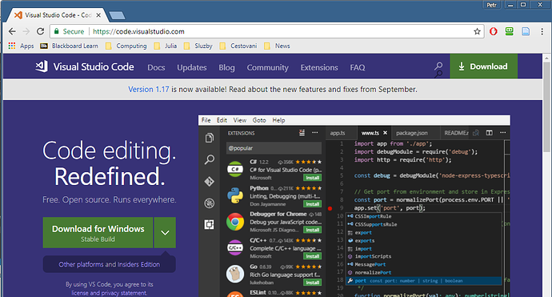
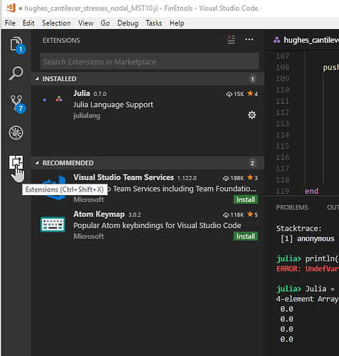
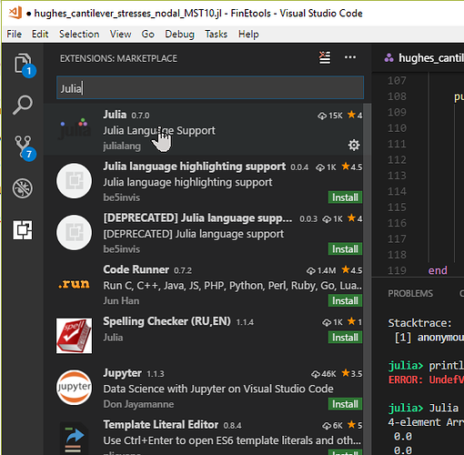
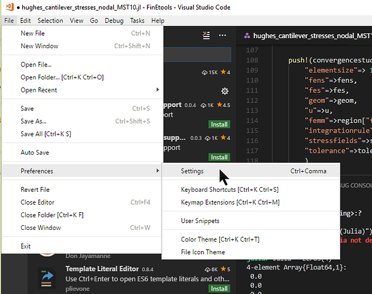
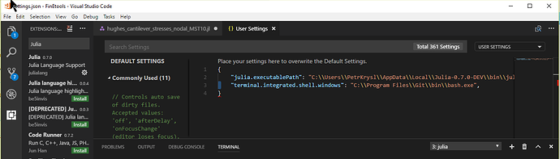

除了类似Jupyter这种方案，目前Julia并没有像PyCharm之于Python这样的利器。

这里转发[Petr Krysl](http://hogwarts.ucsd.edu/~pkrysl/ "Petr Krysl")的一个简单方案：[Visual Studio Code](https://code.visualstudio.com/ "Visual Studio Code") + [Julia Language Support](https://github.com/JuliaEditorSupport/julia-vscode "Julia Language Support")。

---

- 下载、安装、运行Visual Studio Code。

    

- 安装VSCode扩展。

    

- 输入Julia搜索Julia Language Support。

    

- 配置Julia Language Support。

    

- 在工作区设置中加入julia.executablePath和terminal.integrated.shell.windows。

    

    工程目录下.vscode子目录的settings.json文件中：

    {
        "julia.executablePath": "必须给用户Julia可执行程序路径",
        "terminal.integrated.shell.windows": "建议给个如Bash等可执行程序路径"
    }
