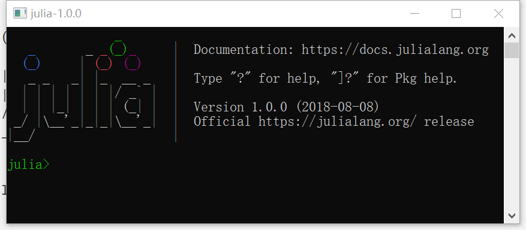
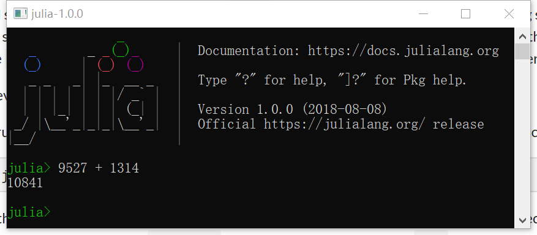
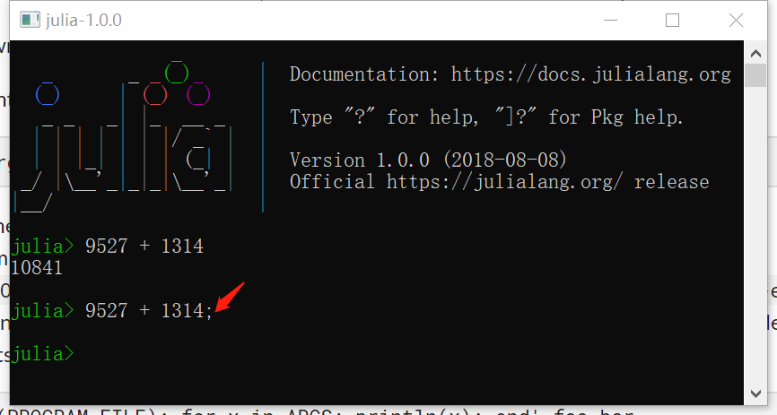
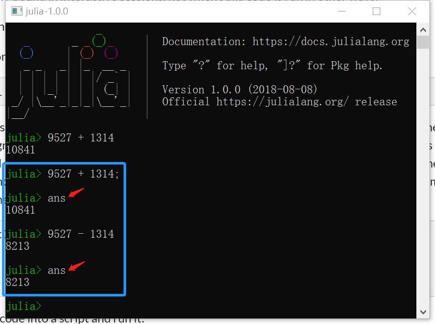
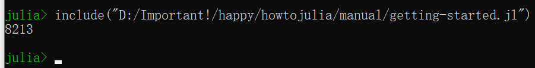
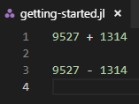
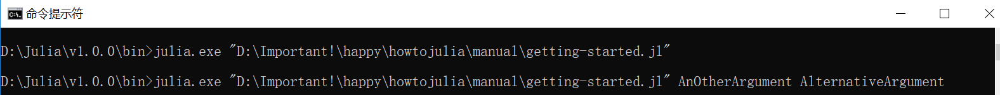
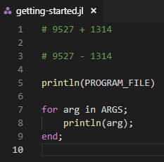
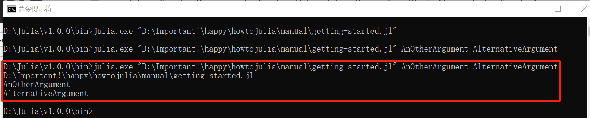
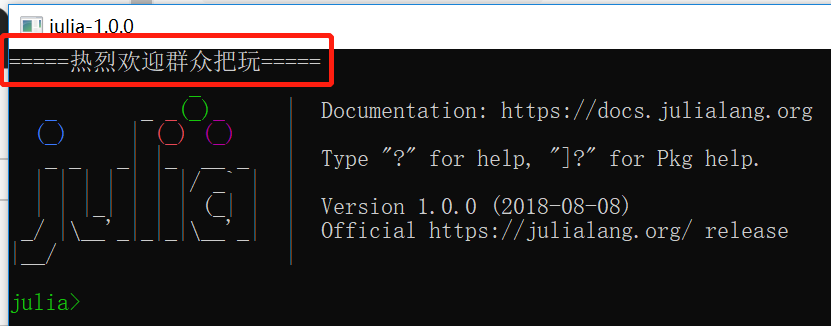

直截了当地安装Julia，用预编译二进制文件或从源码编译。

根据【[下载](https://julialang.org/downloads/ "Downloads")】页面的指示做。

**【[朱华社区](http://julialang.org.cn/ "JulialangOrgCN")】为困难群众也做了点准备，看[这里](http://julialang.org.cn/download.html "下载")。**

学习或实验Julia最简单的方式就是启动交互式会话（又名REPL），双击Julia可执行程序或在命令行执行julia即可。

退出Julia交互式会话，输入CTRL+D或exit()。

运行交互式模式，Julia显示欢迎语和用户输入提示。

用户一旦输入完整的表达式并按下Enter，交互式会话计算出表达式并展示得到的结果。

如果输入的表达式以分号结尾，就不会展示计算结果。

有个名为ans的变量绑定最后一个被成功计算的表达式的结果，无论当时该结果展示与否。

**这个ans变量仅在JuliaREPL下绑定，别的方式运行Julia代码则不会。**

*对Python有些了解的，思考下和Python中的“_”变量有何异同？*

计算源文件（[file.jl](https://github.com/JulialangOrgCN/howtojulia/blob/master/manual/getting-started.jl)）中的表达式，可用include("file.jl")。

此时“~/getting-started”的内容是：

非交互式执行源文件代码，可以直接将源文件作为julia命令的第一个参数。

将“~/getting-started”的内容略作修改：

在命令行执行相同命令及参数。

可见：

- 全部参数保存在全局变量ARGS。
- 源代码文件路径作为全局变量PROGRAM_FILE。
- 之后的参数作为命令行参数传递给源代码文件。

需要注意的是：

- 命令行执行“-e”选项指定Julia表达式，ARGS也会保存*后续的参数*。
- 此时PROGRAM_FILE会是空。

    >julia.exe -e 'println(PROGRAM_FILE); for arg in ARGS; println(arg); end;' cat dog

*发现命令行“-e”选项方式执行脚本报错，已经[反馈](https://github.com/JuliaLang/julia/issues/28662 "ERROR: syntax: invalid character literal")给社区。*

秀才解释：实则因为Windows的cmd.exe单双问题，改成双引号即可。

有个符号“--”，就是两个连续的连字符，可以用来分隔传递给Julia的参数和传递给源文件的参数。

    >julia.exe --color=yes -0 -- "D:\Important!\happy\howtojulia\manual\getting-started.jl" AnOtherArgument AlternativeArgument

可以通过“-p”或“--machine-file”选项启动并行模式：

- “-p n”将启动n个额外的工作进程。
- “--machine-file file”将会为“file”中每一行启动一个工作进程。

    在file中定义的机器必须可通过ssh免密登入，并且在和当前机器上相同路径下安装好Julia。每台机器按“[count*][user@]host[:port][bind-address][:bind-port]”的模式定义。其中：

        user: 默认当前用户；
        port: 模式ssh标准端口（22）；
        count: 想在该节点上启动的工作进程数量（默认一个）；
        bind-address和bind-port: 可选，指定别的工作进程连接该工作进程的网络路径。

*既然可以在一个节点上启动多个工作进程，那么bind-address和bind-port在该节点上是每个工作进程一个还是共用一个？*

若想每当Julia启动就运行一些代码【Julia启动代码】，可以将代码放置在“~/.julia/config/startup.jl”（Windows上 对应“[%USERPROFILE%\.julia\config\startup.jl](https://github.com/JulialangOrgCN/howtojulia/blob/master/manual/startup.jl)”）。

执行Julia代码并提供选项的办法很多，这些可用的跟Perl/Ruby相似。

    julia [Julia可选开关] -- [源文件] [可选源文件参数]

## Julia开关及描述

- []: 表示可选
- <>: 表示必选
- {}: 枚举参数

### 详情

    -v, --version: 显示版本信息。

    -h, --help: 打印这段广告。

    -J, --sysimage <file>: 以指定的系统镜像文件启动。

    -H, --home <dir>: 指定Julia可执行程序工作目录。

    --startup-file={yes|no}: 加载【Julia启动代码】。

    --handle-signals={yes|no}: Julia的默认信号句柄（处理逻辑）。

    --sysimage-native-code={yes|no}: 采用系统镜像的本地代码（若有）。

    --compiled-modules={yes|no}: 模块增量预编译。

    -e, --eval <expr>: 计算expr的值。

    -E, --print <expr>: 计算expr的值并显示结果。

    -L, --load <file>: 在全部处理单元加载file。

    -p, --proc {N|auto}: 整数N则启动N个本地工作进程；auto则启动和本地CPU逻辑核数相等的工作进程。

    --machine-file <file>: 在file列出的机器上运行进程。

    -i: 交互式模式，Julia REPL启动且isinteractive()是true。

    -q, --quiet: [静默启动](../插图/Manual-GettingStarted-JuliaREPL-Launch-Quiet.png)，无欢迎语（就是默认启动首先显示的Logo和文字），抑制Julia REPL警告。

    --banner={yes|no|auto}: 启动欢迎语，与“-q”不同之处在于“仅不显示欢迎语”。

    --color={yes|no|auto}: 彩色文本。

    --history-file={yes|no}: 加载保存的历史。

    --depwarn={yes|no|error}: 语法和方法废弃警告（error则将警告转为错误）。

    --warn-overwrite={yes|no}: 方法重写警告。

    -C, --cpu-target <target>: 限制CPU*特征*使用不大于target，通过help查看可用的选项。

    -O, --optimize={0|1|2|3}: 设置优化级别：不用此开关则默认2；用了此开关但未选参数则默认3。

    -g [level]: 设置调式信息生成等级：不用此开关则默认1；用了此开关但未给参数则默认2。

    --inline={yes|no}: 控制允许内联（inlining）否，包括覆盖@inline装饰器。

    --check-bounds={yes|no}: 进行边界检测否（忽略声明）。

    --math-mode={ieee,fast}: 不安全的浮点优化（覆盖@fastmath装饰器）。

    --code-coverage={none|user|all}: 源代码行执行计数。

    --track-allocation={none|user|all}: 源代码每行分配的字节。

    --track-allocation: 等价于“--track-allocation=user”。

# 资源
茱莉亚官网的【[学习](https://julialang.org/learning/)】页面列出了“馆藏”的、有用的资源帮助用户向Julia世界启航。

---
# 译后感

- 尚未见惊世骇俗之处。
