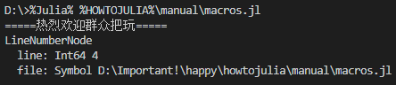

在Julia中，Lisp最大的遗产就是支持元编程。
如Lisp一样，Julia用和编程语言本身相同的数据结构表达代码。
由于对象所表现的代码可从编程语言内部创建和操作，程序改变和生成自有代码是可能的。
这允许复杂代码生成，无须额外构建步骤，且允许[抽象语法树](https://en.wikipedia.org/wiki/Abstract_syntax_tree)级别的真Lisp风格宏操作。
相反，预处理宏系统，如C/C++的，视在任何实际解析或解释发生之前执行字面处理和替换的。
因为Julia的全部数据类型和代码由Julia数据结构表达，强大的[反射](https://en.wikipedia.org/wiki/Reflection_%28computer_programming%29)能力可用来像任何别的数据那样探测程序内部及其类型。

# 程序表达

每个Julia程序以字符串入世：
```
julia> program = "9527 + 1314"
"9527 + 1314"
```

**接下来发生了什么？**

下一步是[解析](https://en.wikipedia.org/wiki/Parsing#Computer_languages)每个字符换为叫做表达式的对象，由Julia类型`Expr`表示：
```
julia> xa = Meta.parse(program)
:(9527 + 1314)

julia> typeof(xa)
Expr
```

`Expr`对象包含两部分：

- 一个`Symbol`标识表达式的种类。一个符号就是一个[缓存（interned）字符串](https://en.wikipedia.org/wiki/String_interning)标识符（更多讨论后边说）。

    ```
    julia> xa.head
    :call
    ```

- 表达式参数，可以是符号、别的表达式或字面值。

    ```
    julia> xa.args
    julia> xa.args
    3-element Array{Any,1}:
        :+
    9527
    1314
    ```

表达式也可以直接在[波兰表示法](https://en.wikipedia.org/wiki/Polish_notation)构造：
```
julia> xb = Expr(:call, :+, 9527, 1314)
:(9527 + 1314)
```

上述两中构造表达式（通过解析字符串或直接构造）是等价的。
```
julia> xa == xb
true
```

**这里的关键点是Julia代码内在地表达为编程语言本身可访问的数据结构。**

函数`dump`提供缩进且带注释的`Expr`对象显示：
```
julia> dump(xa)
Expr
  head: Symbol call
  args: Array{Any}((3,))
    1: Symbol +
    2: Int64 9527
    3: Int64 1314

julia> dump(xb)
Expr
  head: Symbol call
  args: Array{Any}((3,))
    1: Symbol +
    2: Int64 9527
    3: Int64 1314
```

`Expr`对象也可能嵌套：
```
julia> xc = Meta.parse("(4 + 4) / 2")
:((4 + 4) / 2)
```

查看表达式的另一种方法是`Meta.show_sexpr`，它显示给定`Expr`的[S表达式](https://en.wikipedia.org/wiki/S-expression)，这看起来个对Lips用户可能非常熟悉。
这里给个展示嵌套`Expr`演示的例子：
```
julia> Meta.show_sexpr(xc)
(:call, :/, (:call, :+, 4, 4), 2)
```

## 符号

字符`:`在Julia中有两种语义目的。
第一种形式创造一个`Symbol`，一个【缓存字符串】用作表达式的一个构件块：
```
julia> :symbola
:symbola

julia> typeof(ans)
Symbol
```

构造函数`Symbol`接受任意个参数并把它的字符串表达连接起来创建一个新的符号：
```
julia> :symbolb == Symbol("symbolb")
true

julia> Symbol("fuck", 9527, "yet")
:fuck9527yet

julia> Symbol(:var, '_', "count")
:var_count
```

在一个表达式的上下文中，符号通常用来表示访问变量；
当一个表达式被计算，一个符号被绑定到该符号的值替代，在合适的【[作用域](./变量的作用域 "Scope of Variables")】。

偶尔，为避免解析时模棱两可，字符`:`周围额外的圆括号是须要的：
```
julia> :(:)
:(:)

julia> :(::)
:(::)
```

# 表达式和计算

## 引用

字符`:`的另一个语义目的是创造表达式对象，不显式采用`Expr`构造函数。
把这个称作引用（refer to as）。
字符`:`后紧跟一对圆括号，包裹单个Julia代码声明，产生一个基于该闭包代码的`Expr`对象。
这里有个用来引用算法表达式的简易格式：
```
julia> xd = :(k*x+b)
:(k * x + b)

julia> typeof(xd)
Expr
```

查看该表达式的结构，尝试`xd.head`和`xd.args`或用如上所述的`dump`或`Meta.@dump`。
注意，等价的表达式可用`Meta.parse`函数或直接用`Expr`构造形成：
```
julia> xe = Meta.parse("k*x+b")
:(k * x + b)

julia> xf = Expr(:call, :+, Expr(:call, :*, :k, :x), :b)
:(k * x + b)

julia> xd == xe == xf
true
```
解析器提供的表达式通常只有符号，别的表达式和字面值作为它的参数，然而Julia代码构造的表达式可有任意的运行时值，没有作为参数的字面形式。
在上述例子中，`+`和`b`式符号，`*(k,x)`式子表达式。
下面的例子中，`9527`是`Int64`字面值：
```
julia> :(x*x - 9527)
:(x * x - 9527)
```

对于多个表达的引用，还有一种语法形式：由`quote`和`end`包裹的代码块。
```
julia> xg = quote
         x = 0
         y = 1
         z = 2
       end
quote
    #= REPL[26]:2 =#
    x = 0
    #= REPL[26]:3 =#
    y = 1
    #= REPL[26]:4 =#
    z = 2
end

julia> typeof(xg)
Expr
```

## 篡改（字面格式化）

用值参数直接构造`Expr`是很猛，但是`Expr`构造函数可冗长乏味的和Julia语法相比。
作为一个备胎（alternative），Julia允许字面或表达式到引用表达式的篡改。
篡改用`$`前缀表示。

在本例中，变量`sb`的值被篡改：
```
julia> sb = 1314
1314

julia> xh = :($sb + b)
:(1314 + b)
```

不支持篡改到为引用的表达式，会引起编译时错误：
```
julia> $sb + b
ERROR: syntax: "$" expression outside quote

julia> :$sb + b
ERROR: syntax: extra token "sb" after end of expression

julia> :($sb) + b
ERROR: UndefVarError: b not defined
Stacktrace:
 [1] top-level scope at none:0
```

下个例子中，元组`(1,2,3)`篡改为表达式作条件测试：
```
julia> xi = :(x in $:((1,2,3)))
:(x in (1, 2, 3))
```

用于表达式篡改的`$`有意让人联想到【[字符串篡改](./字符串.md "Strings")】和【[命令篡改](./运行外部程序.md "Running External Programs")】。
表达式篡改让复杂Julia表达式便捷、可读的规划建设。

## 抛雪球算法插值（splatting interpolation）

注意到`$`篡改语法允许插入单个表达式到闭包表达式中。
偶尔，要把表达式数组中所有的元素（表达式）作为`$`所包裹的表达式的参数。
这可以通过语法`$(xs...)`完成。
举个例子，下面的代码产生一个函数调用，参数的个数是以编程方式检测的。
```
julia> xs = [:x, :y, :z]
3-element Array{Symbol,1}:
 :x
 :y
 :z

julia> :(fuck(9527, $(xs...)))
:(fuck(9527, x, y, z))
```

## 嵌套引用

自然而然地，引用包含别的引用表达式地表达式是可能的。
理解篡改在这些场景中是如何工作的有点棘手（a bit tricky）。
考虑下面的例子：
```
julia> xj = :(9527 + 1314)
:(9527 + 1314)

julia> xk = quote quote $xj end end
quote
    #= REPL[40]:1 =#
    $(Expr(:quote, quote
    #= REPL[40]:1 =#
    $(Expr(:$, :xj))
end))
end
```

注意到结果包含的`Expr(:$, :xj)`表示`xj`尚未被计算。
换句话说，属于内部引用表达式的`$`表达式，连同它的参数，仅当内部引用表达式被计算（`eval`）时被计算。
```
julia> eval(xk)
quote
    #= REPL[40]:1 =#
    9527 + 1314
end
```

然而，外部`quote`表达式能篡改内部`quote`的值。
这通过多个`$`实现：
```
julia> xl = quote quote $$xj end end
quote
    #= REPL[42]:1 =#
    $(Expr(:quote, quote
    #= REPL[42]:1 =#
    $(Expr(:$, :(9527 + 1314)))
end))
end
```

注意到`:(9527 + 1314)`目前出现在结果中，而不是`:xj`符号。
计算该表达式生成一个被篡改的结果：
```
julia> eval(xl)
quote
    #= REPL[42]:1 =#
    10841
end
```

该行为背后的直觉是`xj`对每个`$`计算一次：一个`$`的作用和`eval(:xj)`相似，给出`xj`的值，因为两个`$`相当于`eval(eval(:xj))`。

## 引用节点

在抽象语法树（AST）中引用常见的表现形式是`head`为`:quote`的`Expr`：
```
julia> dump(Meta.parse(":(9527+1314)"))
Expr
  head: Symbol quote
  args: Array{Any}((1,))
    1: Expr
      head: Symbol call
      args: Array{Any}((3,))
        1: Symbol +
        2: Int64 9527
        3: Int64 1314
```
正如所见，这种表达式支持以`$`插值。
然而，有些场景中，不执行插值的代码引用是必须的。
这种引用尚无语法，只是内部表达为`QuoteNode`类型的对象。
解析器为如符号的简单引用项生成`QuoteNode`：
```
julia> dump(Meta.parse(":x"))
QuoteNode
  value: Symbol x
```
`QuoteNode`也可用于特定的高级元编程任务。

## [eval](../基础/精要.md "Base: Essentials-Syntax-MainInclude-eval")及其影响

给定一个表达式对象，即可让Julia采用`eval`在全局作用域执行它：
```
julia> :(9527 + 1314)
:(9527 + 1314)

julia> eval(ans)
10841

julia> exp = :(x + y)
:(x + y)

julia> eval(exp)
ERROR: UndefVarError: x not defined
Stacktrace:
 [1] top-level scope at none:0
 [2] eval at .\boot.jl:319 [inlined]
 [3] eval(::Expr) at .\client.jl:389
 [4] top-level scope at none:0

julia> x = 9527; y = 1314;

julia> eval(exp)
10841
```
每个[模块](./模块.md "Modules")有其`eval`函数，用来在它的全局作用域计算表达式。
传递给`eval`的表达式不限制返回值——亦有改变模块环境的闭包状态的副作用：
```
julia> exp = :(z = 250)
:(z = 250)

julia> z
ERROR: UndefVarError: z not defined

julia> eval(exp)
250

julia> z
250
```
这里，一个表达式对象的计算导致给全局变量`z`的赋值。

由于表达式只是可程序构建病随后计算的`Expr`对象，可能动态产生任意代码然后用`eval`执行。
这儿给出一个简单例程：
```
julia> a = 1.0
1.0

julia> exp = Expr(:call, :+, a, :b)
:(1.0 + b)

julia> a = 2.0; b = 0.2;

julia> eval(exp)
1.2

julia> a
2.0

julia> b
0.2
```
可见`a`的值用来构造`exp`表达式，即将`+`函数应用给`1.0`和变量`b`。
注意`a`和`b`之间重大的使用区别：

- 表达式构造时变量`a`的值采用立即数，因此当计算表达式时`a`的值是什么无关紧要，值已经是`1.0`了，和`a`变量此时的值无关。
- 另一方面，符号`:b`用于构造表达式，和变量`b`的值此时无关，`:b`只是个符号，没必要定义值，在计算表达式时，符号`:b`的值通过查找`b`变量的值来解决。

## 表达式中的函数

如上边暗示的，Julia的一个极其有用的特性是自行生成和操纵Julia代码的能力。
已经看过函数返回`Expr`对象的例子：`parse`函数，输入一个Julia代码字符串、输出对应的`Expr`。
函数也可以有一个或多个`Expr`对象作为参数，返回另一个`Expr`。
这里展示一个简单的、刺激的例程：
```
julia> function mathexpr(op, op_, op__)
         expr = Expr(:call, op, op_, op__)
         return expr
       end
mathexpr (generic function with 1 method)

julia> expr = mathexpr(:+, 9527, Expr(:call, :*, 657, 2))
:(9527 + 657 * 2)

julia> eval(expr)
10841
```

作为另一个例程，下面的函数将任何数值参数双倍，但不理睬表达式：
```
julia> function makeexpr(op, opr_, opr__)
         oprf_, oprf__ = map(x -> isa(x, Number) ? 2*x : x, (opr_, opr__))
         expr = Expr(:call, op, oprf_, oprf__)
         return expr
       end
makeexpr (generic function with 1 method)

julia> makeexpr(:+, 9527, 1314)
:(19054 + 2628)

julia> makeexpr(:+, 9527, Expr(:call, :*, 657, 2))
:(19054 + 657 * 2)
```

# 宏

宏提供将生成的代码包含到最终程序体的方法。
一个宏将参数元组映射到返回的表达式，而且结果表达式直接编译，而不须要在运行时调用`eval`。
宏参数可以包含表达式，字面值和符号。

## 基础

这里给出一个十分简单的宏：
```
julia> macro sayhi()
         return :( println("hi, julia!") )
       end
@sayhi (macro with 1 method)
```
在Julia语法中，宏有专用的字符：紧随`@`的唯一名称，在`macro name ... end`块中声明。
在该例程中，编译器将替换所有`@sayhi`为`:( println("hi, julia!") )`。

当在JuliaREPL中碰到`@sayhi`，表达式立即执行，因此仅能看到计算结果：
```
julia> @sayhi()
hi, julia!
```

现在，考虑一个稍微复杂的宏：
```
julia> macro saybye(name)
         return :( println("bye, ", $name ,"!") )
       end
@saybye (macro with 1 method)
```
该宏带一个参数`name`。
当遇到`@saybye`，所引用的表达式被展开为参数的值（插值）到最终表达式：
```
julia> @saybye("julia")
bye, julia!

julia> @saybye("xiucai")
bye, xiucai!
```

可以用`macroexpand`查看引用返回的表达式（重要提示：这是调试宏非常有用的工具）：
```
julia> macroexpand(Main, :(@saybye("bob")))
:((Main.println)("bye, ", "bob", "!"))

julia> typeof(ans)
Expr
```

可见`"bob"`字面已经插值到表达式中。

还存在`@macroexpand`宏或许多少给函数`macroexpand`带来点儿便利：
```
julia> @macroexpand @saybye "alice"
:((Main.println)("bye, ", "alice", "!"))
```

### 等一下：为啥要宏？

前文已经看到函数`f(::Expr...) -> Expr`。
事实上，`macroexpand`也是个函数。
如此，宏为何而生？

因为代码被解析时执行，宏是必要的，因此，宏允许程序员在全部程序运行之前生成并包含定制代码片段。
为了演示这个区别，考虑下述例程：
```
julia> macro twosteps(msg)
         println("at parse time, message is: ", msg)
         return :(println("at runtime, message is: ", $msg))
       end
@twosteps (macro with 1 method)

julia> exp = macroexpand(Main, :(@twosteps :(1, 2, 9527, 1314)))
at parse time, message is: $(Expr(:quote, :((1, 2, 9527, 1314))))
:((Main.println)("at runtime, message is: ", $(Expr(:copyast, :($(QuoteNode(:((1, 2, 9527, 1314)))))))))
```
第一个`println`调用在调用`macroexpand`时执行。
结果表达式仅包含第二个`println`：
```
julia> typeof(exp)
Expr

julia> exp
:((Main.println)("at runtime, message is: ", $(Expr(:copyast, :($(QuoteNode(:((1, 2, 9527, 1314)))))))))

julia> eval(exp)
at runtime, message is: (1, 2, 9527, 1314)
```

## 宏调用

通过如下一般语法调用宏：
```
@name expr expr_ ...
@name(expr, expr_, ...)
```
注意区分宏名之前的`@`和缺失参数表达式间逗号的（前一种）、宏名后缺失空白的（后一种）形式。
两种风格不能混合。
举个例子，下述语法和上述例子不同；它将`(expr, expr_, ...)`元组作为一个整体参数传递给宏：
```
@name (expr, expr_, ...)
```

另一种调用宏遍历数组字面的可选方式是并置所有不带圆括号。
这种情况下，数组是反馈给宏的唯一表达式。
下述语法等价，但不同于`@name [a b] * v`：
```
@name[a b] * v
@name([a b]) * v
```
强调接收其参数作为表达式、字面值或符号是重要的。
暴露宏参数的一种方法是在宏内部调用`show`函数：
```
julia> macro showarguments(x)
         show(x)
       end
@showarguments (macro with 1 method)

julia> @showarguments(a)
:a
julia> @showarguments(9527+1314)
:(9527 + 1314)
julia> @showarguments(println("hi"))
:(println("hi"))
```
除给定的参数列表外，每个宏都传递额外的参数，名曰`__source__`和`__module__`。

参数`__source__`提供关于解析器从宏调用`@`符号的位置信息（以`LineNumberNode`对象形式）。
这允许宏宏包含更好的错误诊断信息，并且通常用于日志、字符串解析宏和文档中，例如，和实现`@__LINE__`、`@__FILE__`、`@__DIR__`宏一样。

通过`__source__.line`和`__source__.file`可访问位置信息：
```
julia> macro __LOCATION__(); return QuoteNode(__source__); end
@__LOCATION__ (macro with 1 method)

julia> dump(
         @__LOCATION__()
       )
LineNumberNode
  line: Int64 2
  file: Symbol REPL[50]
```


参数`__module__`提供关于宏调用的表达式上下文的信息（以`Module`对象形式）。
这允许宏查找上下文信息，诸如存在的绑定或以额外阐述值插入运行时函数在当前模块调用自身反射。

## 构建高级宏

这里给出Julia的`@assert`宏的简化定义：
```
julia> import Base.@assert

julia> macro assert(exp)
         return :( $exp ? nothing : throw(AssertionError($(string(exp)))))
       end
@assert (macro with 2 methods)
```

该宏可这样使用：
```
julia> @assert 1 == 1.0

julia> @assert 1 == 0.0
ERROR: AssertionError: 1 == 0.0
Stacktrace:
 [1] top-level scope at none:0
```

替代书写语法，宏调用在解析时展开并返回结果。
这和如下写法等价：
```
1 == 1.0 ? nothing : throw(AssertionError("1 == 1.0"))
1 == 0.0 ? nothing : throw(AssertionError("1 == 0.0"))
```

换言之，第一个调用，表达式`:(1 == 1.0)`拼接进测试条件槽，而`string(:(1 == 1.0))`的值拼接到断言消息槽。
整个表达式这样构建好，放置在语法树中出现`@assert`的位置。
然后在执行时，如果测试表达式计算为真，则返回`nothing`，反之如果测试为假，则抛出错误表明被断言的表达式是假。
注意也可以写为函数，因为仅条件值可用且不能显示在错误消息中计算的表达式。

实际上`@assert`定义在Julia的`Base`中，要复杂得多。
允许用户可选地指定定制的错误消息，而不是只打印失败的表达式。
正如拥有可变个数参数的Julia函数，在最后一个参数后跟省略号：
```
julia> macro assert(exp, msg...)
         msg = isempty(msg) ? exp : msg[1]
         msg = string(msg)
         return :($exp ? nothing : throw(AssertionError($msg)))
       end
@assert (macro with 2 methods)
```

现在`@assert`有两个操作模式，取决于接收到的参数个数！
如果仅有一个参数，`msg`捕捉到的表达式元组就是空的，将和上述定义的简单版本行为一致。
但现在如果用户指定第二个参数，将替换失败表达式作为打印消息。
可以用适当的名为`@macroexpand`宏检查宏展开结果：
```
julia> @macroexpand @assert a == b
:(if Main.a == Main.b
      Main.nothing
  else
      (Main.throw)((Main.AssertionError)("a == b"))
  end)

julia> @macroexpand @assert a == b "a should equal b!"
:(if Main.a == Main.b
      Main.nothing
  else
      (Main.throw)((Main.AssertionError)("a should equal b!"))
  end)

julia> @assert 1 == 1.0 "yes"

julia> @assert 1 == 0.0 "yet"
ERROR: AssertionError: yet
Stacktrace:
 [1] top-level scope at none:0
```

还有别的真实`@assert`宏处理的情况：即便如此，除了打印`"a should equal b!"`，想要打印值会怎样？
有人可能幼稚地尝试在定制消息中用字符串插值，举例来说，`@assert a==b "a ($a) should equal b ($b)!"`，但这用在上述宏上得不到期望的结果。
知道为什么嘛？回想【[字符串插值](./字符串.md "Strings-Interpolation")】，一个插值字符串重写为调用【[`string`](../基础/字符串.md "Base: Strings")】。

比较：
```
julia> typeof(:("a should equal b!"))
String

julia> typeof(:("a ($a) should equal b ($b)!"))
Expr

julia> dump(:("a ($a) should equal b ($b)!"))
Expr
  head: Symbol string
  args: Array{Any}((5,))
    1: String "a ("
    2: Symbol a
    3: String ") should equal b ("
    4: Symbol b
    5: String ")!"
```

因此现在宏接收需要计算并如期显示的完整表达式而不是普通字符串。
这可以直接拼接到返回的表达式作为`string`调用的参数；查看[error.jl](https://github.com/JuliaLang/julia/blob/master/base/error.jl)获取完整实现。

这个`@assert`宏充分利用拼接到引用的表达式来简化宏体内表达式的操作。

## 卫生（hygiene）

更复杂的宏抛出的问题就是【卫生】。
就是保证宏按期望地展开，看个C语言的例子：
```
#define SQUARE(x) x*x

int main(void)
{
  printf("%d\n", SQUARE(2));
  // 预编译器处理为“9527+1314*9527+1314”，而不是期望的“(9527+1314)*(9527+1314)”。
  printf("%d\n", SQUARE(9527+1314));
  return 0;
}
```
再看个C宏定义：
```
#define INC(i) do { int i=0; ++i; } while(0)

int main()
{
	int a = 9527, b = 1314;
	printf("a is %d, b is %d.\n", a, b);
  // 宏操作不影响外层变量a和b的，因为宏定义中有名为a、b的局部变量。
	INC(a);
	INC(b);
  // 试想把宏定义中的“int i=0;”改为“int a=0;”或“int b=0;”的话，又当如何？
  return 0;
}
```
上述例程是C语言中典型的不卫生宏。

简而言之，**宏必须保证在返回的表达式中引入的变量不意外地和宏展开处周围代码中已存在地变量冲突**。

相反地，作为参数传递给宏地表达式经常期望在周围代码的上下文中计算，和已存在的变量相互影响甚至修改之。

现实中出现的另一个要关心的是宏可能在不同于定义处被调用。
在这种情况下，须要确保所有全局变量分解到正确的模块。
与使用文本宏扩展(如C)的语言相比，Julia已经有了一个主要优势，即它只需要考虑返回的表达式。
所有别的变量（如上述`@assert`中的`msg`）遵循【[正常作用域块行为](./变量的作用域.md "Scope-of-Variables")】。

为了演示这些问题，来一起考虑编写一个`@time`宏，带一个表达式作为参数，记录时间、计算表达式，再次记录时间，打印两次时间记录的差，最后将表达式的值作为最终值返回。
该宏看起来应该是这样子的：
```
julia> import Base.@time

julia> macro time(exp)
         return quote
           local t_ = time()
           local expr = $exp
           local _t = time()
           println("elapsed time: ", _t-t_, " seconds.")
           expr
         end
       end
@time (macro with 1 method)
```
这里，想让`t_`、`_t`和`expr`是私有临时变量，让`time`引用【[time](../基础/精要.md "Base: Libc-time")】函数，而不是任何用户可能定义的`time`变量。
想象该问题会发生，如果用户表达式`exp`也包含给称作`t_`的变量赋值，或者定义自己的`time`变量。
会得到错误或难以理解的错误行为。

```
julia> @time println("hi")
hi
elapsed time: 0.0010001659393310547 seconds.
```

Julia的宏扩展器用如下方式解决了这些问题。
首先，宏结果中的变量分类为局部（local）或全局（global）。
如果是赋值（且未声明全局）、声明未局部或用作函数参数名的变量被认为是局部的。
否则认为是全局的。

局部变量重命名为独一无二的（用【[`gensym`](../基础/精要.md "Base: gensym")】函数生成新的符号）；
全局变量在宏定义环境内解决。

因此上边的关注点都得到了处理；宏的局部变量不会和任何用户变量冲突，且`time`和`println`将引用Julia基础定义。

然而遗留一个问题。考虑下边宏的使用：
```
module Macros
import Base.@time

time() = println("macros")

@time time()

end
```

这儿的用户表达式`exp`是调用`time`函数，但不同于宏所用的`time`函数。
用户表达式所`exp`用的`time`明显地引用`Macros.time`。
因此咱必须为用户表达式`exp`中的代码在宏调用环境中的解决做准备。
这通过用【[`esc`](../基础/精要.md "Base: esc")】函数实现：
```
macro time(exp)
  ...
  local v = $(esc(exp))
  ...
end
```
这种德行包裹的表达式会被宏扩展器放羊，简单地逐字粘贴到输出。
因此将在宏调用环境中被解决。

这种逃逸机制可在须要时用来“违反（violate）”卫生（条例），为了引入或操作用户变量。
举个例子，下述宏在调用环境中设置`x`为零：
```
julia> macro zerox()
         return esc(:(x = 0))
       end
@zerox (macro with 1 method)

julia> function fuck()
         x = 9527
         @zerox
         return x
       end
fuck (generic function with 1 method)

julia> fuck()
0
```
这种变量修改应当头脑清醒地运用，不过偶尔确实便捷。

领会卫生规则是令人生畏的挑战。
在使用宏之前，应当考虑函数闭包足够与否。
另一个有用的策略是延迟尽可能多的工作到运行时。
举个例子，很多宏简单地包装其参数到`QuoteNode`或别的相似的`Expr`。
其中就包括`@task body`简单地返回`schedule(Task(()->$body))`，`@eval exp`简单地返回`eval(QuoteNode(exp))`。

为了演示，要重写上述的`@time`例程为：
```
julia> import Base.@time

julia> macro time(exp)
         return :(timeit(()->$(esc(exp))))
       end
@time (macro with 1 method)

julia> function timeit(f)
         t_ = time()
         v = f()
         _t = time()
         println("elapsed time: ", _t-t_, " seconds.")
         return v
       end
timeit (generic function with 1 method)

julia> @time println("just print.")
just print.
elapsed time: 0.0 seconds.
```

然而，这样做并非理由充分：在一个新的作用域块中包装`exp`（匿名函数）也会稍微改变表达式（其中任何变量的作用域）的含义，当咱想要`@time`对被包装的代码的影响最小。

## 宏和派送

宏，正如Julia函数，是普通的。
这意味着也可以有多个方法定义，多亏多重分派：
```
julia> macro m end
@m (macro with 0 methods)

julia> macro m(args...)
         println("$(length(args)) arguments.")
       end
@m (macro with 1 method)

julia> macro m(x,y)
         println("tow arguments: ", x, " and ", y, ".")
       end
@m (macro with 2 methods)

julia> @m "xiucai"
1 arguments.

julia> @m "alice" "bob"
tow arguments: alice and bob.

julia> @m "huaan" "qiuxiang" "cto" "sb"
4 arguments.
```

无论如何要牢记，宏的分发基于AST（抽象语法树）处理给宏的类型，而不是运行时计算给AST的类型：
```
julia> macro m(::Integer)
         println("An Integer.")
       end
@m (macro with 3 methods)

julia> @m 9527
An Integer.

julia> huaan = 9527
9527

julia> @m huaan
1 arguments.
```
**宏是编译期就确定类型的！**

# 代码生成

当要求重复大量样板文件代码时，程序化生成代码以避免冗余是通常的。
在大多数编程语言中，这须要额外的构建步骤，单独的程序来生成重复代码。
在Julia中，表达式插值和`eval`允许这种代码生成在程序执行的正常过程中发生。
举个例子，考虑如下客户代码：
```
julia> struct FunnyNumber
         fn::Float64
       end
```
想要给它添加很多方法。
可以在如下循环终程序化完成：
```
julia> for op = (:sin, :cos, :tan, :log, :exp)
         eval(
         quote
           Base.$op(x::FunnyNumber) = FunnyNumber($op(x.fn))
         end
         )
       end
```
现在可以用这些函数处理定制的类型：
```
julia> sin(x)
FunnyNumber(1.2246467991473532e-16)

julia> cos(x)
FunnyNumber(-1.0)

julia> exp(x)
FunnyNumber(23.140692632779267)
```
按照这种德行，Julia作为自己的[预处理器](https://en.wikipedia.org/wiki/Preprocessor)，并且允许从编程语言内部生成代码。
上述代码可用`:`前缀引用形式写得更紧凑些：
```
julia> for op = (:sin, :cos, :tan, :log, :exp)
         eval(:(Base.$op(x::FunnyNumber) = FunnyNumber($op(x.fn))))
       end

julia> tan(x)
FunnyNumber(-1.2246467991473532e-16)

julia> log(x)
FunnyNumber(1.1447298858494002)
```
这个某种程度的在语言代码生成，不管怎样，采用`eval(quote(...))`模式，Julia一并提供足够通用的缩写模式：
```
julia> for op = (:sin, :cos, :tan, :log, :exp)
         @eval Base.$op(x::FunnyNumber) = FunnyNumber($op(x.fn))
       end

julia> exp(x)
FunnyNumber(23.140692632779267)
```
这个`@eval`宏重写该调用恰恰等价于上述较长的版本。
对于较长生成的代码块，提供给`@eval`的表达式参数可以是个块：
```
@eval begin
  ...
end
```

# 非标准字符串字面

回想【[字符串](./字符串.md "Strings")】，前缀标识符的字符串字面是非标准字符串字面，并且有着和不带前缀的字符串字面迥异的语义。
举个例子：

- `r"^\s*(?:#|$)"`产生一个正则表达式而非字符串。
- `b"DATA\xff\u2200"`是字节数组字面，代表`[68，65，84，65，255，226，136，128]`。

  ```
  julia> bs = b"DATA\xff\u2200"
  8-element Base.CodeUnits{UInt8,String}:
  0x44
  0x41
  0x54
  0x41
  0xff
  0xe2
  0x88
  0x80

  julia> for b = bs
          println(b)
        end
  68
  65
  84
  65
  255
  226
  136
  128
  ```

或许惊讶吧，这些行为没有硬编码到Julia解析器或编译器。
相反，都是任何人都可用的一般机制提供的定制行为：前缀字符串字面调用特殊命名的宏来解析。
举个例子，正则表达式宏正是如下：
```
macro r_str(p)
  Regex(p)
end
```
这是全部。
该宏表明字符串字面`r"^\s*(?:#|$)"`应当传递给`@r_str`宏，且宏展开的结果应当放置在书法书中出现该字符串字面的位置。
换句话说，表达式`r"^\s*(?:#|$)"`和直接在语法树中放置`Regex("^\\s*(?:#|$)")`对象等价。

不仅字符串字面形式简单、更便捷，而且更高效：因为正则表达式被编译且`Regex`对象实际上在代码编译时被创建，编译只发生一次，而不是每次执行代码时都编译。
考虑如果正则表达式出现在循环中：
```
for line = lines
  m = match(r"^\s*(?:#|$)", line)
  if m === nothing
    ...
  else
    ...
  end
end
```
由于正则表达式`r"^\s*(?:#|$)"`在解析该代码时被编译接着被插入到语法树，表达式只编译一次而不是每次执行循环时都编译一次。
为了无宏实现同样逻辑，必须如下编写循环：
```
re = Regex("^\\s*(?:#|$)")
for line = lines
  m = match(re, line)
  if m === nothing
    ...
  else
    ...
  end
end
```

此外，如果编译器不能判定正则表达式对象在整个循环过程中不变，特定的优化或许不可能，使得该版本仍然较上述更便捷的字面形式低效。

当然，让然存在非字面形式更高效的情况：如果须要插值到正则表达式，必须采用整个更啰嗦的方法；在正则表达式模式自身是动态的、每次循环迭代潜在变化的的情况下，必须在每个迭代构造新的正则表达式对象。

在大量主要的应用场景，无论怎样，正则表达式不依赖运行时数据构建。
在这些主要的情况下，将正则表达式当作编译时的值编写是非常重要的。

如非标准字符串字面，存在非标准命令字面——前缀不同的命令字面语法。
命令字面``custom `literal` ``解析为`@custom_cmd "literal"`。

Julia自己不包括任何非标准命令字面，但是包可以运用该语法。
除不同的语法和`_cmd`后缀替代`_str`后缀外，非标准命令字面行为和非标准字符串字面酷似（exactly like）。

果如（in the event）两个模块提供同名的非标准命令字面或非标准字符串字面，可能须要用模块名来限定字符串字面或命令字面。
举个例子，如果`Bark`和`Miaow`都提供非标准字符串字面`@x_str`，则可编写`Bark.x"literal"`或`Miaow.x"literal"`来消除两者的歧义。

用户自定义字符串字面机制是深奥的，极度强大。
不仅Julia的非标准字面用它实现，而且命令字面语法（`echo "hi, $(julia)!"`）就是用下述看起来无害的宏实现的：
```
macro cmd(str)
  :(cmd_gen($(shell_parse(str)[1])))
end
```

当然，在该宏定义中隐藏大量复杂的函数，但是这些仅仅是函数，完全用Julia编写。
可以阅读源代码，查看究竟如何做的，所作的无非是构造表达式对象并插入到客户程序语法树中。

# 生成函数

