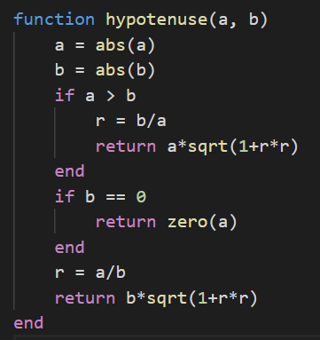

Julia的函数是映射一组参数值到返回值的对象（*别的编程语言函数不也是么*）。

Julia的函数不是纯粹数学方程，意思是函数会改变且受程序全局状态的影响。

Julia的函数基本定义语法如下：
```
julia> function fuck(male, female)
         println("$(male) fucks $(female) or $(female) fucks $(male)?")
       end
fuck (generic function with 1 method)
```

有种更简洁的Julia函数定义语法。上述传统函数声明语法演示等价于下述紧凑的“赋值形式”：
```
julia> kiss(male, female) = "$(male) pushes tongue down $(female)'s throat or $(female) pushes tongue down $(male)'s throat?"
kiss (generic function with 1 method)
```
这种赋值形式定义的Julia函数，函数体必须是单条表达式，尽管可以是【[混合表达式](./控制流.md "Control Flow - Compound Expressions")】。
Juia中短小精悍的函数定义如家常便饭。
这种简单函数语法相应地很符合习惯，显著减少输入和视觉干扰。

函数通过常规的圆括号语法调用：
```
# 书接上文
julia> fuck("alice", "bob")
alice fucks bob or bob fucks alice?

julia> kiss("alice", "bob")
"alice pushes tongue down bob's throat or bob pushes tongue down alice's throat?"
```

不带圆括号，表达式`fuck`、`kiss`引用函数对象，可以当作任何值一样传递：
```
julia> coitus = fuck
fuck (generic function with 1 method)

julia> pax = kiss
kiss (generic function with 1 method)
```

函数名像任何变量名一样，是可以用Unicode的：
```
julia> 操(男, 女) = "$(男) 操 $(女) 还是 $(女) 操 $(男)?"
操 (generic function with 1 method)

julia> 亲(男, 女) = "$(男) 把舌头塞进 $(女) 的嘴里还是 $(女) 把舌头塞进 $(男) 的嘴里?"
亲 (generic function with 1 method)

julia> 操("华安", "秋香")
"华安 操 秋香 还是 秋香 操 华安?"

julia> 亲("华安", "秋香")
"华安 把舌头塞进 秋香 的嘴里还是 秋香 把舌头塞进 华安 的嘴里?"
```

# 参数传递德行
Julia函数参数遵循有时称作“共享传递”的约定，这意味着传递到函数的参数值并没有做拷贝，而参数扮演的是新的变量绑定（引用参数值的新地址），所引用的值才是真正传入的东西，在修改可变值（如数组）参数，调用者也会看到。
共享传递在Scheme、Python、Ruby、Perl，大多数Lisp以及别的动态编程语言中很常见。

# `return`

函数的返回值默认是最后一个表达式的计算结果。
在C或别的命令式、函数式编程语言中，关键字`return`导致函数直接返回紧跟的表达式的计算结果。
```
julia> function beat(hero, heroine)
         return "$(hero) versus. $(heroine)"
         println("一山不容二虎——除非一公一母")
       end
beat (generic function with 1 method)
```

由于函数定义可进入交互式会话，对比这些定义很简单：
```
# 书接上文
julia> beat("jack", "rose")
"jack versus. rose"
```

当然，在一个纯线性函数体（如`beat`这样），运用`return`掷到点子上（不得要领），因为表达式`println("一山不容二虎——除非一公一母")`永远不被计算，省略`return`可以把`"$(hero) versus. $(heroine)"`放到最后一条。
结合控制流才是`return`真正的用武之地。
举个[栗子](https://github.com/JulialangOrgCN/howtojulia/blob/master/manual/functions.jl)，计算两条直角边长分别式`a`和`b`的直角三角形的斜边长`c`的函数避免溢出：



上述`hypotenuse`函数有三个可能的返回点，返回结果来自三个不同的表达式，取决于参数`a`和`b`的值。
最后一行的`return`可以省略，因为是最后一个表达式。

还可以在定义函数时用`::`操作符指定返回结果类型。
这将返回值转换成指定的类型。
```
julia> function ages(one, another)::Int8
         return one + another
       end
ages (generic function with 1 method)

# 爱情面前年纪不是问题（问题是钱）
julia> ages(66, 22)
88
```

这样`ages`函数总是返回`Int8`类型值，不论`x`或`y`的类型。
查看【[类型声明](./类型.md "Types - Type Declaratioins")】获取更多返回类型。

# 操作符即函数

猪吏大多数操作符就是特殊语法支持的函数。
*例外是带特殊计算语义如`&&`和`||`的操作符，这些操作符不可作函数是因为【[短路计算](./控制流.md "Control Flow - Short-Circuit Evaluation")】要求操作对象在操作符计算之前不能被计算。*
于是乎，群众可以把参数列表用圆括号包裹起来，把操作符当作任意别的函数那样用：
```
julia> 9527 + 1314 + 250
11091

julia> +(9527,1314,250)
11091
```

中缀形式恰好等价于函数应用形式——事实上前者解析为产生内部函数调用。
这意味着群众可以拿如`+`、`*`等操作符赋值，可以将之传递，就像别的函数值一样：
```
julia> add = +
+ (generic function with 163 methods)

julia> add(9527,1314,250)
11091
```
然而，以`add`命名的加函数（即`+`操作符）不支持中缀注解。
```
julia> 9527 add 1314 add 250
ERROR: syntax: extra token "add" after end of expression
```

# 有特殊名称的操作符

一小撮特殊表达式和调用*无明显名称（non-obvious name）*的函数是一致的。

|表达式|调用的函数|
|:---:|:---:|
|`[A B C ...]`|`hcat`|
|`[A;B;C; ...]`|`vcat`|
|`[A B; C D; ...]`|`hvcat`|
|`A'`|`adjoint`|
|`A[i]`|`getindex`|
|`A[i] = x`|`setindex!`|
|`A.n`|`getproperty`|
|`A.n = x`|`setproperty!`|

# 匿名函数

函数在Julia中式一等对象：可以赋值给变量，并按照标准函数调用语法调用所赋值的变量；可以当作参数；可以作为返回值。

可以创建没有函数名的匿名函数：
```
julia> x -> x^2 + 2x +1
#3 (generic function with 1 method)

julia> function (x)
         x^2 + 2x + 1
       end
#5 (generic function with 1 method)
```
这样就创建了带一个参数`x`返回值是`x^2+2x+1`（`(x+1)^2`）的函数。
注意到表达式结果是“generic function”（通用函数），但是带着*基于连续编号*的编译器产生名。

*TODO: 显然编译器产生名并不连续且不是从一开始。*

匿名函数最主要的应用是将其作为别的函数参数传递。
典型例子是`map`函数，应用函数到数组每个元素并返回包含结果的新数组：
```
julia> map(round, [9.527,95.27,952.7])
3-element Array{Float64,1}:
  10.0
  95.0
 953.0
```
如果一个有效转换（上述例程的四舍五入）的命名函数已经存在，作为第一个参数传递给`map·是没问题的。
然而，经常没有已经备好待用的函数。
这种情况下匿名函数概念允许简单创建无需名称的一次性（single-use）函数对象：
```
julia> map(x -> x^2+2x+1, [1,2,3,4,5,6,7,8,9,0])
10-element Array{Int64,1}:
   4
   9
  16
  25
  36
  49
  64
  81
 100
   1
```

接受多个参数的匿名函数定义：`(x,y,z) -> 3x+4y+5z`。

无参数匿名函数定义：`() -> 'egg'`。
没参数函数的想法似乎有些奇怪，但在“延迟计算”中很有用：将晚些调用的代码封装到一个无参数函数中。

# 元组

Julia中内建的称为“元组”的数据结构和函数参数及返回值密切相关。
一个元组就是能保存任何值得固定长度的容器，但*不能修改（回想共享传递对照Python的元组可知这个结论须做深入理解）*。
元组由逗号和圆括号构成，可以通过索引访问。

```
julia> (9527, "1314")
(9527, "1314")

julia> ans[1]
9527
```

- 一个元素的元组：("the lonely element"`,`)
- 空元组：()

## 命名元组

元组的成员能带可选的名称，成员带名称的元组：
```
julia> (9527, "1314")
(9527, "1314")

julia> ans[1]
9527
```

命名元组和元组非常相似，除了可以通过点操作符访问成员名称所引用的值。

# 多个返回值

Julia通过返回元组模拟返回多个值。
然而，元组可以无须圆括号地构建和解构，这里给出返回多个值、而非返回一个元组的示例。
```
julia> function nameparse(fullname)
         ming, shi, xing = split(fullname, ".")
         ming, shi, xing
       end
nameparse (generic function with 1 method)

julia> nameparse("Adullah.xiucai.Mohamed")
("Adullah", "xiucai", "Mohamed")
```
一旦调用、马上便知返回的是元组。

多个返回值的典型应用就是将每个返回元素抽取到对应变量，Julia支持简单元组解构来简化这一过程：
```
julia> haha, heihei, hehe = nameparse("Adullah.xiucai.Mohamed")
("Adullah", "xiucai", "Mohamed")

julia> haha
"Adullah"

julia> heihei
"xiucai"

julia> hehe
"Mohamed"
```

也可以用`return`显式返回多个值。

# 参数解构

解构特性也适用于函数参数：
```
julia> maxmin(x, y) = (x > y) ? (x, y) : (y, x)
maxmin (generic function with 1 method)

julia> distance((_max, _min)) = _max - _min
distance (generic function with 1 method)

julia> distance(maxmin(9527, 1314))
8213
```
特别要注意`distance`函数参数的一对内部圆括号，没有的话就认为`distance`有两个参数，则上例不能正常执行。

# 不定参数函数

写个接受任意个参数的函数通常是方便的，这种函数习惯上称作不定参数函数（VarArgs=Variable number of Arguments）。在参数列表的末尾增加省略号来定义不定参数函数：
```
julia> bar(a,b,andsoon...) = (a,b,andsoon)
bar (generic function with 1 method)

julia> bar(1,2)
(1, 2, ())

julia> bar(1,2,3)
(1, 2, (3,))

julia> bar(1,2,3,4,5,6,7,8,9,0)
(1, 2, (3, 4, 5, 6, 7, 8, 9, 0))
```
上述例程中`a`和`b`如常绑定前两个参数值，变量`andsoon`绑定绑定零到多个传递给`bar`函数的第三个（含）之后的参数可迭代集合。

任何情况下，变量`andsoon`都绑定传递给`bar`末尾的（第三个及其后的）参数元组。

可以约束传递给不定参数函数的参数个数，这会在稍后的【[参数受限的不定参数方法](./方法.md "Methods - Parametrically-constrained Varargs methods")】中讨论。

另一方面，把包含在一个可迭代集合的“一串”值作为每个函数调用参数是便捷的，也可以用省略号：
```
julia> arguments = (1,2,3,4,5,6,7,8,9,0)
(1, 2, 3, 4, 5, 6, 7, 8, 9, 0)

julia> bar(arguments...)
(1, 2, (3, 4, 5, 6, 7, 8, 9, 0))
```
再看几个例子：
```
# 书接前文
julia> function add(x, y)
         x + y
       end
add (generic function with 1 method)

julia> add(9527, 1314)
10841

julia> add((9527, 1314)...)
10841

julia> add(arguments...)
ERROR: MethodError: no method matching add(::Int64, ::Int64, ::Int64, ::Int64, ::Int64, ::Int64, ::Int64, ::Int64, ::Int64, ::Int64)
Closest candidates are:
  add(::Any, ::Any) at REPL[9]:2
Stacktrace:
 [1] top-level scope at none:0

julia> bar((1,)...)
ERROR: MethodError: no method matching bar(::Int64)
Closest candidates are:
  bar(::Any, ::Any, ::Any...) at REPL[2]:1
Stacktrace:
 [1] top-level scope at none:0

julia> bar((1,2)...)
(1, 2, ())
```
可见“平铺可迭代集合”作函数的各个参数，并未要求该函数必须是不定参数函数；但“可迭代集合”的元素至少要能覆盖可变参数变量之外的必备参数；若是不定参数函数，必备参数之外的则统统算入可变参数变量（元组），若非不定参数函数，必备参数之外的则报错（显式给定的参数个数不对）。

记住是**可迭代集合**，不仅仅是元组可平铺为不定参数函数各个参数。
```
julia> bar([1 2 3 4 5 6 7 8 9 0]...)
(1, 2, (3, 4, 5, 6, 7, 8, 9, 0))

julia> bar([1,2,3,4,5,6,7,8,9,0]...)
(1, 2, (3, 4, 5, 6, 7, 8, 9, 0))
```
数组亦可、横竖都可。

# 可选参数

很多场景中，函数参数带默认值，没必要每次调用都显式提供全部参数值。
举个例子，模块`Dates`中的`Date(y, [m, d])`函数，用给定的年（`y`）、月（`m`）、日（`d`）构建`Date`类型。然而月和日参数可选，默认是一。这副德行可用下面演示简明表达：
```
julia> function Date(y::Int64, m::Int64=1, d::Int64=1)
         err = validargs(Date, y, m, d)
         err === nothing || throw(err)
         return Date(UTD(totaldays(y, m, d)))
       end
Date (generic function with 3 methods)
```
注意到上述定义调用另一个带一个`UTInstant{Day}`类型参数的`Date`函数。

如此定义，该函数就可以以一个、两个、三个参数来调用，后两个参数若未显式提供，则取默认值一。
```
julia> using Dates

julia> Date(2000,1,1)
2000-01-01

julia> Date(2000,2)
2000-02-01

julia> Date(2000)
2000-01-01
```

**由于上述定义是标准库中的，直接在JuliaREPL或以脚本方式运行有问题，接下来将`Date`函数自定义化。**

```
using Dates
function Date(y::Int64, m::Int64=1, d::Int64=1)
    err = Dates.validargs(Dates.Date, y, m, d)
    err === nothing || throw(err)
    return Dates.Date(Dates.UTD(Dates.totaldays(y, m, d)))
end
```
或
```
julia> import Dates: validargs, totaldays, UTD, Date

julia> function date(y::Int64, m::Int64=1, d::Int64=1)
         err = validargs(Date, y, m, d)
         err === nothing || throw(err)
         return Date(UTD(totaldays(y, m, d)))
       end
date (generic function with 3 methods)

julia> date(2003, 12, 26)
2003-12-26
```
或
```
julia> import Dates: validargs, totaldays, UTD, Date

julia> function Date(y::Int64, m::Int64=1, d::Int64=1)
         err = validargs(Date, y, m, d)
         err === nothing || throw(err)
         return Date(UTD(totaldays(y, m, d)))
       end
Date

julia> Date(2003, 12, 26)
2003-12-26
```
提前透露几点：

- 包的引入；
- 同名函数重载。

可选参数实际上是编写带不同参数个数函数便捷语法（查看【[可选参数和关键字参数笔记](./方法.md "Methods - Note on Optional and keyword Arguments")】），调用`methods`函数即可检查`date`/`Date`函数样例。
```
julia> methods(date)
# 3 methods for generic function "date":
[1] date(y::Int64, m::Int64, d::Int64) in Main at REPL[8]:2
[2] date(y::Int64, m::Int64) in Main at REPL[8]:2
[3] date(y::Int64) in Main at REPL[8]:2
```
或
```
# 3 methods for generic function "Date":
[1] Date(y::Int64, m::Int64, d::Int64) in Main at D:\Important!\happy\howtojulia\manual\functions.jl:29
[2] Date(y::Int64, m::Int64) in Main at D:\Important!\happy\howtojulia\manual\functions.jl:29
[3] Date(y::Int64) in Main at D:\Important!\happy\howtojulia\manual\functions.jl:29
```

# 关键字参数

有些函数所需参数量巨大，或者说是套路很多。
记住这种函数如何调用有难度。
关键字参数让这类复杂接口的使用更简单并且扩展了以名称指定参数，而非只能用位置。

举个例子，考虑`plot`函数绘画一条线。
这个函数可能有需多选项，用于控制线条风格、宽度、颜色等等。
如果接受关键字参数，一种可能的调用方式`plot(x, y, z, width=2)`只有宽度可选。
注意这么写是出于两个目的：调用更容易阅读，可以用标签表达参数的含义；可以任何顺序传递大量参数的子集。

带关键字参数函数定义形式如下：
```
julia> function plot(x, y, z; style="solid", width=1, color="black")
         # do something
       end
plot (generic function with 1 method)
```
调用带关键字参数的函数时，分号是可选的。
不论`plot(x, y, z, width=2)`或`plot(x, y, z; width=2)`，前者风格更平常。
显式地分号只有随后所述的当传递可变参数或计算关键字参数时时必须的。

关键字参数默认值仅在必要时被计算（当对应的关键字参数未传递），并以从左到右的顺序。
因此，默认表达式会参考在先的关键字参数。

关键字参数的类型可显式声明如下：
```
julia> function niuer(;x::Int=1)
         # do something
       end
niuer (generic function with 1 method)
```

额外的关键字参数可用省略号收集，就像不定参数函数那样：
```
julia> function xiaosu(a, b;x::Int=1, kws...)
         # do something
       end
xiaosu (generic function with 1 method)
```

若方法定义中某关键字参数没有赋予默认值，且在调用时没有分配值，则抛出`UndefKeywordError`异常：
```
julia> function play(;boy, girl)
         println("$boy and $girl play play~")
       end
play (generic function with 1 method)

julia> play("bob", "alice")
ERROR: MethodError: no method matching play(::String, ::String)
Stacktrace:
 [1] top-level scope at none:0

julia> play(boy="bob", girl="alice")
bob and alice play play~

julia> play(boy="bob")
ERROR: UndefKeywordError: keyword argument girl not assigned
Stacktrace:
 [1] (::getfield(Main, Symbol("#kw##play")))(::NamedTuple{(:boy,),Tuple{String}}, ::typeof(play)) at .\none:0
 [2] top-level scope at none:0

julia> play(boy="bob", "alice")
ERROR: MethodError: no method matching play(::String; boy="bob")
Closest candidates are:
  play(; boy, girl) at REPL[9]:2
Stacktrace:
 [1] top-level scope at none:0

julia> play("bob", girl="alice")
ERROR: MethodError: no method matching play(::String; girl="alice")
Closest candidates are:
  play(; boy, girl) at REPL[9]:2
Stacktrace:
 [1] top-level scope at none:0
```

在`xiaosu`中`kws`将会是命名元组。

命名元组（也叫字典）可以当作关键字参数传递给函数：
```
# 书接前文
julia> roles = (boy="bob", girl="alice")
(boy = "bob", girl = "alice")

julia> xiaosu("a", "b"; x=9527, roles...)
```

群众还可以在分号后直接传递`key => value`表达式。
例如`plot(x, y, z; width=2`等价于`plot(x, y, z; :width=>2`。这在关键字参数名称在运行时才计算的情况挺有用。

关键字参数的天性使得多次指定相同参数是可能的。
比如`xiaosu("a", "b"; x=9527, options...)`调用中`optioins`结构中还包含了`x`。
这种情况下，最右边的关键字参数有效。
这个例子中`x`肯定有个`9527`的值，最终`x`是多少并不一定。
然而，显式地多次指定相同关键字参数语法上是不允许的。

# 默认值的计算范围

当可选参数和关键字参数默认值表达式被计算时，仅在先的参数在当前上下文中找。如下定义例子：
```
julia> b
ERROR: UndefVarError: b not defined

julia> function f(x,a=b,b=1)
        # do something
       end
f (generic function with 3 methods)

# 因为b没有被用到
julia> f("x")

julia> function f(x,a=b,b=1)
         println(a)
       end
f (generic function with 3 methods)

# 发现b没在环境中
julia> f("x")
ERROR: UndefVarError: b not defined
Stacktrace:
 [1] f(::String) at .\REPL[26]:2
 [2] top-level scope at none:0

# 试个狠的
julia> function huashan(south=east+58.7, west=east-13.6, east=middle+58.4, middle=east+423.8, east=1614)
         println("east=$east,west=$west,south=$south,north=$north,middle=$middle")
       end
ERROR: syntax: function argument names not unique
```

# 函数参数之干块（Do-Block）语法

把函数作为参数传递给别的函数是中强大的技术，但相应的语法不总是便捷的。
当函数参数必须多行时，这种函数调用写起来特别尴尬。
举个例子，考虑`map`若干情况的函数：
```
julia> map(x->begin
         if x<0 && iseven(x)
           return 0
         elseif x==0
           return 1
         else
           return x
         end
       end,
       [-1,2,-3,4,-5,6,7,-8,9,0])
10-element Array{Int64,1}:
 -1
  2
 -3
  4
 -5
  6
  7
  0
  9
  1
```
Julia提供保留字`do`用于更清晰地书写此类代码：
```
julia> map([-1,2,-3,4,-5,6,7,-8,9,0]) do x
         if x<0 && iseven(x)
           return 0
         elseif x==0
           return 1
         else
           return x
         end
       end
10-element Array{Int64,1}:
 -1
  2
 -3
  4
 -5
  6
  7
  0
  9
  1
```

上述`do x`语法创建一个匿名函数，带一个参数`x`并作为第一个参数传递给`map`函数。
同理`do a,b`将创建带两个参数的匿名函数，一个朴素的`do`将声明紧随其后的是一个形式为`() -> ...`的匿名函数。

这些参数如何被初始化取决于外部函数；这里`map`将依次设置`x`为`-1,2,-3,4,-5,6,7,-8,9,0`并各自调用匿名函数，正如`map(function, [-1,2,-3,4,-5,6,7,-8,9,0]`所发生的一样。

该语法令运用函数高效扩展编程语言更容易，因为函数调用看起来像正常代码块。
有很多和`map`完全不同的可用点，如管理系统状态。
举个例子，有种确保被打开的文件最终被关闭的执行`open`函数的代码版本：
```
julia> open("D:\\Important!\\happy\\howtojulia\\manual\\eventually-closed-open.out", "w") do io
         write(io, "eventually closed open.")
       end
23
```
*结果看[这里](https://github.com/JulialangOrgCN/howtojulia/blob/master/manual/eventually-closed-open.out)。*

上述代码可按如下定义熟练完成：
```
julia> import Base: open

julia> function open(f::Function, args...)
         io = open(args...)
         try
           f(io)
         finally
           close(io)
         end
       end
open (generic function with 8 methods)

julia> open((io)->write(io, "traditionally try open finally close."), "D:\\Important!\\happy\\howtojulia\\manual\\eventually-closed-open.out", "a")
37
```
这里的`open`首先以打开文件以备写入，接着将结果输出流传递给`do ... end`定义的匿名函数，在匿名函数退出后，确保流被正确关闭，无论匿名函数正常退出还是抛出异常（有关`try/finally`结构将在【[控制流](./控制流.md "Control Flow")】中描述）。

用`do`块语法，碰巧有助检查文档或实现以了解用户自定义函数参数如何初始化。

一个`do`块，像任何别的内部函数一样，可以捕捉其闭包范围内的变量。比如可以将上述例程中写入的数据用`data`替代，而`data`则会从外部范围中捕捉。
被捕捉的变量会产生性能挑战，如【[性能窍门](./性能窍门.md "Performance Tips")】所讨论的。

# 用于向量化函数的点语法

在技术计算编程语言中，拥有向量化函数版本司空见惯，简单地将给定函数应用在数组每个元素并产生新的数组。这种语法对于数据处理很便捷，但在别的编程语言向量化也经常是性能所必须的：如果循环慢，函数的向量化版本能够快速调用别的低级语言缩写的库。
在Julia中，向量化函数并非性能所必须的，编写用户自己的循环的确经常受益（参考【[性能窍门](./性能窍门.md "Performance Tips")】），但任然便捷。因此，任何Julia函数可以用点语法逐元素地应用到任何数组。

举例说明：
```
julia> A = [1.0, 2.0, 3.0, 4.0, 5.0, 6.0, 7.0, 8.0, 9.0, 0.0]
10-element Array{Float64,1}:
 1.0
 2.0
 3.0
 4.0
 5.0
 6.0
 7.0
 8.0
 9.0
 0.0

julia> sin.(A)
10-element Array{Float64,1}:
  0.8414709848078965
  0.9092974268256817
  0.1411200080598672
 -0.7568024953079282
 -0.9589242746631385
 -0.27941549819892586
  0.6569865987187891
  0.9893582466233818
  0.4121184852417566
  0.0
```
当然，如果写一个特殊的向量方法，就可以省略点。
比如令`f(A::AbstractArray) = map(f, A)`则跟`f.(A)`效果相同。
但前者要求用户提前决定要向量化哪个函数。

更一般地，`f.(args...)`实际上等价于`broadcast(f, args...)`，这允许操作多个数组（即使形状不同），或数组和标量地混合（查看【[广播](./多维数组.md "Multi-dimensional Arrays - Broadcasting")】）。
举个例子，如果有`f(x, y) = 3x + 4y`，则`f.(pi, A)`将返回由`A`的每个成员`a`的`f(pi, a)`组成的新的数组，则`f.(vectorx, vectory)`将返回由每个索引`i`的`f(vectorx[i], vecotry[i])`组成的新向量（当向量长度不同则报异常）。

```
julia> f(x, y) = 3x + 4y
f (generic function with 1 method)

julia> A = [9527.0, 1314.0]
2-element Array{Float64,1}:
 9527.0
 1314.0

julia> f.(pi, A)
2-element Array{Float64,1}:
 38117.42477796077
  5265.4247779607695

julia> vectorx = [1.0,2.0,3.0,4.0,5.0]
5-element Array{Float64,1}:
 1.0
 2.0
 3.0
 4.0
 5.0

julia> vectory = [6.0,7.0,8.0,9.0,0.0]
5-element Array{Float64,1}:
 6.0
 7.0
 8.0
 9.0
 0.0

julia> f.(vectorx, vectory)
5-element Array{Float64,1}:
 27.0
 34.0
 41.0
 48.0
 15.0
```

此外，嵌套`f.(args...)`调用融入单个`broadcast`循环。
举个例子，`sin.(cos.(X))`等价于`broadcast(x -> sin(cos(x)), X)`，和`[sin(cos(x)) for x in X]`相似：只在`X`遍历一通，并分配一个结果数组。
相反地，在典型地向量化编程语言中`sin(cos(X))`会首先分配一个临时数组`tmp=cos(X)`然后在单独的循环中计算`sin(tmp)`分配第二个数组。
该循环融合不是能或不能发生的编译器优化，是语法级保证，无论何时碰到`f.(args...)`嵌套调用。
技术上说，该融合当碰到非点函数调用时停止；例如在`sin.(sort(cos.(X)))`中`sin`和`cos`循环不能合并，因为`sort`函数的介入。

最后，当向量化操作的输出数组是预先分配好的时，是典型地最高效实现，这样一来重复调用不会为结果再三反复分配新数组（见【[预分配输出](./性能窍门.md "Performance Tips - Pre-allocating outputs")】。
一种便捷的语法是`X .= ...`，等价于`broadcast!(identity, X, ...)`，除上述外，该`broadcast!`循环融合任何嵌套点调用。
例如`X .= sin.(Y)`等价于`broadcast!(sin, X, Y)`，用`sin.(Y)`就地替换`X`。如果左边是数组索引表达式，如`X[2:end] .= sin.(Y)`，然后转化成`broadcast!`在一个`view`上，如`broadcast!(sin, view(X, 2:lastindex(X)), Y)`，以便左边就地被更新。

由于在一个表达式中给许多操作符和函数调用添加点会冗长且导致代码难以读懂，提供宏操作符`@`把表达式中每个函数调用、操作和赋值转化成“点版本”。
```
julia> Y = [9.0 5.0 2.0 7.0]
1×4 Array{Float64,2}:
 9.0  5.0  2.0  7.0

julia> X = similar(Y)
1×4 Array{Float64,2}:
 7.09917e-316  1.1362e-315  1.13636e-315  1.13654e-315

julia> @. X = sin(cos(Y))
1×4 Array{Float64,2}:
 -0.790197  0.279873  -0.404239  0.684489
```
二元或一元操作符如`.+`以同样机制处理：这些等价于`broadcast`调用，和别的嵌套点调用融合。`X .+= Y`等和`X .= X .+ Y`等价，产出融合的就地赋值结果，在【[点操作符](./算术操作符和基本函数.md "Mathematical Operations and Elementary Functions")】处亦可见。

如下例所示，还可以将点操作和函数链（通过`|>`操作符）结合：
```
# 五个元素的列向量
# 平方、逆矩阵、两倍、取负、是奇数否
julia> [1:5;] .|> [x->x^2, inv, x->2*x, -, isodd]
5-element Array{Real,1}:
    1
    0.5
    6
   -4
 true
```
*TODO: 为何去掉任何一个函数过程都报错？*

大家必须说至此离完整的函数定义图还很远。
Julia拥有复杂的类型系统并允许参数类型重载。
本文给出的例程基本都没有参数类型注解，意味着适用全部参数类型。
类型系统在【[类型](./类型.md "Types")】中讲解，按照运行时类型重载选择的方法定义一个函数，见【[方法](./方法.md "Methods")】中的描述。

---
# 译后感

- 至点嵌套混合单行或匿名函数语法及其复杂，尽管功能强大。
