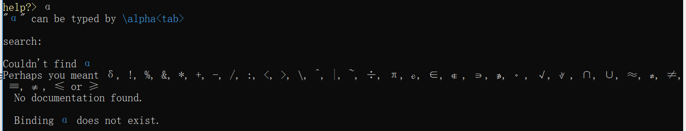
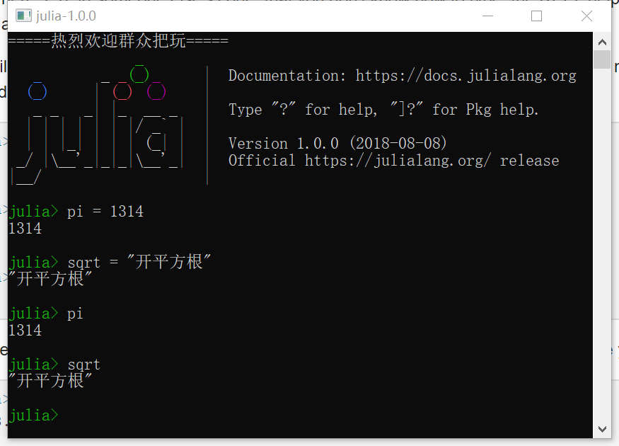
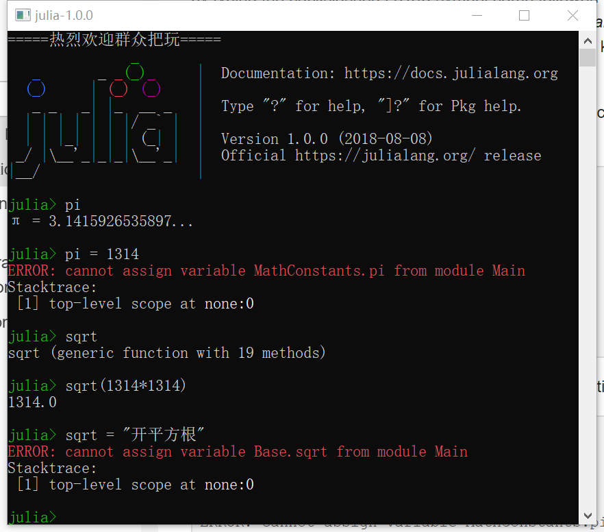
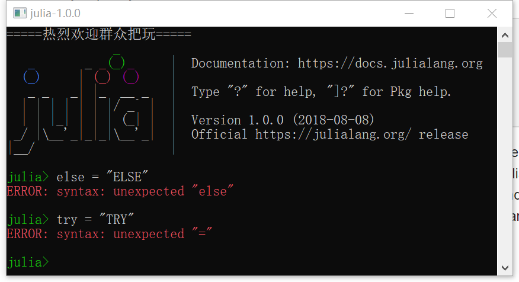

茱莉亚中的变量，就是关联或绑定一个值的名称（*讲的真好——貌似全世界的语言都是这样吧*）。
当群众想保存诸如某些数学计算得出的值以备后用时，变量很有用。

举个栗子：

```
# 把值9527赋给变量huaan
julia> huaan = 9527

# 把huaan的值用数学计算折腾一番
julia> huaan + 1314
10841

# 给huaan重新赋值
julia> huaan = 1 + 1
2

# 还可以给huaan变型，整个文本啥的
julia> huaan = "秋香姐，今晚三更、池塘边柳树下、不见不散！"
"秋香姐，今晚三更、池塘边柳树下、不见不散！"

# 顺便试了下“唐伯虎”的人品（后边再专门得瑟）
julia> 唐伯虎 = "桃花坞裏桃花庵，桃花庵裏桃花仙。桃花仙人种桃树，又折花枝当酒钱。"
"桃花坞裏桃花庵，桃花庵裏桃花仙。桃花仙人种桃树，又折花枝当酒钱。"
```

主力为变量命名提供及其灵活的系统。

变量名称大小写敏感（区分大小写），无语义含义（也就是说Julia不会根据变量名称区别对待）。

```
julia> tangyin = 2.0
2.0

julia> qiuxiang = -250
-250

julia> QuiXiang = 250
250

julia> ShiLiuJie_WuZhuangYuan = "天生一对！"
"天生一对！"
```

**统一字符编码（Unicode）名称（均以UTF-8字符编码）也是可以的。**

还记得刚才得瑟的“唐伯虎”么？

```
julia> δ = 0.00001
1.0e-5

julia> 당백호, 당백호 = "唐さま"
"唐さま"
```

在Julia REPL和若干别的猪吏编辑环境，群众可以通过输入“反斜杠加LaTeX符号名称、水平制表符号（Tab）”来表达Unicode数学符号。

举一筐栗子（尝试输入下）：

```
\delta<Tab> ---> δ
\alpha<Tab>\hat<Tab>\_2<Tab> ---> α^2
```

**弱（若）群众碰到一些不知道如何输入的字符，在Julia REPL中输入“?”并粘贴该符号就能得到答案。**



猪吏甚至允许群众重新定义内建常量和函数，如有必要；尽管不推荐这么玩儿，以避免潜在的混乱。

```
julia> pi = 1314
1314

julia> pi
1314

julia> sqrt = "开平方根"
"开平方根"
```



*大家思考下图所示的报错。*



没错，如果群众想重新定义猪吏已经使用的内建常量或函数，猪吏毫不留情地惩罚群众的错误。

# 允许的变量名

**马上进入字符编码高能区域，非该领域专业人士无须深究，群众按别的编程语言的标识符命名要求来写猪吏代码可保无忧。**

- 必须以英文字母（[A-Z|a-z]）、下划线（_）或大于“00A0”的Unicode码点开头；
  - 若是[Unicode字符种类](http://www.fileformat.info/info/unicode/category/index.htm)，一段专业的说法：【Lu/LI/Lt/Lm/Lo/NI（字母），Sc/So（货币或别的符号），少许类似字母的字符（如Sm数学符号的一个子集）】都是可以的。
- 之后的字符还可以包含感叹号（英文半角）和数字（[0-9]和Nd/No范畴的一些字符），别的Unicode码点：音标符号（diacritics）、修改标记（Mn/Mc/Me/Sk），某些标点连接符号（Pc），撇号（primes）和少许别的字符。

- 在某些上下文，操作符号可像变量一样被使用。例如加号（+）也是有效的标识符，但会被特殊解析，把加号（+）重新赋值为一个函数（(+) = f）。

- 大多数Unicode中缀（infix）操作符号（在Sm范畴），如“⊕”也可用于群众自定义的方法。

    可以通过“const ⊕ = kron”定义“⊕”是【克罗内克积（[kronecker product](https://en.wikipedia.org/wiki/Kronecker_product)）】中缀。

- 操作符号也可以带修改标记、撇号（primes）、上下标（如“+^ₐ"”）前缀，被解析为和加号（+）优先级相同的中缀（infix）。

- 唯一明确禁止的名称就是内建声明。



- 某些Unicode字符可认为和标识符等价，录入Unicode组合字符（如重音符号（accents））的不同方式一视同仁，明确地讲（早说嘛），Julia标识符合乎NFC标准。

    统一字符编码“ɛ（U+025B：拉丁小写开口e）”和“µ（U+00B5：微标志）”被当作等价的希腊字母，因为某些输入方法容易理解前者（稀里糊涂落槌计）。

# 编码风格（文体约定（Stylistic Conventions））

虽然Julia没有给有效标识符强加限制，实践证明接受如下约定是有用的：

- 变量名小写；
- 单词分隔可用下划线（_）指明，但不鼓励滥用下划线，除非很难读懂（必须分隔）；
- 类型名和模块名以大写字母开始，单词分隔用大驼峰而非下划线；
- 函数名和宏名是小写，不用下划线；
- 更改参数的函数名以感叹号（!）结尾，有时也称为“变异（mutating）函数”或“就地（in-place）函数”，因其被调用后不仅返回值，还会对参数产生更改。

更多详情参考【[风格指南](./风格指南.md "Style Guide")】。

---
# 译后感

- 较Python等语言好在一个开始就很好的解决了Unicode字符兼容。
