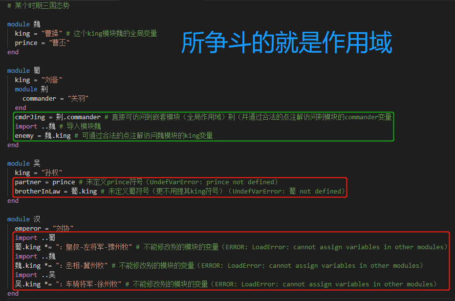
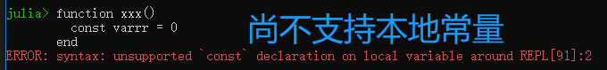

变量的作用域就是“一个变量可见的代码区域”。
变量作用域有助于避免变量名冲突。
这个概念可想而知（intuitive）：两个函数都可以有名为`x`的参数、没有`x`引用的相同对象。
同理，有很多别的情况，不同代码块用想相同名字，引用不同对象。
什么时候相同变量名引用相同对象、什么时候相同变量名引用不同对象的规则，就是作用域规则。
本文详述该规则。

编程语言中特定结构引入作用域块，就是适合做某变量集的作用域的代码区域。
变量的作用域不是源代码行任意集合；相反，总是这些代码块的某些行。
在Julia中有两种主要的作用域类型：全局（`global`)和本地（`local`），后者可嵌套。

介绍作用域块的概念有：

- 仅在新的（别的）全局作用域块中可嵌套的作用域
  - 全局
    - 模块、裸模块（baremodule）
    - 在交互式命令提示符中（REPL）
  - 本地（不允许嵌套）
    - （可变对象）结构体（struct），宏（macro）
- 可任意嵌套的作用域块（全局或本地）
  - 本地
    - `for`、`try-catch-finnaly`、`let`
    - 函数（不论语法、匿名或干块）
    - 解析（comprehension），广播融合（broadcast-fusing）

尤其是表中缺失的【[`begin`块和`if`块](./控制流.md "Control Flow")】并不引入新的作用域块。
这两种控制流的作用域类型复合有点不同的规则，后边会解释到。

Julia采用[词法作用域](https://en.wikipedia.org/wiki/Scope_%28computer_science%29#Lexical_scoping_vs._dynamic_scoping)，意思是函数的作用域不是继承自主调者的作用域的，而是函数自己定义的作用域。
例如下面的代码，函数`sb`引用其模块`Bar`全局作用域中的`x`变量：
```
julia> module Bar
         x = 9527
         sb() = x
       end
Main.Bar
```
而**不是调用`sb`时主调者上下文中的`x`变量**：
```
# 书接上文
julia> Bar.sb()
9527

julia> x = 1314
1314

julia> Bar.sb()
9527
```
因此此法作用域意味着变量的作用域可根据源代码单独推测出来。

# 全局作用域

每个模块引入一个新的全局作用域，和别的任何模块的全局作用域隔离；没有包罗万象的全局作用域。
模块能够将别的模块的变量引入自己的作用域，通过【[`using`或`import`](./模块.md "Modules")】声明或以合法的点注解（也就是每个模块所谓的命名空间）访问。
注意变量绑定智能在其全局变量内改变，在外部模块中无法修改。

如[例](https://github.com/JulialangOrgCN/howtojulia/blob/master/manual/scope-of-variables.jl)：



注意交互式提示符（即JuliaREPL）在模块`Main`的全局作用域。

# 本地作用域

大多数代码块都引入新的本地作用域。
本地作用域继承亲级本地作用域中的全部变量，读写均可。
此外，本地作用域作用域继承所有分配到亲代全局作用域块（如果被全局`if`或`begin`作用域包围）的全局作用域。
不同于全局作用域，本地作用于不是命名空间，因此一个内部作用域不能通过某些合法的（点注解）访问从亲代作用域中检索到。

下面规则和例程适合本地作用域。
在本地作用域中新建的变量不会反向传播到亲代作用域中。
例如`z`不会引入到顶层作用域。
```
julia> for i = 1:3
         z = i
       end

julia> z
ERROR: UndefVarError: z not defined
```
注意，这个例子和之后所有的例子都假定顶层全局作用域是干净的工作空间，启动一个新的JuliaREPL那样。

**顶层作用域不是`Main`作用域。**
```
julia> x = 9527
9527

julia> Main.x
9527

julia> Main.x = 1314
ERROR: cannot assign variables in other modules
Stacktrace:
 [1] setproperty!(::Module, ::Symbol, ::Int64) at .\sysimg.jl:14
 [2] top-level scope at none:0
```

在本地作用域中，一个变量可以强制为一个新的本地变量，用`local`关键字。
```
julia> x
9527

julia> for i = 1:3
         local x # 强制x为本地变量（否则会引用外部定义的）
         println(x + i)
       end
ERROR: UndefVarError: x not defined
Stacktrace:
 [1] top-level scope at .\REPL[8]:3 [inlined]
 [2] top-level scope at .\none:0
```

在本地作用域中，一个变量可以用`global`关键字分配（赋值）。

*并强制为全局变量*。
```
julia> for i = 1:3
         global z
         z = i
       end

julia> z
3

julia> x
9527

julia> for i = 1:3
         global x
         x = i # 修改全局变量x的值
       end

julia> x
3
```

关键在`local`和`global`在作用域块中的位置都无关紧要。
下面例子和上边例子等价，尽管文法上略差。
```
julia> for i = 1:3
         zz = i
         global zz # 将本地变量zz强制为全局变量
       end

julia> zz
3
```
*TODO: 关于本离还有更有趣的探索，可以验证Julia是按行执行（第一次执行`zz = i`时`zz`商未声明全局）否；可以验证Julia符号声明优化（每次迭代都要`global zz`才更新全局）否。*

关键字`local`和`global`还可用来解构赋值，例如`local x, y = 9527, 1314`，该例中关键字影响所有列出的变量。

大多数块关键字都引入本地作用域，显然除了`begin`和`if`控制流。

在一个本地作用域，所有变量继承自亲代全局作用域块，除非：

- 被修改的`global`变量导致的赋值；
- 明确以`local`标记的变量。

因此，全局变量只能以读的方式继承，而不能写。
```
julia> x, y = 9527, 1314
(9527, 1314)

julia> function nb()
         x = 250 # 通过赋值引入新的本地变量
         return x + y # 这里的y引用全局的（外部定义的）
       end
nb (generic function with 1 method)

julia> nb()
1564

julia> x
9527
```

给全局变量赋值，必须显式的`global`关键字。
```
# 书接上文
julia> function nb()
         global x
         x = 250
       end
nb (generic function with 1 method)

julia> nb()
250

julia> x
250
```

**避免全局**：避免修改全局变量的值被需多编程语言认为是优秀实践。
一个理由是远程改变别的模块中的全局变量的状态务必小心，因为这使程序的本地行为难以推测。
这就是需要`global`关键在声明修改全局变量意图的原因。

注意：**嵌套函数能够修改亲代作用域的本地变量**。
```
julia> x, y = "qiuxiang", "huaan"
("qiuxiang", "huaan")

julia> function biz()
         x = "1314" # 本地变量
         function bar()
           x = "9527" # 修改外部本地变量
           return x * y
         end
         return bar() * x # "9527" * "huaan" * "9527"
       end
biz (generic function with 1 method)

julia> biz()
"9527huaan9527"

julia> x, y # 全局变量并未改变
("qiuxiang", "huaan")
```

允许嵌套函数中修改亲作用域的本地变量的动机是为构建`closures`（闭包），闭包持私有状态，举个栗子，下述代码中`state`变量。
```
julia> let state = 0
         global counter() = (state += 1)
       end
counter (generic function with 1 method)

julia> counter()
1

julia> counter()
2
```

看接下来两部分的示例。
第一个栗子中的变量`x`和第二个例子中内部函数继承自闭包作用域的变量`state`有时称作捕获变量。
捕获变量能呈现性能挑战，在【[性能窍门](./性能窍门.md "Performance Tips")】中讨论。

继承全局作用域和嵌套本地作用域的区别，会导致本地定义的函数间一些轻微的差异，对比全局作用域的变量赋值。
注意最后一个栗子的变更：将`bar`函数转移到全局作用域。
```
julia> x, y = 9527, 1314
(9527, 1314)

julia> function bar()
         x = 250 # 不再是闭包变量（而是本地变量）
         return x + y
       end
bar (generic function with 1 method)

julia> function biz()
         x = 3 # 本地变量
         return bar() + x # (250 + 1314) + 3
       end
biz (generic function with 1 method)

julia> biz()
1567

julia> x, y # 全局变量并未改变
(9527, 1314)
```

注意：**上述嵌套规则不适合类型和宏定义**，因为这些只能出现在全局作用域。
就【[函数](./函数.md "Functions")】中讨论的默认参数和关键字参数的计算，尤其特殊作用域规则。

一个函数、类型或宏定义中用赋值引入一个变量，不能早于内部使用之前出现（*这句英文太啰嗦反而晦涩*）。
```
julia> f = x -> x + offset
#4 (generic function with 1 method)

julia> f(9527)
ERROR: UndefVarError: offset not defined
Stacktrace:
 [1] (::getfield(Main, Symbol("##4#5")))(::Int64) at .\REPL[25]:1
 [2] top-level scope at none:0

julia> offset = 1314
1314

julia> f(9527)
10841
```

这种玩儿法对常规变量似乎是奇怪的，但允许用于具名函数（相对匿名函数），只是持有函数对象的普通变量，在定义之前使用。
这允许函数以任何顺序定义，直观、便捷，而不是自底而上地顺序或要求提前声明，需要调用时再定义。
为了说明该特性，举个低效、互递归的测试整数值奇偶的方法：
```
julia> even(n) = n == 0 ? true : odd(n - 1)
even (generic function with 1 method)

julia> odd(n) = n == 0 ? false : even(n - 1)
odd (generic function with 1 method)

julia> even(9527)
false

julia> odd(1314)
false
```

Julia提供了内建的、高效的判断奇偶的`iseven`和`isodd`函数，上述栗子仅仅是为了说明作用域，而非实效设计。

## 令（`let`）块

和给本地变量赋值不同，令（`let`）声明每次执行都分配新的变量绑定。
赋值修改已存在值的地址，而`let`创新新地址。
这点儿区别通常并不重要，只在通过闭包超作用域存活变量的情况下可检测到。
接受逗号分隔系列赋值和变量名。
```
julia> x, y, z = -1, -1, -1
(-1, -1, -1)

julia> let x = 9527, z
         println("x: $x") # 本地变量
         println("y: $y") # 全局变量
         println("z: $z") # 没有定义
       end
x: 9527
y: -1
ERROR: UndefVarError: z not defined
Stacktrace:
 [1] top-level scope at REPL[38]:4
```

赋值语句按顺序执行，先右后左。
因此写成`let x = x`是讲得通的，因为两个`x`变量完全不同，有各自的存储。
举个需要`let`这种特性的栗子（一定要炒熟否则拉稀）：
```
julia> Fs = Vector{Any}(undef, 2)
2-element Array{Any,1}:
 #undef
 #undef

julia> i = 1
1

julia> while i<= 2
         Fs[i] = () -> i
         global i += 1
       end
```
*提前透露任意未定义占位参数`undef`啦。*
执行`Fs`中的各个成员（都是单行函数）：
```
# 书接上文
julia> Fs[1]
#6 (generic function with 1 method)

julia> Fs[2]
#6 (generic function with 1 method)

julia> Fs[1]()
3

julia> Fs[2]()
3
```
这里创建并保存两个返回变量`i`的闭包。
然而，总是相同的`i`变量，因此两个闭包动作一致。
可以用`let`为`i`创新新的绑定。
```
# 书接上文
julia> i = 1
1

julia> while i <= 2
         let i = i
           Fs[i] = () -> i
         end
         global i += 1
       end

julia> Fs[1]()
1

julia> Fs[2]()
2
```

由于`begin`结构不引入新的作用域，运用零参数`let`不创建新绑定只是引入新的作用域块挺有用。
```
julia> let
         local x = 9527 # 默认就是本地变量
         let
           local x = 1314 # 默认就是本地变量
         end
         x
       end
9527
```
因为`let`引入新的作用域块，内部本地变量`x`和外部本地变量`x`是不同的变量。

## 缶（`for`）循环和解析（comprehension）

咳~`for`、`while`循环和【[多维数组](./多维数组.md "Multi-dimensional Arrays - Comprehensions")】有如下德行：在其循环（解析）体作用域引入的任何新变量在每个迭代重新分配，犹如循环（解析）体被`let`块包围。
```
# 书接上文
julia> for j = 1:2
         Fs[j] = () -> j
       end

julia> Fs[1]()
1

julia> Fs[2]()
2
```

解析或`for`循环的迭代变量总是新变量：
```
julia> function funny()
         i = 0
         for i = 1:3
         end
         return i
       end
funny (generic function with 1 method)

julia> funny()
0
```
然而，偶尔复用已存在的变量作为迭代变量是有用的，添加`outer`关键字可方便地实现。
```
julia> function punny()
         i = 0
         for outer i = 1:3
         end
         return i
       end
punny (generic function with 1 method)

julia> punny()
3
```

# 常量

变量的一种常用方式作为指定的、不可更改的值的名称。
这类变量只赋值一次。
这个意图可以用`const`关键字传递给编译器。
```
julia> const WebsiteOfAuthor = "www.nagexiucai.com"
"www.nagexiucai.com"

julia> const WebsiteOfJulialangOrgCN = "julialang.org.cn"
"julialang.org.cn"

julia> const huaan, qiuxiang = "华安", "秋香"
("华安", "秋香")
```
多个变量可以在一行用`const`声明为常量。

常量声明必须用在全局资源的全局作用域。
编译器优化包括全局变量的代码有困难，因为这些全局变量的值（甚至类型）可能在任何时候改变。
如果一个全局变量不会改变，添加`const`声明解决该性能问题。

本地常量大相径庭（quite different）。
编译器能自动检测到本地的`const`变量，因此**本地常量**声明不是必须的，实际上**目前不支持**。



特殊的顶层赋值，如由函数（`function`）和结构体（`struct`）关键字所执行的，默认是常量。

注意`const`只影响变量的绑定；变量可能绑定到多个对象（如数组），该对象还是可被修改的。
此外，当尝试给声明为`const`的变量赋值，可能有以下情节（scenarios）：

- 若新值和原值类型不同则抛错
  ```
  julia> const tangyin = 9527
  9527

  julia> tangyin = "bohu"
  ERROR: invalid redefinition of constant tangyin
  Stacktrace:
  [1] top-level scope at none:0
  ```
- 若新值和原值类型相同则告警
  ```
  julia> const tangyin = 9527
  9527

  julia> tangyin = 1314
  WARNING: redefining constant tangyin
  1314
  ```
- 若赋值不改变变量则保持沉默
  ```
  julia> const tangyin = 9527
  WARNING: redefining constant tangyin
  9527

  julia> tangyin = 9527
  9527
  ```

最后一条规则主要用于不可变对象，即使变量绑定会变化，例如：
```
julia> const s = "string"
"string"

julia> ss = "string"
"string"

julia> s = ss # 沉默地接受不可变`const`对象被“字面无差别”修改
"string"

julia> const sarray = ["string"]
1-element Array{String,1}:
 "string"

julia> ssarray = ["string"]
1-element Array{String,1}:
 "string"

julia> sarray = ssarray # 告警地接受可变对象被“字面无差别”修改
WARNING: redefining constant sarray
1-element Array{String,1}:
 "string"

# 不要说话（体会）
julia> const tangbohu = "唐伯虎"
"唐伯虎"

julia> nagexiucai = "那个秀才"
"那个秀才"

julia> pointer.([tangbohu, nagexiucai])
2-element Array{Ptr{UInt8},1}:
 Ptr{UInt8} @0x00000000108f4578
 Ptr{UInt8} @0x000000001090cfb8

julia> tangbohu = nagexiucai
WARNING: redefining constant tangbohu
"那个秀才"

julia> pointer.([tangbohu, nagexiucai])
2-element Array{Ptr{UInt8},1}:
 Ptr{UInt8} @0x000000001090cfb8
 Ptr{UInt8} @0x000000001090cfb8

julia> tangbohu = "那个秀才"
"那个秀才"

julia> pointer.([tangbohu, nagexiucai])
2-element Array{Ptr{UInt8},1}:
 Ptr{UInt8} @0x0000000010341c98
 Ptr{UInt8} @0x000000001090cfb8

julia> tangbohu = "那个秀才"
"那个秀才"

julia> pointer.([tangbohu, nagexiucai])
2-element Array{Ptr{UInt8},1}:
 Ptr{UInt8} @0x0000000010258358
 Ptr{UInt8} @0x000000001090cfb8

julia> nagexiucai = tangbohu
"那个秀才"

julia> pointer.([tangbohu, nagexiucai])
2-element Array{Ptr{UInt8},1}:
 Ptr{UInt8} @0x0000000010258358
 Ptr{UInt8} @0x0000000010258358
```

注意，尽管只是告警，仍然不鼓励修改`const`变量的做法。
举个例子，如果一个方法引用一个修改之前已经编译号的常量，则会保持引用旧常量值。
```
julia> const julia = "julia"
"julia"

julia> whoami() = julia
whoami (generic function with 1 method)

julia> shadow() = julia
shadow (generic function with 1 method)

# 修改`const`变量之前的调用
julia> whoami()
"julia"

julia> julia = "A programming language based on OpenBLAS&SuiteSparse&GMP&MPFR&LibUV&LLVM and so on."
WARNING: redefining constant julia
"A programming language based on OpenBLAS&SuiteSparse&GMP&MPFR&LibUV&LLVM and so on."

# 修改`const`变量之后的调用
julia> whoami()
"julia"

# 体会
# 修改`const`变量之前的没有调用过
julia> shadow()
"A programming language based on OpenBLAS&SuiteSparse&GMP&MPFR&LibUV&LLVM and so on."
```

---
译后感

- 中规中矩。
