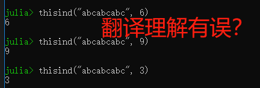

字符串是有限字符序列。

当然，真正的问题是字符是什么。

对于讲英语的人来说，字符就是a、b、c等字母，包括数字和通用标点符号。这些字符已经一起标准化地对应[ASCII](https://en.wikipedia.org/wiki/ASCII)的0到127的整数值。

诚然，在非英语语言中，有很多别的字符，包括ASCII的变体（带重音或别的修改），相关的书写字母包括（古）斯拉夫字母和希腊字母；还有与ASCII及英语完全无关的书写字母，摆阔阿拉伯文、中文、希伯来文、北印度文、日文、韩文或朝鲜文。

统一字符编码标准（[Unicode](https://en.wikipedia.org/wiki/Unicode)）处理一个字符究竟是什么的复杂性，并被普遍接受作为决定性标准解决该问题。

根据码农自身需要，可以完全不屌（忽略）这些琐碎，假装只存在ASCII字符，也可以写代码搞定（处理或编码）可能碰到的任何非ASCII字符。

猪吏让收拾简单ASCII文本简单且高效，对付Unicode文本则尽可能简单高效。
特别是，群众可以写C风格字符串代码来处理ASCII字符串，会如期运转，不论性能和语义都俱佳。
若是碰到非ASCII文本，会以很迎人（graceful）的清晰的错误信息告失败，而不是默默堕落收场。
如果碰到这种情况，端直修改代码处理非ASCII字符数据。

有些值得注意的和Julia字符串相关的高级特性：

- Julia定义了`String`作为字符串内建具体类型。这以[UTF-8](https://en.wikipedia.org/wiki/UTF-8)字符编码支持整个Unicode字符，还有个`transcode`函数来做Unicode不同字符编码之间的转换。
- Julia中所有字符串类型都是`AbstractString`的子类，外部包定义额外的AbstractString的字类（比如对于别的字符编码）。如果群众定义一个函数想带有一个字符串参数，可以把该参数声明为AbstractString以接受任意字符串类型。
- 和C/Java一样，但不同于大多数动态编程语言，Julia有个一等类来表示单个字符，叫做`AbstractChar`。内建的`Char`是AbstractChar的字类，是个32位的原始类型，能够表达任意Unicode字符（当然是基于UTF-8字符编码的）。
- 像Java中一样，字符串是不可变的：AbstractString对象的值是不可变更的，构建一个不同的字符串就是从别的字符串的一部分构建新的字符串。
- 概念上，一个字符串就是从索引到字符的偏函数：某些索引，不返回字符，而是抛出异常。这允许字符串中高效的字节索引而非字符索引，后者对变宽Unicode字符编码的实现不能兼顾效率和复杂度。

# 字符

一个`Char`值表示一个字符：只是32位原始类型，有这特殊的字面含义和适当的算术行为，可以转换成数值类型，表示一个[Unicode编码点](https://en.wikipedia.org/wiki/Code_point)。
猪吏可能在别的包中定义AbstractChar的字类，例如优化其余[文本字符编码](https://en.wikipedia.org/wiki/Character_encoding)操作等。
下面体会Char如何给出和显示的：
```
julia> 'x'
'x': ASCII/Unicode U+0078 (category Ll: Letter, lowercase)

julia> typeof(ans)
Char
```

可以把Char转换成整型值，也就是（i.e. id est）一个Unicode编码点：
```
julia> Int('x')
120

julia> typeof(ans)
Int64
```
*若在32位JuliaREPL上，则`typeof(ans)`是Int32。*

可以把一个整型值转换成Char：
```
julia> Char(120)
'x': ASCII/Unicode U+0078 (category Ll: Letter, lowercase)
```
**并非所有整型值都是有效的Unicode编码点**，但为了性能起见，Char转换没有检查每个字符值有效否。
如果码农想检查每个转换的值是有效的Unicode编码点否，可以用`isvalid`函数：
```
julia> Char(typemax(UInt32))
ERROR: Base.CodePointError{UInt32}(0xffffffff)
Stacktrace:
 [1] code_point_err(::UInt32) at .\char.jl:73
 [2] Char(::UInt32) at .\char.jl:147
 [3] top-level scope at none:0

julia> Char(0x001fffff)
'\U1fffff': Unicode U+1fffff (category In: Invalid, too high)

julia> isvalid(Char, 0x001fffff)
false

julia> Char(0x00200000)
ERROR: Base.CodePointError{UInt32}(0x00200000)
Stacktrace:
 [1] code_point_err(::UInt32) at .\char.jl:73
 [2] Char(::UInt32) at .\char.jl:147
 [3] top-level scope at none:0
```

*莫非Unicode编码点取值范围是0到2097151（0x001fffff）？*

本文编写之时（as of this writing），Unicode编码点包括[U+00, U+D7FF]和[U+E000, U+10FFFF]两个有效区段。
这不代表已分配具体含义、也不掉表应用必须解释的，但所有这些值都认为是合法的Unicode字符。

*可以在[这里](http://unicode.org/charts/)检索Unicode编码点对应的字符。*

```
julia> isvalid(Char, 0xd7ff)
true

julia> isvalid(Char, 0xd800)
false

julia> isvalid(Char, 0xdfff)
false

julia> isvalid(Char, 0xe000)
true

julia> isvalid(Char, 0x10ffff)
true

julia> isvalid(Char, 0x110000)
false
```

通过Unicode编码点的方式直接表达某个字符的方式：
- 以`\u`开头，后跟最多4个十六进制数字；
- 以`\U`开头，后跟最多8个十六禁止数字，目前最长只用到6个。
```
julia> '\u08'
'\b': ASCII/Unicode U+0008 (category Cc: Other, control)

julia> '\u8888'
'袈': Unicode U+8888 (category Lo: Letter, other)

julia> '\U00011000'
'�': Unicode U+011000 (category Mc: Mark, spacing combining)

julia> '\u1314'
'ጔ': Unicode U+1314 (category Lo: Letter, other)

julia> '\u9527'
'锧': Unicode U+9527 (category Lo: Letter, other)
```

Julia根据用户系统现场和语言设置决定按照原样打印哪个字符，必须一般地显示`\u`或`\U`转义输入形式。
除了这些Unicode转义形式，全部[C的一般转义输入形式](https://en.wikipedia.org/wiki/C_syntax#Backslash_escapes)也可以用。

```
julia> Int('\0')
0

julia> Int('\t')
9

julia> Int('\r')
13

julia> Int('\n')
10

julia> Int('\x7f')
127

julia> Int('\177')
127
```

可以比较Char、可以应用有限的算术操作：
```
julia> 'A' < 'a'
true

julia> '0' < '9'
true

julia> 'Z' + 1
'[': ASCII/Unicode U+005b (category Ps: Punctuation, open)
```

# 字符串基础

字符串由双引号、三个双引号包裹。
```
julia> huaan = "华安"
"华安"

julia> xiucai = """www.nagexiucai.com"""
"www.nagexiucai.com"

julia> tangyin = """唐寅，字"伯虎"、后改字"子畏"，号"六如居士"、"桃 花庵主"、"鲁国唐生"、"逃禅仙吏"。"""
"唐寅，字\"伯虎\"、后改字\"子畏\"，号\"六如居士\"、\"桃花庵主\"、\" 鲁国唐生\"、\"逃禅仙吏\"。"
```

若想从字符串中抽出某个字符，可以通过索引访问。
```
# 接着上述示例代码做
julia> huaan[1]
'华': Unicode U+534e (category Lo: Letter, other)

julia> huaan[0]
ERROR: BoundsError: attempt to access "华安"
  at index [0]
Stacktrace:
 [1] checkbounds at .\strings\basic.jl:193 [inlined]
 [2] codeunit at .\strings\string.jl:87 [inlined]
 [3] getindex(::String, ::Int64) at .\strings\string.jl:206
 [4] top-level scope at none:0

julia> huaan[end]
'安': Unicode U+5b89 (category Lo: Letter, other)
```

*不想Julia的索引居然跟[Lua](http://www.lua.org/)一样地从一开始。*

很多Julia的对象，包括字符串，都可以通过整数索引。
第一个元素的索引通过`firstindex(string)`返回，最后一个元素的索引通过`lastindex(string)`返回。
关键字`end`可作为给定维度最后一个索引的速记（别名）。
Julia中大多数索引都是以一为单位，大多整数索引第一个元素的索引多是一；**但并非必然意味着最后一个元素的索引等于字符串长度n的（见UTF-8字符串）**。

还可以对`end`做任何正常运算（结果必须是正整数）。
```
julia> xiucai[length(xiucai)]
'm': ASCII/Unicode U+006d (category Ll: Letter, lowercase)

julia> xiucai[end÷2]
'x': ASCII/Unicode U+0078 (category Ll: Letter, lowercase)
```

任何小于一或大于end的索引均引起报错：
```
julia> xiucai[0]
ERROR: BoundsError: attempt to access "www.nagexiucai.com"
  at index [0]
Stacktrace:
 [1] checkbounds at .\strings\basic.jl:193 [inlined]
 [2] codeunit at .\strings\string.jl:87 [inlined]
 [3] getindex(::String, ::Int64) at .\strings\string.jl:206
 [4] top-level scope at none:0

julia> xiucai[end+1]
ERROR: BoundsError: attempt to access "www.nagexiucai.com"
  at index [19]
Stacktrace:
 [1] checkbounds at .\strings\basic.jl:193 [inlined]
 [2] codeunit at .\strings\string.jl:87 [inlined]
 [3] getindex(::String, ::Int64) at .\strings\string.jl:206
 [4] top-level scope at none:0
```

还可以通过索引范围从字符串中抽出子字符串。
```
# 前闭后闭
julia> xiucai[5:14]
"nagexiucai
```

要注意：`string[i]`和`string[i, j]`返回不同结果！
```
julia> xiucai[4]
'.': ASCII/Unicode U+002e (category Po: Punctuation, other)

julia> xiucai[4:4]
"."
```
上述例程中，前者返回Char，后者返回String（即使只有一个字符元素）。

不支持“反向索引”，但只要`j`小于`i`就返回空串。
```
julia> xiucai[4:-4]
""

julia> xiucai[-4:4]
ERROR: BoundsError: attempt to access "www.nagexiucai.com"
  at index [-4:4]
Stacktrace:
 [1] checkbounds at .\strings\basic.jl:193 [inlined]
 [2] getindex(::String, ::UnitRange{Int64}) at .\strings\string.jl:244
 [3] top-level scope at none:0

julia> xiucai[-4:-4]
ERROR: BoundsError: attempt to access "www.nagexiucai.com"
  at index [-4:-4]
Stacktrace:
 [1] checkbounds at .\strings\basic.jl:193 [inlined]
 [2] getindex(::String, ::UnitRange{Int64}) at .\strings\string.jl:244
 [3] top-level scope at none:0
```

不支持“半缺省索引”，支持“全缺省索引”：
```
julia> xiucai[:]
"www.nagexiucai.com"

julia> xiucai[1:end]
"www.nagexiucai.com"

julia> xiucai[:end]
ERROR: MethodError: no method matching getindex(::String, ::Symbol)
Closest candidates are:
  getindex(::String, ::UnitRange{Int64}) at strings/string.jl:241
  getindex(::String, ::Int64) at strings/string.jl:206
  getindex(::String, ::UnitRange{#s57} where #s57<:Integer) at strings/string.jl:238
  ...
Stacktrace:
 [1] top-level scope at none:0

julia> xiucai[1:]
ERROR: syntax: missing last argument in "1:" range expression
```

索引范围拷贝源字符串的一段或全部。
另外，可以运用`SubString`创建字符串的一个视图（*引用？*），例如：
```
julia> me = SubString(xiucai, 5, 14)
"nagexiucai"

julia> typeof(me)
SubString{String}
```

若干标准函数，如chop、chomp、strip等均返回SubString。

# Unicode（统一字符编码）和UTF-8（基于字节的统一字符编码传输格式）

Julia全面支持Unicode字符和字符串。
上边已经讨论过，Unicode编码点可通过`\uXXXX`和`\UXXXXXXXX`转义序列表示，也可用C风格转义序列表示。
同样可用于书写字符串字面。
```
julia> s = "\u9527 \u1314"
"锧 ጔ"
```

这些Unicode字符显示为转义序列还是特殊字符，取决于用户的终端现场设置及其所支持的Unicode编码点。
字符串字面通过UTF-8字符编码。
UTF-8是变宽字符编码，意味着并非全部字符以相同字节数编码。
在UTF-8中，ASCII字符（那些编码点在128以下的）保持ASCII编码，占一个字节，但是编码点大于等于128的用多个字节，最多达一个字符占四个字节。
这又意味着，UTF-8字符串中，不是所有字节索引都必然对应字符索引；如果字节索引恰好不是有效的字符，会报错。


本例程中，字符“锧”是一个3字节的Unicode字符，因此字节索引2和字节索引3是无效的，下一个字符的索引是字节索引4；
下一个字符索引可通过`nextind(string, 1)`计算得到，下下一个字符索引通过`nextind(string, 4)`计算得到，依此类推。


索引范围采种非字符索引也会报错。


由于可变长字符编码中字符数（`length(string)`不总是和最后的字节索引相等。
```
# 接上述示例做
julia> lastindex(s)
5

julia> s[5:lastindex(s)]
"ጔ"
```
如果从一到`lastindex(s)`迭代字符串字节索引，返回没有报错的字符序列。
这样可以推出特征`length(s) <= lastindex(s)`，因为字符串中的每个字符必须有自己的字符索引。
下面就是抵销且啰嗦的遍历UTF-8字符串中所有字符的方法：
```
julia> for i = firstindex(s):lastindex(s)
         try
           println(s[i])
         catch
           # 忽略
         end
       end
锧

ጔ
```

**“忽略”的空白行实际上有空格**，幸运的是，上述笨拙的风格（idiom）不是必要的，遍历字符串，直接当作可迭代对象即可，无须异常处理。
```
julia> for c in s
         println(c)
       end
锧

ጔ
```

Julia的字符串可包含无效的UTF-8编码单元序列。
这给任何字节序列当作`String`来处理行了方便。
这种情况有条规则：当从左到右解析一个UTF-8编码单元序列时，字符由匹配头比特模式的最长字节编码单元序列组成。

- 0xxxxxxx
- 110xxxxx  10xxxxxx
- 1110xxxx  10xxxxxx    10xxxxxx
- 11110xxx  10xxxxxx    10xxxxxx    10xxxxxx
- 10xxxxxx
- 11111xxx

其中`x`可取零或一（序列模式都是二进制）。

特别是这意味着能接受过长的和太高的编码单元序列。
最好用下面的栗子说明：
```
julia> s = "\xc0\xa0\xe2\x88\xe2?"
"\xc0\xa0\xe2\x88\xe2?"

julia> bitstring(0xc0)
"11000000"

julia> bitstring(0xa0)
"10100000"

julia> bitstring(0xe2)
"11100010"

julia> bitstring(0x88)
"10001000"

julia> bitstring(0xe2)
"11100010"

julia> sb = "110000001010000011100010100010001110001000111111"
"110000001010000011100010100010001110001000111111"

julia> foreach(display, s)
'\xc0\xa0': [overlong] ASCII/Unicode U+0020 (category Zs: Separator, space)
'\xe2\x88': Malformed UTF-8 (category Ma: Malformed, bad data)
'\xe2': Malformed UTF-8 (category Ma: Malformed, bad data)
'?': ASCII/Unicode U+003f (category Po: Punctuation, other)

julia> isvalid.(collect(s))
4-element BitArray{1}:
 false
 false
 false
  true

julia> ss = "\xf7\xbf\xbf\xbf"
"\U1fffff"

julia> foreach(display, ss)
'\U1fffff': Unicode U+1fffff (category In: Invalid, too high)
```

可见前两个编码单元`"\xc0\xa0"`，即二进制序列“1100000010100000”，形成一个超长的空间字符编码。
这自然是无效的，但能“假装”被接受为“单一字符”。

接下来两个编码单元形成三字节UTF-8字符头序列；然而第五个编码单元`xe2`不是有效的后续。
因此第三个编码单元和第四个编码单元构成畸形字符。

相似地，第五个编码单元形成另一个畸形字符，因为“?”又不是第五个编码单元的有效后续。

最后`ss`包含一个超高编码点。

猪吏默认采用UTF-8字符编码，支持扩展包添加别的字符编码。
举个栗子，[LegacyStrings.jl](https://github.com/JuliaArchive/LegacyStrings.jl)包中实现的UTF16String和UTF32String类型。
此外，讨论如何在外部包中实现字符编码已经超出本文的范围。
关于UTF-8字符编码问题更深入的讨论，参考【字节数组字面】。
那个`transcode`函数提供将数据在多种UTF-?字符编码之间的转换，主要为了外部数据和库的正常工作。

# 连结

字符串最有用的操作之一就是连结。
```
julia> huaan = "华安"
"华安"

julia> xiucai = "秀才"
"秀才"

julia> string(huaan, "和", xiucai, "是朋友！")
"华安和秀才是朋友！"
```

小心连结无效的UTF-8字符串的潜在危险是重要的。
结果可能包含不同于输入字符串的字符，字符数也可能少于被连结子串各自字符数之和。
```
julia> a, b = "\xe2\x88", "\x80"
("\xe2\x88", "\x80")

julia> c = a*b
"∀"

julia> string(a,b)
"∀"

julia> collect.([a,b,c])
3-element Array{Array{Char,1},1}:
 ['\xe2\x88']
 ['\x80']
 ['∀']

julia> length.([a,b,c])
3-element Array{Int64,1}:
 1
 1
 1
```

这种情况只发生在无效的UTF-8字符串。
对于有效的UTF-8字符串连结，保护字符串中全部字符并增字符串长度。

也可以用`*`替代`string`来做字符串连结。
```
julia> "唐寅" * "，" * "字伯虎……"
"唐寅，字伯虎……"
```

虽然`*`做字符串连结让熟悉别的编程语言用`+`做字符串连结的朋友吃了一惊，这个星号在之前的算术（乘）——特别是抽象代数中出现过。

在数学中，加号（+）通常表示可交换操作，被操作数的顺序无所谓。
举个例子，就是矩阵相加（A + B == B + A，A和B是任意相同形状的矩阵）。
相反地，乘号（*）表示不可交换地操作，被操作数地顺序至关重要。
举个例子，就是矩阵相乘（A * B != B * A，通常）。

正如矩阵相乘一样，字符串连结是不可交换的："huaan" * "xiucai" != "xiucai" * "huaan"。
就其本身而论（as such），星号（*）是中缀字符串连结更自然的代码，和数学中的应用保持一致。

更准确地说，所有有限长字符串集合`S`和连结符号（*）一起组成【[自由么半群](https://zh.wikipedia.org/wiki/自由么半群)】，其【[么元](https://zh.wikipedia.org/wiki/單位元)】就是空串。

无论何时，一个“自由么半群”都是不可交换的，操作一般表现为`⋅`（*[PR](https://github.com/JuliaLang/julia/pull/28868 "Make center dot more visual")*）、`*`或相似符号，而不是`+`，加号一般表明是可交换的。

# 填写

然而，采用连结构建字符串略显笨重。
减少`string`冗余调用或重复`*`的必要，Julia允许采用`$`填写字符串字面，就像[Perl](http://www.perl.org/)中那样。
```
julia> "$xiucai, $huaan"
"秀才, 华安"

julia> "$xiucai， $huaan"
ERROR: syntax: interpolated variable $xiucai ends with invalid character "，"; use "$(xiucai)" instead.

julia> "$(xiucai)， $(huaan)"
"秀才， 华安"
```

这显得更可读、更方便且等价于之前的字符串连结，系统将上述单行字符串字面用字符串变量连结重写。

最短的完整表达式是在`$`将该表达式的值插入字符串。借助圆括号，可以将任何表达式写成字符串。
```
julia> "9527 + 1314 = $(9527 + 1314)"
"9527 + 1314 = 10841"
```

连结和填写均调用`string`函数将对象转换成字符串形式。
大多非AbstractString对象与其被以字面表达式输入相一致的紧凑（严密）字符串。
```
julia> v = [0,1,2,3,4]
5-element Array{Int64,1}:
 0
 1
 2
 3
 4

julia> h = [0 1 2 3 4]
1×5 Array{Int64,2}:
 0  1  2  3  4
```

函数`string`是`AbstractString`和`AbstractChar`值的身份（identity），对象本色填写到字符串，无引号、无转义。
```
julia> JulialangDotOrgDotCN = "julialang.org.cn"
"julialang.org.cn"

julia> "朱华社区：$(JulialangDotOrgDotCN)"
"朱华社区：julialang.org.cn"
```

要填入美元符号字面本身（$），可以通过反斜杠（\）转义。
```
julia> print("面向人民币（￥）编程还是面向美元（\$）编程？")
面向人民币（￥）编程还是面向美元（$）编程？
```

# 三个双引号

用三个双引号（"""any text"""）包括起来的字符串有特殊的反应，书写长篇文本块很有用。

首先，三个双引号的字符串会保留缩进，字符串内定义代码挺有用。
```
julia> message = """
       Subject: XXX;
       Content:
         Abstract: ???;
         Illustration: !!!"""
"Subject: XXX;\nContent:\n  Abstract: ???;\n  Illustration: !!!"

julia> print(message)
Subject: XXX;
Content:
  Abstract: ???;
  Illustration: !!!
```

缩进级别由三个双引号右半边之前的空行设置：


**缩进级别是所有行都叠加的开头序列（空格或水平制表符），不包括紧跟三个双引号左半边的行、只包含空格或水平制表符的行，总是包含紧跟三个双引号右半边的行。**

*TODO: 不准。*

其次，如果三个双引号开头紧跟换行，新行则被除去。
```
julia> hi = """
       i am bob."""
"i am bob."

julia> hi = """i am bob."""
"i am bob."
```
但是第二行若为空则保留：
```
# 注意交互式回显开头多了换行
julia> hi = """

       i am bob."""
"\ni am bob."
```

去缩进（dedentation?）后，剥去换行：
```
julia> """
         yes,
         i am."""
"yes,\ni am."
```

最后，三个双括号的字符串，无论单引号、双引号，在字符床结果中产生一个换行符（\n），即使用户的编辑器采用CRLF组合。
在字符串中包含回车换行本身，则需要C风格转义。
```
julia> """hi,\r\ni am bob."""
"hi,\r\ni am bob."
```

# 通用操作

Julia默认按照字典方式比较字符串。
```
# 因为第一个字母“b”大于“a”（即使后者更长）
julia> "b" > "a whatever"
true

# 因为第六个字母“s”大于“a”（即使后者更长）
julia> "i am short" > "i am a bit long"
true

# 先填写后比较
julia> "9527 + 1314 = 10841" == "9527 + 1314 = $(9527 + 1314)"
true
```

可以用`findfirst`从左到右地查找某个**字符**第一次出现的索引：


需要注意的是：
```
# Nothing
julia> findfirst(isequal("c"), "abcabcabc")
```

可以用`findnext`带有偏置地、从左到右地查找某个**字符**下一次出现地索引：
```
julia> findnext(isequal('o'), "xylophone", 5)
7

julia> findnext(isequal('o'), "xylophone", 1)
4

# 从偏置开始查找
julia> findnext(isequal('o'), "xylophone", 7)
7

# Nothing
julia> findnext(isequal('o'), "xylophone", 8)
```

*Julia有个Nothing类型。*

可以用`occursin`（即occurs in连写）检查某**字符（串）**包含某子串：
```
julia> occursin("world", "hello, world!")
true

# 这里是双引号
julia> occursin("a", "act as if")
true

julia> occursin("A", "act as if")
false

# 这里是单引号
julia> occursin('a', "act as if")
true
```

**上述例程说明`occursin`也能查找字符字面。**

另外两个顺手地字符串函数：`repeat`、`join`。
```
julia> repeat(".:Z:.", 9)
".:Z:..:Z:..:Z:..:Z:..:Z:..:Z:..:Z:..:Z:..:Z:."

julia> join(["apple", "banana", "cherry"], " ## ", " @@ ")
"apple ## banana @@ cherry"
```

这里给个常用字符串函数清单——

|函数|说明|
|:---:|:---:|
|`firstindex(text)`|首个字节索引，通常是一（别的容器不是必须的）。|
|`lastinfex(text)`|最末字节索引。|
|`length(text)`|字符串中字符个数。|
|`length(text, i, j)`|字节索引`i`和`j`之间的有效字符个数。|
|`ncodeunits(text)`|字符串中编码点个数。|
|`codeunit(text, i)`|字符串索引`i`处编码点数值。|
|`thisind(text, i)`|任意索引`i`处的字符的首个字节索引。|
|`nextind(text, i, n=1)`|字节索引`i`之后第`n`（默认一）个字符的字节索引（字符起始）。|
|`prevind(text, i, n=1)`|字节索引`i`之前第`n`（默认一）个字符的字节索引（字符起始）。|

单练`thisind(text, i)`函数！



没错！这里又得提Unicode字符，以UTF-8为例：
```
julia> thisind("∀α>β:α+1>β", 3)
1

julia> thisind("∀α>β:α+1>β", 6)
6

julia> thisind("∀α>β:α+1>β", 5)
4

julia> 'α'
'α': Unicode U+03b1 (category Ll: Letter, lowercase)
```
就是说任意索引`i`不一定就“踩中”有效字符（起始索引），而`thisind(text, i)`函数的作用就是为解决这个的，“踩在🐍的任意部位总是返回蛇头”。

# 非标准字符串字面

有些情况，群众向构建或采用字符串语义，但不想按标准字符串构建方式来做。
猪吏提供“非标准字符串字面”，看起来是双引号包裹起来的，但紧密前缀一个标识符，也不按常规字符串字面办事。

正则表达式、字节数组字面、版本号码、如下所述，都是某些非标准字符字面的例子，在【[元编程](./元编程.md "Metaprogramming")】中也有些例程。

## 正则表达式

Julia兼容Perl的正则表达式，正如[PCRE](http://www.pcre.org/)库给出的。
正则表达式和字符串以两种方式相关：直接连接、间接连接。

- 直接连接：字符串本身就是正则表达式模式；
- 间接连接：把正则表达式字符串解析为状态机以高效查找符合模式的字符串。

Julia中，正则表达式字符串是以"r"做前缀的；最基础的正则表达式没有任何选项，就是用“r”做前导的字符串。
```
julia> r"^\s*(?:#|$)"
r"^\s*(?:#|$)"

julia> typeof(ans)
Regex
```

用`occursin`来检查是否匹配：
```
julia> pattern = r"^\s*(?:#|$)"
r"^\s*(?:#|$)"

julia> occursin(pattern, "not a comment")
false

julia> occursin(pattern, "# a comment")
true
```

正如骚年所见`occursin`只是简单返回`false`或`true`标识字符串是否匹配正则模式。
一般地，各位通知不但想直到是否匹配，还想知道怎么匹配。
那就得用`match`函数啦！
```
# 书接前文
julia> match(pattern, "not a comment")

julia> match(pattern, "# a comment")
RegexMatch("#")
```

若不匹配，则返回`nothing`——一个特殊值，不在交互式提示符下打印任何痕迹，除此之外，可在编程中当作普通字面用（[脚本](https://github.com/JulialangOrgCN/howtojulia/blob/master/manual/strings.jl)）。
```
pattern = r"^\s*(?:#|$)"

matched = match(pattern, "# a comment")

if matched == nothing
    println("not a comment")
else
    println("blank or a comment")
end
```

如果匹配，则返回`RegexMatch`对象，记录了如何匹配的，包括捕捉到的匹配正则模式的子串（有的话）。
上例只是捕捉匹配的部分子串，但群众想把注释符号（#）之后所有非空文本都捕捉到。
那就得改写正则模式字符串啦！
```
# 捕捉的是“(.*?)”模式指定的部分
# 要么空
# 要么以“#”为非空前导且两端的空白不要（中间单词分隔的空白保留）
# 这不正是Julia中类Shell的注释风格定义么
julia> matched = match(r"^\s*(?:#\s*(.*?)\s*$|$)", "# a comment \t\r\n")
RegexMatch("# a comment \t\r\n", 1="a comment")
```

这个`match`还有指定从哪个索引开始匹配的选项。
```
# 不给这个选项默认就是一（从头开始匹配）
julia> matched = match(r"\d+", "Hi9527we'LL1314aha~")
RegexMatch("9527")

julia> matched = match(r"\d+", "Hi9527we'LL1314aha~", 1)
RegexMatch("9527")

julia> matched = match(r"\d+", "Hi9527we'LL1314aha~", 2)
RegexMatch("9527")

julia> matched = match(r"\d+", "Hi9527we'LL1314aha~", 3)
RegexMatch("9527")

julia> matched = match(r"\d+", "Hi9527we'LL1314aha~", 4)
RegexMatch("527")

julia> matched = match(r"\d+", "Hi9527we'LL1314aha~", 5)
RegexMatch("27")

julia> matched = match(r"\d+", "Hi9527we'LL1314aha~", 6)
RegexMatch("7")

julia> matched = match(r"\d+", "Hi9527we'LL1314aha~", 7)
RegexMatch("1314")
```

可以从`RegexMatch`对象中抽取：

- 匹配到的整体子串：`matched.match`
- 捕捉到的子串（字节数组）：`matched.captures`
- 匹配到的子串在整个字符串的偏移：`matched.offset`
- 匹配到的所有子串偏移向量：`matched.offsets`

如果没有匹配到，`matched.captures`对应位置就是`nothing`，`matched.offsets`包括零偏移（回想Julia是基于`1`的索引——零偏移在字符串中无效）。
下面是些有几分刻意人造的例程：
```
julia> matched = match(r"(9527|huaan|华安)(wants|dreams)?(1314|forever|相爱相守)", "华安dreams1314")
RegexMatch("华安dreams1314", 1="华安", 2="dreams", 3="1314")

julia> matched.match
"华安dreams1314"

julia> matched.captures
3-element Array{Union{Nothing, SubString{String}},1}:
 "华安"
 "dreams"
 "1314"

julia> matched.offset
1

julia> matched.offsets
3-element Array{Int64,1}:
  1
  7
 13
```

*Julia直接支持Unicode，Python的低版本中需要“u”做前导来声明；包括在正则中。*

匹配结果返回数组很方便用解构语法绑定到本地变量。
```
# 书接前文
julia> name, action, state = matched.captures
3-element Array{Union{Nothing, SubString{String}},1}:
 "华安"
 "dreams"
 "1314"

julia> name
"华安"

julia> action
"dreams"

julia> state
"1314"
```

匹配结果还支持索引、捕捉到的命名分组的名称访问：
```
julia> matched = match(r"(?<hour>\d+):(?<minute>\d+):(?<second>\d+)", "12:30:45")
RegexMatch("12:30:45", hour="12", minute="30", second="45")

julia> matched[:minute]
"30"

julia> matched[2]
"30"
```

当然还可以正则替换，先通过例程理解：
```
julia> matched = match(r"(\d+) (?<forever>\d+)", "9527 1314")
RegexMatch("9527 1314", 1="9527", forever="1314")

# 匹配结果是两组
# 命名forever指代第二组匹配结果
julia> matched.captures
2-element Array{Union{Nothing, SubString{String}},1}:
 "9527"
 "1314"

# 将第二组（\2）匹配结果拼在第二组（forever）匹配结果之后
julia> replace("9527 1314", r"(\d+) (?<forever>>\d+)" => s"\g<forever> \2")
"1314 1314"

# 将第一组（\1）匹配结果拼在第二组（forever）匹配结果之后
julia> replace("9527 1314", r"(\d+) (?<forever>\d+)" => s"\g<forever> \1")
"1314 9527"

# 将第零组（\0）匹配结果拼在第二组（forever）陪陪结果之后
# 第零组即整个匹配结果
julia> replace("9527 1314", r"(\d+) (?<forever>\d+)" => s"\g<forever> \0")
"1314 9527 1314"
```

骚年能否明白？

- `s`（substitution）前导的替换模式字符串；
- `\g`（`\g<group>`）表示匹配结果命名分组；
- `\n`（不是换行）代表第n（自然数）组匹配结果。
- `\g<natural-number>`也可表示第n组匹配结果。

```
julia> replace("9527 1314", r"(\d+) (?<forever>\d+)" => s"\g<forever> \g<0> joke")
"1314 9527 1314 joke"
```

群众可以改变正则表达式的行为，结合`i`、`m`、`s`、`x`等。
这些符号有特定含义，下表摘自Perl的[正则表达式手册](http://perldoc.perl.org/perlre.html#Modifiers)。

|符号|简述|含义|
|:---:|:---:|:---:|
|`i`|忽略大小写||
|`m`|处理多行|令“^”和“$”匹配整个字符串的开头和结尾，突破行头行尾的限制。|
|`s`|处理单行|令“.”也匹配换行。|
|`x`|忽略正则模式字符串的空白|有利于把正则表达式写得更可读，“#”还是像源代码一样表示注释。|

举些例子说明：

```
julia> matched = match(r".+"ism, """
       hi, i am bob,
       nicknamed xiucai,
       personal website is "http://nagexiucai.com/".
       i am so glad to make friends with julia.
       """)
RegexMatch("hi, i am bob,\nnicknamed xiucai,\npersonal website is \"http://nagexiucai.com/\".\ni am so glad to make friends with julia.\n")

julia> println(matched.match)
hi, i am bob,
nicknamed xiucai,
personal website is "http://nagexiucai.com/".
i am so glad to make friends with julia.

# 为显著起见用“\x20”表示转义空格
julia> matched = match(r"
       (\d+)
       \x20
       (?<forever>\d+)
       "ismx, "9527 1314")
RegexMatch("9527 1314", 1="9527", forever="1314")
```

从“\x20”（“\ ”）可以看出，正则表达式字符串（带“r”前导）中除了双引号（"），不作任何【填写】或转义。
```
julia> n = 9527
9527

julia> r"$n"
r"$n"

julia> "$n"
"9527"

julia> r"\?"
r"\?"

julia> "\?"
ERROR: syntax: invalid escape sequence
```

正则表达式字符串也支持【三个双引号】，便于书写包含双引号的正则表达式。

## 字节数组字面

形式：`b"..."`。

可用字符串注解表达制度字节数组，就是UInt8的数组。

这类玩意儿的类型是`CodeUnits(UInt8, String)`，遵循以下规则：

- ASCII字符（含转义的）占一个字节；
- `\x<hexadecimal>`和`\<octal>`占用对应的转义字符所占字节；
- Unicode转义序列（`\u`或`\U`）占用UTF-8编码点的字节。

这三条其实有重叠，小于0x80（128）的转义字符前两条都表述了。

略过啰嗦，直奔栗子。
```
julia> b"DATA\xff\u2200"
8-element Base.CodeUnits{UInt8,String}:
 0x44
 0x41
 0x54
 0x41
 0xff
 0xe2
 0x88
 0x80
```

ASCII字符串“DATA”对应“0x44 0x41 0x54 0x41”；
“0xff”占用一个字节（255）；
“\u2200”占用三个字节“0xe2 0x88 0x80”。

**注意：字节数组（样式的字符串）并不对应有效的UTF-8字符串。**
```
# 书接前文
julia> isvalid(ans)
ERROR: MethodError: no method matching isvalid(::Base.CodeUnits{UInt8,String})
Closest candidates are:
  isvalid(::String, ::Int64) at strings/string.jl:301
  isvalid(::String) at strings/string.jl:169
  isvalid(::SubString, ::Integer) at strings/substring.jl:80
  ...
Stacktrace:
 [1] top-level scope at none:0

# 去掉字节数组前导（b）
julia> isvalid("DATA\xff\u2200")
false
```

字节数组结果（`CodeUnits{UInt8, String}`）是只读的，可以通过`Vector{UInt8}`来转换为可读向量。
```
julia> sb = b"hi"
2-element Base.CodeUnits{UInt8,String}:
 0x68
 0x69

julia> Vector{UInt8}(sb)
2-element Array{UInt8,1}:
 0x68
 0x69
```

**其实目前所了解到的编程语言，字符串类型都是只读的。**

再看个ASCII字节和UTF-8编码点的对比：
```
julia> b"\xff"
1-element Base.CodeUnits{UInt8,String}:
 0xff

julia> b"\uff"
2-element Base.CodeUnits{UInt8,String}:
 0xc3
 0xbf
```

普通ASCII字符字节，也就是0x80以下的，UTF-8无差别；
介于0x80和0xff之间的字节，此时Char已不支持，即标准ASCII中没有对应的字符，但确实是一个字节：“\x80”（十六进制转义字节）和“\u80”（UTF-8）的区别在于前者除非紧随特殊字节（构成有效编码点），否则只是个转义UInt8值，后者则是两个字节的编码点。

如果还是犯晕，请看【[码农必须知道的Unicode和字符集](https://www.joelonsoftware.com/2003/10/08/the-absolute-minimum-every-software-developer-absolutely-positively-must-know-about-unicode-and-character-sets-no-excuses/)】缓解头疼。

## 版本号码字面

形式：`v"..."`。

用来构建`VersionNumber`对象（见【[精要](../基础/精要.md "Base: Essentials-VersionNumber")】）,遵守[版本号码语义](http://semver.org/)，包括主版本号、副版本号、补丁序号，紧跟备选发布（pre-release）和测试构建注解。

例如`v"1.0.1-alpha-linux-i686"`理解为：

- 主版本号：1
- 副版本号：0
- 补丁序号：0
- 备选发布：alpha
- 构建注释：linux-i686

*大致如此。*

版本号码在简化和正确比较不同版本很有用。
例如常量`VERSION`持有Julia的版本号码对象，可以定义一些和版本相关的行为声明：
```
julia> if v"0.6" <= VERSION < v"0.7-"
         println("不兼容")
       elseif v"0.7+" <= VERSION <= v"1.0.0"
         println("部分兼容")
       else
         println("兼容")
       end
部分兼容
```
上述例子中采用了非标准的版本号码`0.7-`和`0.7+`是Julia扩展标准的版本号码注解，表示小于`0.7`和大于`0.7`的版本。

代码解读：

    如果当前版本是0.6（含）以上且0.7（不含）以下的稳定版本，貌似只是0.6啰，则不兼容！
    如果当前版本是0.7（含）以上且1.0.0（含）以下的版本，实际只有0.7和1.0.0两个版本，则部分兼容！
    否则都兼容。

*当然上边代码并无确切含义，只是说米国`VERSION`的一个用途。*
这个东西在*Pkg*模块中广泛应用。

**这里没有将英文啰嗦逐句对照翻译，只是说明大意，其实是完整意思。**

## 原字符串字面

原字符串字面，不【填写】也不转义，形式是普通字符串带`raw`前缀。
对于表达包括代码或者有`$`或`\`特殊字符的原意很有用。

例外是引号还必须转义，当反斜杠（`\`）出现在引号之前时也必须转义。
```
julia> println(raw"\\ \\\"")
\\ \"
```
注意前两个反斜杠逐字出现，因为没有紧跟引号，然而最后一个反斜杠由于紧跟引号，需要转义；末尾的引号自然也需要转义。

---
# 译后感

- 一上来把Unicode考虑的挺全面。
