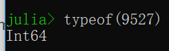
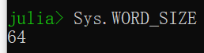
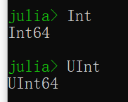
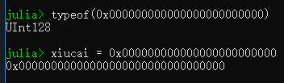
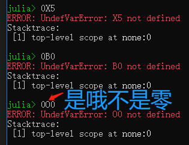

整型数字和浮点型数字是算术和计算的基础积木（building blocks）。

这类值内部称作数学原语（numberic primitives），然而这类立即数在代码中也叫作数值字面值。

如“1”是整型字面值，而“1.0”是浮点型字面值；对应的二进制内存对象是数学原语。

猪吏提供宽泛的基本数值类型，并在此之上定义了全面的算术和位操作以及数学函数。

直接映射现代计算机原生支持的数字类型和操作，使得Julia充分利用计算资源。

此外，Julia通过软件提供【高精度计算（Arbitrary Precision Arithmetic）】，能够处理不能被硬件有效自然表达的数值，自然是以相对较低的性能为代价的。

下面就是Julia基本数值类型：

- 整型

|类型|有无符号|比特数|最小值|最大值|
|:---:|:---:|:---:|:---:|:---:|
|Int8|✓|8|-2^7|2^7-1|
|UInt8||8|0|2^8-1|
|Int16|✓|16|-2^15|2^15-1|
|UInt16||16|0|2^16-1|
|Int32|✓|32|-2^31|2^31-1|
|UInt32||32|0|2^32-1|
|Int64|✓|64|-2^63|2^63-1|
|UInt64||64|0|2^64-1|
|Int128|✓|128|-2^127|2^127-1|
|UInt128||128|0|2^128-1|
|Bool|N/A(Not Applicable)|8|false(0)|true(1)|

- 浮点型

|类型|精度|比特数|
|:---:|:---:|:---:|
|Float16|[half](https://en.wikipedia.org/wiki/Half-precision_floating-point_format)|16|
|Float32|[single](https://en.wikipedia.org/wiki/Single_precision_floating-point_format)|32|
|Float64|[double](https://en.wikipedia.org/wiki/Double_precision_floating-point_format)|64|

此外，【[复数（Complex）和有理数（Rational）](./复数和有理数.md "Complex and Rational Numbers")】的支持是建立在这些原始数字类型之上的。

所有数字类型自然相互转换、无须明言，归功灵活的、用户可扩展的【[类型提升系统](./转换和提升.md "Conversion and Promotion")】。

# 整型

字面整型值按江湖规矩表达：

```
julia> 2
2

julia> 250
250
```

具体的类型取决于目标系统是32位架构还是64位架构。

**需要强调的是：这里的目标系统，指的是Julia本身，并非操作系统和中央处理单元！**

*已经提交[PR](https://github.com/JuliaLang/julia/pull/28868 "Depend on Julia's version")给社区。*



*骚年的马子显然是64位哒~*

```
# 假装在32位JuliaREPL上执行
julia> typeof(1314)
Int32
```

Julia内部变量【[Sys.WORD_SIZE](../基础/常量.md "Base: Constants")】出卖了目标系统的宽窄（32位/64位）。



```
# 假装在32位JuliaREPL上执行
julia> Sys.WORD_SIZE
32
```

Julia也定义了类型Int和UInt，分别对应目标系统本地有符号和无符号的别命。



```
# 假装在32位JuliaREPL上执行
julia> Int
Int32

julia> UInt
UInt32
```

仅用32比特不可装下、但64比特可容纳的“鲲”大整型字面值，不论目标系统受不受得了，直接创建64位整型。

```
# 不论32位Julia还是64位Julia
julia> typeof(4294967295)
Int64
```

明白么？不见得！

```
# 在64位JuliaREPL上跟着做
julia[64]> 2^32-1
4294967295

julia[64]> typeof(2^32-1)
Int64

# 在32位JuliaREPL上跟着做
julia[32]> typeof(2^32-1)
Int32

# 不是说有符号数在32位机器上取值区间是[-2^31,2^31-1]嘞
# 显然2^32-1大于2^31-1呀
# 此时应该自动转为Int64却怎么还是Int32呢
julia[32]> 2^32-1
-1

# 看懂没
# 并非想当然地认为2^32-1等于4294967295自然就是Int64啦
# 在32位机器上先对2^32-1做运算（默认地Int32溢出）在对结果（-1）求类型
```

无符号整型以“0x”前缀的十六进制格式输入输出。

无符号整型内存对象大小通过所占用的十六进制数字多少来检测。

**接下来不假装了，严谨起见，专门在64位机器上同时安装了32位Julia做验证。**

```
# 在32位JuliaREPL上执行
julia> typeof(0x0)
UInt8

julia> typeof(0x00)
UInt8

julia> typeof(0x000)
UInt16

julia> typeof(0x0000)
UInt16

julia> typeof(0x00000)
UInt32

julia> typeof(0x000000)
UInt32

julia> typeof(0x0000000)
UInt32

julia> typeof(0x00000000)
UInt32

julia> typeof(0x000000000)
UInt64

julia> typeof(0x0000000000)
UInt64

julia> typeof(0x00000000000)
UInt64

julia> typeof(0x000000000000)
UInt64

julia> typeof(0x0000000000000)
UInt64

julia> typeof(0x00000000000000)
UInt64

julia> typeof(0x000000000000000)
UInt64

julia> typeof(0x0000000000000000)
UInt64
```

**可见Julia是根据所使用的十六进制数字多少来定无符号整型的尺寸。**

这种行为基于群众惯用十六进制字面整型数值表达固定数值字节序列，而非仅仅一个整型数值。

**这里再次点到“ans”这个仅在JuliaREPL中用来表达最近一次表达式计算值的变量。**

二进制和八进制也行！

```
julia> typeof(0b0)
UInt8

julia> typeof(0b00000000)
UInt8

julia> typeof(0b000000000)
UInt16

julia> typeof(0o0)
UInt8

julia> typeof(0o000)
UInt8

julia> typeof(0o0000)
UInt16

julia> ans
UInt16
```

**可见Julia是根据所使用的二进制或八进制数字多少来定无符号整型的尺寸。**

就十六进制、二进制、八进制产生无符号整型类型而言，如果开头数字非“0”的话，二进制数据元素的尺寸是最小必须大小。

对于开头数字是“0”的情况，则根据该字面数值最小必须大小来检测，*尺寸相同但以“1”为前导*。

这样允许群众控制尺寸。

**数值不能保存为UInt128、亦不能写这样的字面数值（Values, which can not be stored in UInt128 can not be written as such literals）？**

**秀才解释：就是说比typemax(UInt128)还大的值，就不能这样写了。**



二进制、八进制和十六进制无符号字面数值“取负”——前缀“-”符号——产生与原无符号字面数值“尺寸”相同、是原无符号字面数值的**二进制补码**的无符号字面数值。

```
julia> -0xA5A5
0x5a5b

julia> -0x5A5A
0xa5a6
```

要说秀才干活就是细致，顺便看下这个：



原始数值类型（如整型）可表达的最大、最小值可通过typemin和typemax函数获知。

```
julia> (typemin(Int32), typemax(Int32))
(-2147483648, 2147483647)

julia> for t in [UInt128, Int128, UInt64, Int64, UInt32, Int32, UInt16, Int16, UInt8, Int8, Bool]
         println("$(lpad(t,7)): [$(typemin(t)), $(typemax(t))]")
       end
UInt128: [0, 340282366920938463463374607431768211455]
 Int128: [-170141183460469231731687303715884105728, 170141183460469231731687303715884105727]
 UInt64: [0, 18446744073709551615]
  Int64: [-9223372036854775808, 9223372036854775807]
 UInt32: [0, 4294967295]
  Int32: [-2147483648, 2147483647]
 UInt16: [0, 65535]
  Int16: [-32768, 32767]
  UInt8: [0, 255]
   Int8: [-128, 127]
   Bool: [false, true]
```

*这么早就给群众看循环啦，注意引号。*

这里的lpad可以在JuliaREPL中：

```
help?> lpad

# 左填补（Left Pad）
# 三个参数：原串、显示的字符数、填补字符（默认空格）
```

咳~函数typemin和typemax返回的结果总是给定的参数类型。

上述表达式运用了若干群众可能还没修炼的姿势，包括【[for循环](./控制流.md "Control Flow")】、【[字符串](./字符串.md "Strings")】（烤着好吃）、【[插值](./元编程.md "Metaprogramming")】，但对于劳德诺这种带艺投师的人，看不懂是装的。

# 溢出咋办（Be**Havior**）


