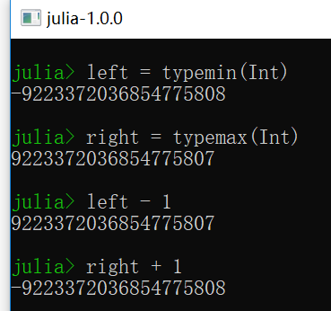
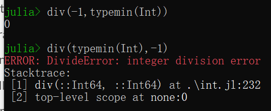
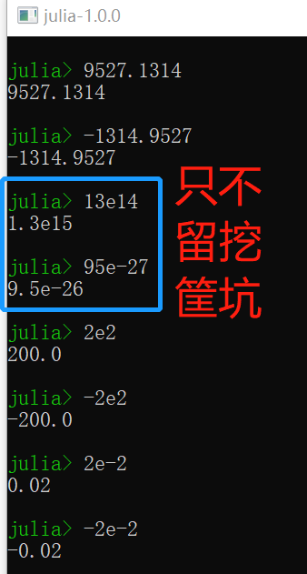
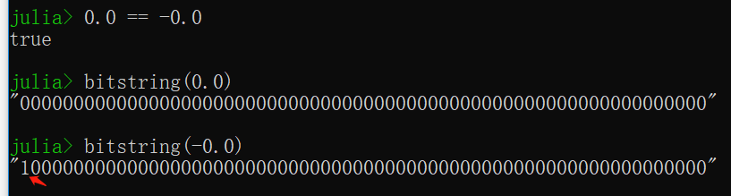
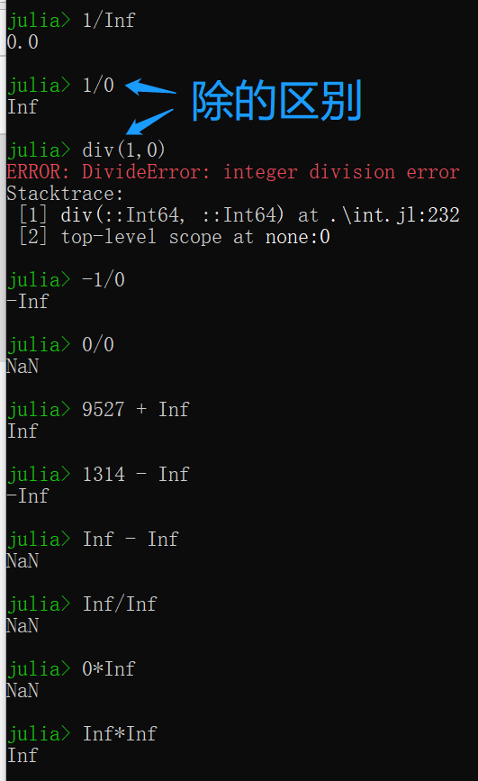

整型数字和浮点型数字是算术和计算的基础积木（building blocks）。

这类值内部称作数学原语（numberic primitives），然而这类立即数在代码中也叫作数值字面值。

如“1”是整型字面值，而“1.0”是浮点型字面值；对应的二进制内存对象是数学原语。

猪吏提供宽泛的基本数值类型，并在此之上定义了全面的算术和位操作以及数学函数。

直接映射现代计算机原生支持的数字类型和操作，使得Julia充分利用计算资源。

此外，Julia通过软件提供【高精度计算（Arbitrary Precision Arithmetic）】，能够处理不能被硬件有效自然表达的数值，自然是以相对较低的性能为代价的。

下面就是Julia基本数值类型：

- 整型

|类型|有无符号|比特数|最小值|最大值|
|:---:|:---:|:---:|:---:|:---:|
|Int8|✓|8|-2^7|2^7-1|
|UInt8||8|0|2^8-1|
|Int16|✓|16|-2^15|2^15-1|
|UInt16||16|0|2^16-1|
|Int32|✓|32|-2^31|2^31-1|
|UInt32||32|0|2^32-1|
|Int64|✓|64|-2^63|2^63-1|
|UInt64||64|0|2^64-1|
|Int128|✓|128|-2^127|2^127-1|
|UInt128||128|0|2^128-1|
|Bool|N/A(Not Applicable)|8|false(0)|true(1)|

- 浮点型

|类型|精度|比特数|
|:---:|:---:|:---:|
|Float16|[half](https://en.wikipedia.org/wiki/Half-precision_floating-point_format)|16|
|Float32|[single](https://en.wikipedia.org/wiki/Single_precision_floating-point_format)|32|
|Float64|[double](https://en.wikipedia.org/wiki/Double_precision_floating-point_format)|64|

此外，【[复数（Complex）和有理数（Rational）](./复数和有理数.md "Complex and Rational Numbers")】的支持是建立在这些原始数字类型之上的。

所有数字类型自然相互转换、无须明言，归功灵活的、用户可扩展的【[类型提升系统](./转换和提升.md "Conversion and Promotion")】。

# 整型

## 有符号

字面整型值按江湖规矩表达：

```
julia> 2
2

julia> 250
250
```

具体的类型取决于目标系统是32位架构还是64位架构。

**需要强调的是：这里的目标系统，指的是Julia本身，并非操作系统和中央处理单元！**

*已经提交[PR](https://github.com/JuliaLang/julia/pull/28868 "Depend on Julia's version")给社区。*


*骚年的马子显然是64位哒~*

```
# 假装在32位JuliaREPL上执行
julia> typeof(1314)
Int32
```

Julia内部变量【[Sys.WORD_SIZE](../基础/常量.md "Base: Constants")】出卖了Julia的宽窄（32位/64位）。


```
# 假装在32位JuliaREPL上执行
julia> Sys.WORD_SIZE
32
```

Julia也定义了类型Int和UInt，分别对应目标系统本地有符号和无符号的别命。


```
# 假装在32位JuliaREPL上执行
julia> Int
Int32

julia> UInt
UInt32
```

仅用32比特不可装下、但64比特可容纳的“鲲”大整型字面值，不论目标系统受不受得了，直接创建64位整型。

```
# 不论32位Julia还是64位Julia
julia> typeof(4294967295)
Int64
```

明白么？不见得！

```
# 在64位JuliaREPL上跟着做
julia[64]> 2^32-1
4294967295

julia[64]> typeof(2^32-1)
Int64

# 在32位JuliaREPL上跟着做
julia[32]> typeof(2^32-1)
Int32

# 不是说有符号数在32位机器上取值区间是[-2^31,2^31-1]嘞
# 显然2^32-1大于2^31-1呀
# 此时应该自动转为Int64却怎么还是Int32呢
julia[32]> 2^32-1
-1

# 看懂没
# 并非想当然地认为2^32-1等于4294967295自然就是Int64啦
# 在32位机器上先对2^32-1做运算（默认地Int32溢出）在对结果（-1）求类型
```

## 无符号

无符号整型以“0x”前缀的十六进制格式输入输出。

无符号整型内存对象大小通过所占用的十六进制数字多少来检测。

**接下来不假装了，严谨起见，专门在64位机器上同时安装了32位Julia做验证。**

```
# 在32位JuliaREPL上执行
julia> typeof(0x0)
UInt8

julia> typeof(0x00)
UInt8

julia> typeof(0x000)
UInt16

julia> typeof(0x0000)
UInt16

julia> typeof(0x00000)
UInt32

julia> typeof(0x000000)
UInt32

julia> typeof(0x0000000)
UInt32

julia> typeof(0x00000000)
UInt32

julia> typeof(0x000000000)
UInt64

julia> typeof(0x0000000000)
UInt64

julia> typeof(0x00000000000)
UInt64

julia> typeof(0x000000000000)
UInt64

julia> typeof(0x0000000000000)
UInt64

julia> typeof(0x00000000000000)
UInt64

julia> typeof(0x000000000000000)
UInt64

julia> typeof(0x0000000000000000)
UInt64
```

**可见Julia是根据所使用的十六进制数字多少来定无符号整型的尺寸。**

这种行为基于群众惯用十六进制字面整型数值表达固定数值字节序列，而非仅仅一个整型数值。

**这里再次点到“ans”这个仅在JuliaREPL中用来表达最近一次表达式计算值的变量。**

二进制和八进制也行！

```
julia> typeof(0b0)
UInt8

julia> typeof(0b00000000)
UInt8

julia> typeof(0b000000000)
UInt16

julia> typeof(0o0)
UInt8

julia> typeof(0o000)
UInt8

julia> typeof(0o0000)
UInt16

julia> ans
UInt16
```

**可见Julia是根据所使用的二进制或八进制数字多少来定无符号整型的尺寸。**

就十六进制、二进制、八进制产生无符号整型类型而言，如果开头数字非“0”的话，二进制数据元素的尺寸是最小必须大小。

对于开头数字是“0”的情况，则根据该字面数值最小必须大小来检测，*尺寸相同但以“1”为前导*。

这样允许群众控制尺寸。

**数值不能保存为UInt128、亦不能写这样的字面数值（Values, which can not be stored in UInt128 can not be written as such literals）？**

**秀才解释：就是说比typemax(UInt128)还大的值，就不能这样写了。**


二进制、八进制和十六进制无符号字面数值“取负”——前缀“-”符号——产生与原无符号字面数值“尺寸”相同、是原无符号字面数值的**二进制补码**的无符号字面数值。

```
julia> -0xA5A5
0x5a5b

julia> -0x5A5A
0xa5a6
```

要说秀才干活就是细致，顺便看下这个：


原始数值类型（如整型）可表达的最大、最小值可通过typemin和typemax函数获知。

```
julia> (typemin(Int32), typemax(Int32))
(-2147483648, 2147483647)

julia> for t in [UInt128, Int128, UInt64, Int64, UInt32, Int32, UInt16, Int16, UInt8, Int8, Bool]
         println("$(lpad(t,7)): [$(typemin(t)), $(typemax(t))]")
       end
UInt128: [0, 340282366920938463463374607431768211455]
 Int128: [-170141183460469231731687303715884105728, 170141183460469231731687303715884105727]
 UInt64: [0, 18446744073709551615]
  Int64: [-9223372036854775808, 9223372036854775807]
 UInt32: [0, 4294967295]
  Int32: [-2147483648, 2147483647]
 UInt16: [0, 65535]
  Int16: [-32768, 32767]
  UInt8: [0, 255]
   Int8: [-128, 127]
   Bool: [false, true]
```

*这么早就给群众看循环啦，注意引号。*

这里的lpad可以在JuliaREPL中：

```
help?> lpad

# 左填补（Left Pad）
# 三个参数：原串、显示的字符数、填补字符（默认空格）
```

咳~函数typemin和typemax返回的结果总是给定的参数类型。

上述表达式运用了若干群众可能还没修炼的姿势，包括【[for循环](./控制流.md "Control Flow")】、【[字符串](./字符串.md "Strings")】（烤着好吃）、【[插值](./元编程.md "Metaprogramming")】，但对于劳德诺这种带艺投师的人，看不懂是装的。

## 溢出咋办（Be**Havior**）

超出猪吏某个类型能表达的最大值则导致“回环（wraparound）反应”。

超出猪吏某个类型能表达的最小值，又何尝不是？



*TODO: 提交PR给社区，表述更全面。*

这样，猪吏整型算术实则[模运算](https://en.wikipedia.org/wiki/Modular_arithmetic)形式。
这反应了现代计算机所实现的整型基本算术的特点。
在可能发生溢出的应用中，明确检查由于溢出导致的回环是必要的；否则，推荐【高精度计算】中的BigInt类型。

## 除法错误

整型除法（即div函数）有两个“例外”情况：除数是零、用“-1”除以最小负数。
两者都抛出DivieError异常。

取余（rem）和取模（mod）当第二个参数为零时也抛出DivideError异常。

除零错误自不必说，一看看后者。



*顺便看看Python的情况：*
```
Python 2.7.14 (v2.7.14:84471935ed, Sep 16 2017, 20:25:58) [MSC v.1500 64 bit (AMD64)] on win32
Type "help", "copyright", "credits" or "license" for more information.
>>> import sys
>>> right = sys.maxint
>>> left = -sys.maxint - 1
>>> divmod(left, -1)
(2147483648L, 0L)
>>>

Python 3.6.5 (v3.6.5:f59c0932b4, Mar 28 2018, 17:00:18) [MSC v.1900 64 bit (AMD64)] on win32
Type "help", "copyright", "credits" or "license" for more information.
>>> import sys
>>> sys.maxsize
9223372036854775807
>>> divmod(-sys.maxsize-1, -1)
(9223372036854775808, 0)
```
*可见Python中并无类似限制，Julia这样做的妙处尚未体会到。*

# 浮点数字

字面浮点数值同样按江湖规矩表示，必要时用"[科学计数法](https://en.wikipedia.org/wiki/Scientific_notation#E-notation)"。



以上结果均是Float64类型数值（**即便是32位的猪吏**）；而Float32类型数值把科学计数法的那个“e”替换为“f”即可。

```
julia> 2.0f0
2.0f0

julia> typeof(ans)
Float32

julia> 2.0f-4
0.0002f0
```

很容易强转Float32类型：
```
julia> Float32(2.5)
2.5f0

julia> typeof(ans)
Float32
```

**十六进制浮点字面数值也是有效的，但仅限于Float464类型**，如下所示，字母p引导的是以2为底数的指数。
```
# 刚好一起了解浮点数的十六进制
# 小数点之前和普通整型数的十六进制无异
# 小数点之后则是表达“十六分之几”
# 即“一点十六分之八（1.5）”乘以“二的三次方（8）”
julia> 0x1.8p3
12.0

julia> 0x.4p-1
0.125
```

**还记得XBO不行、且f也不行，但EP可行。**
```
julia> 2F0
ERROR: UndefVarError: F0 not defined
Stacktrace:
 [1] top-level scope at none:0

julia> 0x1.8P3
12.0

julia> 1E1
10.0
```

也支持半精度浮点数值（Float16），但是以软件方式实现并以Float32类型参与运算。
```
julia> sizeof(Float16(2.5))
2

julia> 2*Float16(2.5)
Float16(5.0)

julia> Float16(2.)
Float16(2.0)

julia> Float16(.2)
Float16(0.2)
```

可用下划线（_）作为数字分隔符：
```
julia> 95_27, 0.13_14, 0xAA_55, 0b0101_1010, 0o333_777
(9527, 0.1314, 0xaa55, 0x5a, 0x0001b7ff)
```

脑洞一下（各种不行——别给点儿阳光就灿烂）：
```
julia> 0._1314
ERROR: syntax: invalid numeric constant "0._"

julia> 0_.1314
ERROR: syntax: extra token "0.1314" after end of expression

julia> _0.1314
ERROR: syntax: extra token "0.1314" after end of expression

julia> 0.1314_
ERROR: syntax: all-underscore identifier used as rvalue

julia> 0_x1314
ERROR: UndefVarError: _x1314 not defined
Stacktrace:
 [1] top-level scope at none:0

julia> 0x_1314
ERROR: syntax: invalid numeric constant "0x_"

julia> 2E1_1
ERROR: UndefVarError: _1 not defined
Stacktrace:
 [1] top-level scope at none:0

julia> 2f0_0
ERROR: UndefVarError: _0 not defined
Stacktrace:
 [1] top-level scope at none:0

julia> 0x1.8p3_0
ERROR: UndefVarError: _0 not defined
Stacktrace:
 [1] top-level scope at none:0
```

## 浮点零

浮点数字有“两个零”：正零和负零，即[有符号零](https://en.wikipedia.org/wiki/Signed_zero)。

正零和负零相等，但二进制表达迥异，正如bitstring函数所展现的：



## 特殊浮点值

有三个标准浮点值在实数轴上没有任何对应的点：

|Float16|Float32|Float64|名称|描述|
|:---:|:---:|:---:|:---:|:---:|
|Inf16|Inf32|Inf|正无穷|大于全部有限浮点值的数|
|-Inf16|-Inf32|-Inf|负无穷|小于全部有限浮点值的数|
|NaN16|NaN32|NaN|非数字|不等于任何浮点值（包括自身）的数|

有关有限浮点值相互之间及与别的浮点值秩序的讨论，请看【[算术操作符和基本函数](./算术操作符和基本函数.md "Mathematical Operations and Elementary Functions")】。

根据[IEEE 754](https://en.wikipedia.org/wiki/IEEE_754-2008)标准，这些特殊浮点值是特定算术运算的结果：



浮点型的typemin和typemax如下：

```
julia> typemin(Float16), typemax(Float16)
(-Inf16, Inf16)

julia> typemin(Float32), typemax(Float32)
(-Inf32, Inf32)

# 不同于Int有默认的取决于Julia版本（32/64）机器字长（Sys.WORD_SIZE）
julia> typemin(Float), typemax(Float)
ERROR: UndefVarError: Float not defined
Stacktrace:
 [1] top-level scope at none:0

julia> typemin(Float64), typemax(Float64)
(-Inf, Inf)

julia> typemin(Int), typemax(Int)
(-9223372036854775808, 9223372036854775807)

julia> typemin(Int64), typemax(Int64)
(-9223372036854775808, 9223372036854775807)

julia[32]> typemin(Int32), typemax(Int32)
(-2147483648, 2147483647)

julia[32]> typemin(Int), typemax(Int)
(-2147483648, 2147483647)
```

## 及其精度（Machine epsilon）

很多实数并不能被浮点值准确表示，最最要不过知道相邻两个可表示的浮点值之间的距离，通常叫做[机器精度](https://en.wikipedia.org/wiki/Machine_epsilon)。

Julia的eps函数给出1.0和可表示的相邻较大浮点值的距离。

```
julia> eps(Float16)
Float16(0.000977)

julia> eps(Float32)
1.1920929f-7

julia> eps(Float64)
2.220446049250313e-16

# 默认Float64的机器精度
julia> eps()
2.220446049250313e-16
```

如2.0^-23和2.0^-52分别对应Float32和Float64这样的值，这个eps函数也可以接受这种参数，给出参数和相邻可表示较大浮点值的绝对差。

也就是eps(x)生成和x相同类型且x+eps(x)就是相邻可表达较大浮点值。

**可见立即数的机器精度是实时计算得到的。**

```
julia> eps(1.0)
2.220446049250313e-16

julia> eps(9527.)
1.8189894035458565e-12

julia> eps(0x1.8p3)
1.7763568394002505e-15

julia> eps(0.0)
5.0e-324
```

两个相邻可表达浮点值的距离不是常数，但eps(x)是单调递增的（smaller for smaller values and larger for larger values）。

换句话说，可表示的浮点值在实数轴上越靠近零越稠密，远离零移动呈指数稀疏增长。

按照定义，有eps(1.0)等同于eps(Float64)因为1.0是Float64类型值（*这个理由并不充分*）。

Julia还提供了nextfloat和prevfloat函数返回下一个与参数相应的较大或较小的可表示浮点值。

```
julia> x = 9527.0f0
9527.0f0

julia> xnext = nextfloat(x)
9527.001f0

julia> xprev = prevfloat(x)
9526.999f0

julia> bitstring(x)
"01000110000101001101110000000000"

julia> bitstring(xnext)
"01000110000101001101110000000001"

julia> bitstring(xprev)
"01000110000101001101101111111111"
```

上述例子强调一般原则：**相邻可表达浮点值也有相邻二进制整型表示**。

## 舍入模式

如果一个数字没有精确的浮点表达，就必须舍入到合适表达的值。
然而如有需要，可以根据[IEEE 754](https://en.wikipedia.org/wiki/IEEE_754-2008)标准变更舍入规范。

默认的舍入模式通常是【[RoundNearrest](../基础/算术.md "Base: Mathematics")】，限制在（with ties）舍入到最邻近的值，甚至是LSB（Least Significant Bit: 最低有效位）的变化。

## 背景和参考

浮点算术蕴含需多令熟悉底层实现细节的群众惊讶的微妙之处。
然而，这些微妙之处在大多科学计算及下述参考中有详细描述：

- 浮点算术最关键的（definitive）指导是[IEEE 754](http://standards.ieee.org/findstds/standard/754-2008.html)标准；但不能免费在线取得。
- 浮点数字如何表达的简明阐述，参见John D Cook的[文章](https://www.johndcook.com/blog/2009/04/06/anatomy-of-a-floating-point-number/)，相关主题还[介绍](https://www.johndcook.com/blog/2009/04/06/numbers-are-a-leaky-abstraction/)了这种表达和实数理想抽象不同的反应引发的问题。
- 还推荐Bruce Dawson有关浮点数的[系列博客](https://randomascii.wordpress.com/2012/05/20/thats-not-normalthe-performance-of-odd-floats/)。
- 计算中碰到的数值精确度问题及浮点数值极好的深度讨论，阅读David Goldberg的[What Every Computer Scientist Should Know About Floating-Point Arithmetic](http://citeseerx.ist.psu.edu/viewdoc/download?doi=10.1.1.22.6768&rep=rep1&type=pdf)论文。
- 更广泛的，原理的、历史的浮点数相关阐述及其问题，需多别的数值计算话题的讨论，可以详查[William Kahan](https://en.wikipedia.org/wiki/William_Kahan)（著名的“浮点之父”）的[文集（collected writings）](https://people.eecs.berkeley.edu/~wkahan/)；特别兴趣或许[An Interview with the Old Man of Floating-Point](https://people.eecs.berkeley.edu/~wkahan/ieee754status/754story.html)更佳。

# 高精度计算

为了做整型和浮点数值高精度计算，Julia分别包装了[GNU Multiple Precision Arithmetic Library(GMP)](https://gmplib.org/)和[GNU MPFR Library](http://www.mpfr.org/)。
Julia中可分别用BigInt和BigFloat类型来处理整型和浮点数值高精度计算。

提供了从基本数值类型构建高精度数值计算类型的方法，且【[parse](../基础/数字.md "Base: Numbers")】函数可从AbstractStrings构建（将大数字字面文本解析为相应的类型）。
一旦构建好，大数字即可参与全部别的数值类型预算，这全靠Julia的【[类型转换和提升机制](./转换和提升.md "Conversion and Promotion")】。

```
julia> BigInt(typemax(Int64)) + 1
9223372036854775808

julia> parse(BigInt, "123456789012345678901234567890")
123456789012345678901234567890

julia> parse(BigFloat, ".012345678901234567890123456789")
1.234567890123456789012345678899999999999999999999999999999999999999999999999999e-02

julia> BigFloat(2.0^56)
7.2057594037927936e+16

julia> BigFloat(2.0^56) / 3
2.401919801264264533333333333333333333333333333333333333333333333333333333333344e+16

# 阶乘
julia> factorial(BigInt(49))
608281864034267560872252163321295376887552831379210240000000000
```

然而，上述BigInt/BigFloat和基本类型之间的提供不是自动，必须明确声明。

```
julia> x = typemin(Int)
-9223372036854775808

julia> x = x - 1
9223372036854775807

julia> typeof(x)
Int64

julia> y = BigInt(typemin(Int))
-9223372036854775808

julia> y = y - 1
-9223372036854775809

julia> typeof(y)
BigInt
```

BigFloat的默认精度（有效位的数字）和舍入模型可通过调用setprecision和setrounding全局更改，对之后的计算全部有效。

还可以在特定代码块修改精度和舍入模式：

```
julia> setrounding(BigFloat, RoundUp) do
         BigFloat(1) + parse(BigFloat, "0.1")
       end
1.100000000000000000000000000000000000000000000000000000000000000000000000000003

julia> setrounding(BigFloat, RoundDown) do
         BigFloat(1) + parse(BigFloat, "0.1")
       end
1.099999999999999999999999999999999999999999999999999999999999999999999999999986

julia> setprecision(1) do
         BigFloat(1) + parse(BigFloat, "0.1")
       end
ERROR: DomainError with 1:
`precision` cannot be less than 2.
Stacktrace:
 [1] setprecision at .\mpfr.jl:762 [inlined]
 [2] setprecision(::getfield(Main, Symbol("##7#8")), ::Type{BigFloat}, ::Int64) at .\mpfr.jl:902
 [3] setprecision(::Function, ::Int64) at .\mpfr.jl:910
 [4] top-level scope at none:0

julia> setprecision(2) do
         BigFloat(1) + parse(BigFloat, "0.1")
       end
1.0

julia> setprecision(10) do
         BigFloat(1) + parse(BigFloat, "0.1")
       end
1.0996

julia> setprecision(100) do
         BigFloat(1) + parse(BigFloat, "0.1")
       end
1.1000000000000000000000000000003
```

*其中setprecision是按bit位数来计算的。*

# 数值字面系数（Coefficients）

为使普通数值公式和表达式清晰，Julia允许变量前直接加数值字面意味着相乘。这让多项式展开书写更清晰。

```
julia> x = 9527
9527

julia> 2x^2 - 3x + 1
181498878
```

也让书写指数函数更优雅。

···
julia> y = 3
3

julia> 2^2y
64
···

数值字面系数比一元运算略低，如取负（-），所以-2x解析为(-2)*x，√2x解析为(√2)*x。

然而，在结合指数运算时，数值字面系数解析为与一元运算相似，如2^3x解析为2^(3x)，2x^3解析为2(x^3)。

*可见，取负、开方，指数运算优先级都比数值字面系数优先级高。*

数值字面系数也可作为圆括号表达式的系数。

```
julia> z = 5
5

julia> 2(z-1)^2 - 3(z-1) + 1
21
```

注意：数值字面系数用于隐含相乘，优先级比别的二进制操作高，如乘法（*）、除法（/，\，//）。
这意味着，举点栗子：1/2im等于-0.5im，6//2(2+1)等于6//6等于1//1。

此外，圆括号表达式能当作变量的系数使用，意味着变量的乘法表达式：
```
julia> (z-1)z
20

julia> (z-1)(z+1)
ERROR: MethodError: objects of type Int64 are not callable
Stacktrace:
 [1] top-level scope at none:0

julia> (z-1)*(z+1)
24

julia> z(z-1)
ERROR: MethodError: objects of type Int64 are not callable
Stacktrace:
 [1] top-level scope at none:0
```

**然而，不要并置两个圆括号表达式，也不好把变量放置在圆括号表达式之前，这两种做法都不能用来暗示相乘。**
这样做，两个表达式均被认为是函数，任何非数值字面值的表达式，直接跟圆括号都被解释为函数，圆括号内的作为参数。
详查【[函数](./函数.md "Functions")】。
因此上述报错均由左边的表达式不是函数引起。

以上语法增强显著减少书写普通数学公式的视在噪音。
要注意**数值字面系数和要相乘的标识符或圆括号表达式之间没有空白**。

# 语法冲突

并置数值字面系数语法可能和两种数值字面语法冲突：十六进制整型字面和浮点字面的工程注释。
下列就是一些抛出语法冲突的情况：

- 十六进制整型字面表达式0xff可被解释为数字0和变量xff相乘；
- 浮点字面表达式1e10会解释为数字1和变量e10相乘，1E10同解；
- Float32的1.5f22能解释为数字1.5和变量f22相乘。

所有的情况，猪吏支持解释为数值字面（而非系数）：

- 以0x开头的表达式总认为是十六进制字面；
- 一个数值字面后出现e或E的表达式总认为是浮点字面；
- 一个数值字面后出现f的表达式总认为是Float32字面。

不同于E，因历史原因在数值字面中等价于e，F只是普通字母，而不能像数值字面中f的那样用。
因此，一个数值字面后出现F的表达式即是数值字面系数和变量相乘：1.5F22等于1.5*F22。

# 字面零一

Julia提供返回指定类型对应的字面零一的方法。

|函数|描述|
|:---:|:---:|
|zero(x)|类型x或变量x的类型的字面零|
|one(x)|类型x或变量x的类型的字面一|

这些函数在【[数字比较](./算术操作和基本函数.md "Mathematical Operations and Elementary Functions")】中游泳，可以避免不必要的【[类型转换](./转换和提升.md "Conversion and Promotion")】开销。

```
julia> zero(Float32)
0.0f0

julia> zero(1.0)
0.0

julia> zero(BigFloat)
0.0

julia> zero(Int32)
0

julia> zero(1.0)
0

julia> zero(BigInt)
0
```
