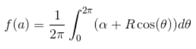

Julia让包开发者和用户通过内建的文档系统（始于Julia v0.4）能很容易给函数、类型和别的对象添加文档。

基本语法很简单：任何正好出现在对象（函数、宏、类型、实例）前一行的字符串将被解释为该对象的文档（叫做“文档字符串”）。
注意，在文档字符串和被注解的对象之间不能插入空行或注释。
看个基本例子：
```
"华安无耻地玷污秋香。"
fuck(boy::AbstractString, girl::AbstractString) = ...
```
文档解释为[Markdown](https://en.wikipedia.org/wiki/Markdown)（如本文格式），因此可用缩进和“代码护栏”来界定文本和代码例程。
技术上，任何对象可关联别的对象为元数据；Markdown碰巧是默认的，但是可以构建别的字符串宏并照样能传递给`@doc`宏。

这儿有个更复杂的例子，仍然用Markdown：
````
"""
    fuck(boy, girl)

男娃和女娃做羞羞事。

# 例子
```julia-repl
julia> fuck("huaan", "qiuxiang")
"ない，のどを突き破る。"
```
"""
function fuck(boy, girl) ...
````
如上述例程中，推荐在写文档时遵循某些简单的惯例：

- 总是在一开始显式函数的签名，带四个空格的缩进，这样可以打印为Julia代码。

    可以跟Julia代码中的签名相同（如`mean(x::AbstractArray)`），或者简化形式。  
    可选参数应当展示默认值（即`f(x, y=1)`），若可能的化，遵循Julia的实际语法。  
    可选参数，没有默认值的应当放入中括号内，如`f(x[, y])`和`f(x[, y[, z]])`。  
    一个备选方案是使用若干行：一个没有可选参数，其余的带可选参数。  
    该方案可能用于给给定函数的相关方法添加文档。  
    当一个函数接受许多关键字参数，仅在签名中包含`<keyword arguments>`占位符，如`f(; <keyword argument>)`，并且在`# Arguments`下面给出完整参数表（看下面的第四点）。

- 包括唯一单行语句的函数动作或在简化的签名块之后表达啥对象的描述。如果需要，在第二段提供更详细的，隔一个空行（像Git注释短长又像HTTP请求头体的分隔）。

    给函数添加文档时，单行语句应当采用“命令”形式（干这个并返回那个），而不是第三人称（不要写“返回长度云云”)。  
    应当以句号结束。  
    如果函数的意义不容易总结，分割为独立的组成部分是有益的（尽管这不应该作为每个单行情况的绝对要求）。

- 不要重复自己。

    因为函数名是签名给定的，因此没必要以“函数`fuck`……”开始：直击要害（开门见山）。  
    类似地，如果签名指定了参数的类型，在描述中再次提及是多余的。

- 仅在必要的时候提供参数列表。

    针对简单函数，直接在函数目的的描述中提及参数角色通常是清晰的。  
    别处的参数列表可能只是重复已经提供的信息。  
    然而，有很多参数（特别是关键字参数）的复杂函数，提供参数列表是个好主意。  
    在这种情况下，在函数一般描述之后插入参数列表，在`# Arguments`头之下，每个参数前导一个`-`“子弹”。  
    参数列表应当提到参数类型和参数默认值（若有）：
    ```
    """
    #上文
    # Arguments
    - `n::Integer`: 要计算的元素个数。
    - `dim::Integer=1`: 要遍历的对象的维度，默认值是一。
    #下文
    """
    ```

- 提供相关函数的提示。

    有些时候，函数有相关的函数。  
    为了提升可发现性，请在`See also:`段落提供简短的相关函数列表。
    ```
    See also: [`bar!`](@ref), [`baz`](@ref), [`baaz`](@ref)
    ```

- 在`# Examples`部分包含任何代码历程。

    例程应当，任何时候可能的话，写为文档字符串。  
    文档字符串是防护代码块（见【代码块】），以` ```jldoctest`开始且包含任意个`julia>`提示符，和输出及期望的输出一起模仿JuliaREPL。

    举个例子，下述文档字符串中，一个变量`a`被定义，期望的结果，像在JuliaREPL中打印的那样，随后出现：
    ````
    """
    # 若干暖文。

    # Examples
    ```jldoctest
    julia> a = [1 2; 3 4]
    2×2 Array{Int64,2}:
    1  2
    3  4
    ```
    """
    ````
    **警告**：应当在文本字符串中避免调用`rand`以及别的RNG（随机数字发生器：Random Number Generator）相关的函数，因为这些函数输出在不同的Julia会话中不固定。  
    如果就是像显式某些随机数发生器相关的函数，一个选项是显式构造并用自己的`MersenneTwister`（或别的伪随机数发生器）为种子并传递给被添加文档字符串的函数。  
    操作系统字长（`Int32`或`Int64`），路径分隔符（`/`或`\`）也会影响某些文档字符串的再现性。  
    注意文档字符串中的空格有意义的！举个例子，和数组优雅打印不重合的文档字符串会失败。

    然后可以运行`make -C doc doctest=true`来执行Julia手册和API文档中的全部文档字符串，将确保例程工作正常。

    为了标识输出结果是节选的（去尾），应当在检查要停止的行写上`[...]`。  
    这对隐藏栈回溯（包含非永久的Julia代码行引用）有用，当文档字符串显示异常，例如：
    ````
    ```jldoctest
    julia> div(1, 0)
    ERROR: DivideError: integer division error
    [...]
    ```
    ````
    不可验证的例程应当写入以` ```julia`开头的保护代码块中，这样可以在生成的文档中正确高亮。

    **提示**：任何可能的地方，例程应当自包含且可运行，这样读者能够在不必须包含任何依赖的情况下验证之。

- 用反引号（backtick）识别代码和等式。

    Julia标识符和代码节选（excerpt）应当总是出现在反引号`` ` ``之间以高亮。  
    以LaTeX语法的等式可插入在双反引号``` `` ```之间。  
    宁可采用Unicode字符，而不用其LaTeX转义序列，也就是说要``` ``α = 1`` ```、不要``` ``\\alpha = 1`` ```。

- 置开始和结束的`"""`独立成行。

    那就是，这么写：
    ```
    """
    # 哦

    # 哦哦
    """
    f(x, y) = ...
    # 已被一刀捅死
    ```
    而不要写成：
    ```
    """啊

    噢嗯"""
    f(x, y) = ...
    # 还是走吧
    ```
    上一种让文档字符串的开始和结束更清晰。

- 遵守用于周围代码的行长度。

    文档字符串用和编码一样的编辑。  
    因此适用相同约定。  
    推荐92个字符后添加一个换行符。

- 提供信息以让定制类型在`# Implementation`部分中实现函数。

    这些实现细节是给开发者的，而不是给普通用户的，阐述诸如那些函数应当被覆盖、那些函数自动采用合适的后手，和函数行为的主要描述区分开是好的做法。

# 访问文档
在JuliaREPL或[IJulia](https://github.com/JuliaLang/IJulia.jl)中可以通过`?`后跟随函数名或宏名、接着`Enter`键来访问文档字符串。
例如：
```
?cos
?@time
?r""
```
会分别带出相关函数、宏或字符串宏的文档字符串。
在[Juno](http://junolab.org/)中用`Ctrl-J`、`Ctrl+D`带出鼠标下对象的文档字符串。

# 函数和方法

在Julia中，函数可能有许多实现，也叫方法。
虽然一般函数有一个目的是好的实践，Julia允许给方法分别添加文档，如果需要的话。
一般地，只有大多数一般方法应当添加文档，或函数本身（也就是说以`function bar end`创建的没有任何方法的对象）。
只有当具体方法的行为和更一般的方法不同时方可添加文档。
在任何情况下，都不能重复在别处已经提供的信息。
例如：
```
"""
    *(x, y, z...)

乘法操作符。
`x * y * z *...`以因子参数调用该函数。
也就是`*(x, y, z...)`。
"""
function *(x, y, z...)
    # ... [独立的实现体] ...
end

"""
    *(x::AbstractString, y::AbstractString, z::AbstractString...)

当应用到多个字符串，将这些字符串黏结起来。
"""
function *(x::AbstractString, y::AbstractString, z::AbstractString...)
    # ... [这里插入秘诀] ...
end

help?> *
search: * .*

  *(x, y, z...)

  乘法操作符。
  x * y * z *...以多个因子参数调用该函数。
  也就是*(x,y,z...)。

  *(x::AbstractString, y::AbstractString, z::AbstractString...)

  当应用到多个字符串，将这些字符串粘结起来。
```
当为一般函数检索文档字符串时，每个方法的元数据以`catdoc`函数粘结，当然也可以在定制类型中被覆盖。

# 高级用法

这个`@doc`宏将第一个参数和第二个参数关联到每个模块的叫做`META`的字典中。
默认地，文档字符串期望被写成Markdown，并且`doc"..."`字符串宏简单创建表达Markdown内容的对象。
未来很可能实现诸如允许创建相关图像或链接路径等更多高级东西。

为使书写文档字符串更简单，解析器特别对待宏名`@doc`：如果调用`@doc`带一个参数，单个换行后出现另一个表达式，则该额外表达式作为该宏的参数。
因此下述语法解析为两个参数调用`@doc`：
```
@doc raw"""
...
"""
f(x) = x
```
这让将任何对象（上述是`raw`字符串）用作文档字符串变得可信手拈来。

当用于文档检索时，宏`@doc`（或等价的`doc`函数）将搜索所有`META`字典，找出和给定对象对应的元数据并返回之。
返回的对象（例如某种Markdown内容）将默认聪明地显示自身。
这种设计也让以编程方式应用文档系统变得简单；举个例子，复用函数不同版本的文档：
```
@doc "..." fuck!
@doc (@doc fuck!) fuck!
```
或者用在Julia的元编程函数：
```
for (f, op) in ((:add, :+), (:subtract, :-), (:multiply, :*), (:divide, :/))
    @eval begin
        $f(a,b) = $op(a,b)
    end
end
@doc "`add(a,b)`即把`a`和`b`相加起来" add
@doc "`subtract(a,b)`即从`a`中减去`b`" subtract
```
写在非顶层块的文档，例如`begin`、`if`、`for`和`let`也加入文档系统，就像块一样被计算。
例如：
```
if condition()
    "..."
    f(x) = x
end
```
将添加文档给`f(x)`，当`condition()`是`true`。
注意即使`f(x)`在块的末尾走出作用域，文档仍被保留。

# 动态文档

有些时候，一个类型实例的恰当的文档取决于该实例的字段值，而不止是类型本身。
在这些情况下，可以给`Docs.getdoc`添加针对定制类型的方法，每个实例为基础返回文档。
例如：
```
struct MyType
    value::String
end

Docs.getdoc(t::MyType) = "值是$(t.value)的类型MyType的文档。"

x = MyType("x")
y = MyType("y")
```
`?x`将显示“值是x的类型MyType的文档”；`?y`将显示“值是y的类型MyType的文档”。

# 语法指南

Julia语法的整体概览。

在下述例子中`"..."`用来演示任意文档字符串。

`doc"..."`应当仅用在文档字符串包含`$`或`\`字符时，不应当被Julia解析，诸如LaTex语法或包含篡改的Julia源代码例程。

## 函数和方法

```
"..."
function f end

"..."
f
```
给函数`f`添加文档`"..."`。
第一个版本是首选的语法，然而，两种写法等价。
```
"..."
f(x) = x

"..."
function f(x)
  x
end

"..."
f(x)
```
给`f(::Any)`添加文档`"..."`。
```
"..."
f(x, y=1) = x + y
```
给两个方法添加文档，名为`f(::Any)`和`f(::Any, ::Any)`。

## 宏

```
"..."
macro m(x) end
```
给`@m(::Any)`宏定义添加文档。
```
"..."
:(@m)
```
给名为`@m`的宏添加文档。

## 类型

```
"..."
abstract type Tx end

"..."
mutable struct Rx
  ...
end

"..."
struct UART
  ...
end
```
给`Tx`、`Rx`和`UART`添加文档“...”。
```
"..."
struct Port
  "t"
  t
  "r"
  r
end
```
给类型`Port`添加文档“...”，给字段`Port.t`添加文档“t”，给字段`Port.r`添加文档“r”。
也适用于`mutable struct`类型。

## 模块

```
"..."
module M end

module M

"..."
M

end
```
给模块`M`添加文档“...”。
给模块添加文档，上述语法优先，然而，两者等价。
```
"..."
baremodule M
  ...
end

baremodule M

import Base: @doc

"..."
f(x) = x

end
```
给`baremodule`添加文档，上述表达式自动导入`@doc`到当前模块中。
这些导入必须手动完成，当模块表达式未加文档时。
**空`baremodule`不可加文档**。

## 全局变量

```
"..."
const a = 1

"..."
b = 2

"..."
global c = 3
```
给各个`Binding`，即`a`、`b`、`c`添加文档“...”。

`Binding`用来再`Module`中保存特定`Symbol`的引用，而不用保存所引用的值本身。

**注意**：当定义一个`const`时，仅用于定义另一个定义的别名，举个例子，`Base`中的函数`div`及其别名`÷`，不要给别名添加文档，而要给实际的函数添加文档。

如果别名被添加文档，并且不是真正的定义，则文档系统（`?`模式）搜索真正定义的时候，不会返回附加在别名上的文档。

举个例子，应该这么写：
```
"..."
f(x) = x + 1
const alias = f
```
而不是：
```
f(x) = x + 1
"..."
const alias = f
```

```
"..."
sym
```
给`sym`关联的值添加文档。
用户最好在`sym`定义处添加文档。

## 多个对象

```
"..."
a, b
```
给`a`和`b`，应当都是可添加文档的表达式，添加文档。
该语法等价于：
```
"..."
a

"..."
b
```
可以这种方式同时给任意个表达式添加文档。
当两个函数相关时，这种语法会显得特别有用，例如不可变和可变版本的`f`和`f!`。

## 宏生成的代码

```
"..."
#m expression
```
给通过展开`@m expression`生成的表达式添加文本字符串`"..."`。
这允许用于给以`@inline`、`@noinline`、`@generated`或别的宏装饰的表达式像无装饰的表达式一样添加文档。

宏作者应该留意只有产生单行表达式的宏自动支持文档字符串。
如果一个宏返回包含多个子表达式的块，则要添加文档的子表达式必须用`@__doc__`宏做标记。

宏`@enum`采用`@__doc__`为`Enum`对象添加文档。
检查其定义应该就是正确使用`@__doc__`的例子。
```
Core.@__doc__ # 宏

@__doc__(xpsn)
```
低级宏常常用来标记应当添加文档的某个宏返回的表达式。
如果不止一个表达式被标记，则每个表达式应用相同的文档字符串。
```
macro example(f)
    quote
        $(f)() = 0
        @__doc__ $(f)(x) = 1
        $(f)(x, y) = 2
    end |> ecs
end
```
当使用`@__doc__`的宏没有文档时`@__doc__`不起作用。

# Markdown语法

Julia支持如下Markdown语法。

## 内联元素

这里的`"inline"`引用在文本块中能找到的元素，即段落。
这包含如下元素。

- 粗体（Bold）

    用两个星号（asterisk）`**`包裹，以粗体显示被包裹的文本。
    ```
    段落包含一个**粗体**单词。
    ```

- 斜体（Italic）

    用一个星号（asterisk）`*`包裹，以斜体显示被包裹的文本。
    ```
    段落包含一个*斜体*单词。
    ```

- 字面（Literal）

    反引号``` ` ```包裹的文本将原样显示。
    ```
    段落包含一个`字面`单词。
    ```
    字面用来写变量、函数的名称或别的Julia程序部分。
    - 提示

        在字面中包含反引号本身时，用三个反引号包裹。
        ```
        段落包含一个``` `反引号` ```字符。
        ```
        推论：任意奇数个反引号可以包裹更少数量的反引号。

- LaTeX

    用两个反引号``` `` ```包裹起来的`LaTeX`语法文本显示为数学形式。
    ```
    段落包含某些``\LaTeX``标记。
    ```
    - 提示

        如上述【字面】，如果被包裹的文本出现多个字面反引号，则需要更多偶数个反引号，而不是两个。
        注意如果单个字面反引号出现在被包裹的文本中，则两个反引号来包裹这种`LaTex`是有效的。

- 链接

    外部或内部地址的链接可如下语法书写，文本包裹在方括号`[]`中，是链接的名称，放在圆括号`()`中的文本是URL。
    ```
    段落包含[JulialangOrgCN](http://julialang.org.cn))的链接。
    ```
    也可以添加交叉引用（到Julia文档自身别的带文档的函数、方法或变量），看个例子：
    ```
    """
        tryparse(type, str; base)
    
    如[`parse`](@ref)，但返回请求的类型或[`nothing`](@ref)如果字符串没有包含有效的数字。
    """
    ```
    这将创建创建到自动生成的`nothing`文档、`parse`文档的链接（有关于函数实际实现的更多信息）。
    包含函数的可变或不可变版本的交叉引用、强调相似函数不同的交叉引用是好的做法。
    - 注意

        上述交叉引用不是Markdown的特性，是基于[Documenter.jl](https://github.com/JuliaDocs/Documenter.jl)的，它用来构建Julia文档的基础。

- 脚注引用

    命名和编号的脚注引用可以如下语法书写。
    脚注名称必须是字母数字的字词，不能有标点符号。
    ```
    段落包含编号的脚注[number]或一个命名[alphanumberic]。
    ```
    - 注意

        关联脚注的文本可写在与脚注同一页面的任意位置。
        用来定义脚注文本语法的讨论在下面的【脚注】环节。

## 顶层元素

下述元素可写在文档的顶层或写入别的顶层元素内。

- 段落

    段落是普素文本块，大概包括任意个【内联元素】，前后都有至少一个空行。
    ```
    这是一个段落。

    这事包含某些强调文本的另一个段落。
    一个新行，但仍然是当前段落的一部分。
    ```

- 标题（Header）

    一个文档可以用标题划分成不同的片段。标题的语法如下：
    ```
    # 第一级
    ## 第二级
    ### 第三级
    #### 第四级
    ##### 第五级
    ###### 第六级
    ```
    一个标题行可以包含任意【内联元素】，如段落那样（上下至少一个空行）。
    - 注意

        设法避免单个文档中过多标题层级。重度嵌套的文档表明需要拆分为多个页面来涵盖不同的话题。

- 代码块

    如下述例子，源代码可用四个空格缩进的字面块显示。
    ```
    这是一个段落。

        function fuck(o)
            # ...
        end

    另一个段落。
    ```
    此外，代码块可用三个反引号包裹起来，以及一个可选的“编程语言”来指定如何高亮代码块。
    ````
    不带“编程语言”可选参数的代码块。

    ```
    function fuck(o)
        # ...
    end
    ```

    另一个指定“编程语言”可选参数为`julia`的代码块。

    ```julia
    function fuck(o):
        # ...
    end
    ```
    ````
    - 注意

        如上述最后的例子展示的，“围墙”代码块，应当先于缩进代码块指定“编程语言”可选参数，因为无法指定一个缩进代码块是用什么语言编写的。

- 块引述

    来自外部源代码的文本，如网站或书籍的引用，可用`>`字符作为每行的前缀来引证。
    ```
    这里是一段引述：

    > 法代谕则屁自止。 —— 《评<新华社>有关禁止“学生家长群”拍马屁风的新闻稿》
    > 少年爱恨终作古，何须计较重与轻。 —— 《题永清老村台墙下》
    > 农时不当误，佳节也辛劳。 —— 《村居·戊戌十一耕种》
    ```
    *更多秀才诗词，移步[《疯子一样的诗词》](https://github.com/nagexiucai/manuscripts/blob/master/Poesy.md)。*

    注意`>`之后的单个空格，每行必须有。引述块自身可包含别的【顶层元素】或【内联元素】。

- 图像

    图像的语法和上边提到的链接语法相似。前缀`!`字符将原地展示URL指定的图像。
    ```
    
    ```

- 列表

    无序列表这样写，每个元素之前带`*`、`+`或`-`。
    ```
    无序列表：

      * 条目一
      * 条目二
      * 条目三
    ```
    注意每个`*`之前两个空格、之后一个空格。

    列表可包含别的嵌套的【顶层元素】，如列表、代码块、引述块。
    一个列表包含任何【顶层元素】时，每个条目之间应该留出一个空行。
    ````
    另外一个无需列表：

      * 条目一

      * 条目二

        ```
        f(x) = x
        ```

      * 一个子无序列表：

        + 子条目一
        + 子条目二
    ````
    - 注意

        每个条目的内容必须和第一行对齐（line up with）。
        上述例子中“围墙”代码块必须缩进四个空格以保持和“条目二”对齐。

    有序列表，将项目符号（`*`/`+`/`-`）替换为正整数，后跟`.`或`)`。
    ```
    两个有序列表：

      1. 条目一
      2. 条目二
      3. 条目三

      5) 条目五
      6) 条目六
      7) 条目七
    ```
    一个有序列表可不从一开始编号，上述第二个列表就是的，从五开始编号。
    和无序列表一样，有序列表可以包含嵌套的【顶层元素】。

- 显示方程式

    大型``\LaTeX``方程式，不适合写为一个段落的内联展示，可写为“编程语言”可选参数为`math`的围墙代码块。
    ```math
    f(a) = \frac{1}{2\pi}\int_{0}^{2\pi} (\alpha+R\cos(\theta))d\theta
    ```
    

- 脚注

    脚注语法和【脚注引用】语法成对出现。
    确信业已阅读过【脚注引用】部分。

    脚注文本通过下述语法定义，和【脚注引用】语法相似，除`:`字符外，后续内容追加到脚注标签。
    ````
    [^1]: 编号的脚注文本。

    [^note]:

        命名脚注文本，包含若干【顶层元素】。

          * 条目一
          * 条目二
          * 条目三

        ```julia
        function fuck(o)
            # ...
        end
        ```
    ````
    - 注意

        解析过程中不会检查所有【脚注引用】都有匹配的【脚注】否。

- 水平分割线

    和`HTML`中`<hr>`标签的等价物，语法如下：
    ```
    之前行的文本。
    
    ---

    之后行的文本。
    ```

- 表格

    基本表格可以下述讨论的语法编写。
    注意，不同于上述别的【顶层元素】，Markdown的表格语法特性优先，不能嵌套的【顶层元素】，只允许嵌套【内联元素】。
    表格必须总是包含一个标题行，带列名。
    单元格不能跨越多行或多列。
    ```
    | 列一 | 列二 | 列三 |
    |:-----|------|:----:|
    | 秀才 | nagexiucai.com | me@nagexiucai.com |
    | 朱华社区 | julialang.org.cn | bbs.julialang.org.cn |
    ```
    - 注意

        上述演示的表格，每列的`|`字符必须垂直对齐？

        一个`:`字符在列标题之前或之后或前后都有，表明该列左对齐或右对齐或居中对齐。
        没有`:`默认右对齐。

- 警告

    特殊格式化块，以警告著名，可用来高亮特定评论。用下述`!!!`语法定义：
    ```
    !!! note

        这是该`note`的内容。

    !!! warning "当心"

        这是另一个警告。

        该警告有个定制的标题“当心”。
    ```
    警告的类型可以是任何单词，但是某些类型产生特定风格，也就是（以降严重程度为序）：`danger`、`warning`、`info/note`和`tip`。

    警告框的定制标题，紧随警告类型之后，是字符串（双引号内）。
    如果警告类型之后没有指定标题文本，则标题将是块的类型，也就是说`note`警告对应`"Note"`。

    警告，像大多数别的【顶层元素】，可以包含别的【顶层元素】。

# Markdown语法扩展

Julia的Markdown支持以跟基本字符串字面非常相似的方法插值，不同的是，它会自行保存对象到Markdown树（与转换为字符串截然相反）。
当Markdown内容以常用`show`方法渲染，这些方法照样可被覆盖。
这种涉及允许Markdown扩展任意复杂特性（如引用）而不搞乱基础语法。

原则上，Markdown解析器自身也可被包（package）随意扩展，或者完全定制Markdown的喜好，但并不必要。

---
# 译后感

- 可见这套中文简体译本并未完全遵循Julia的文档规范。
- 较系统的Markdown语法。
