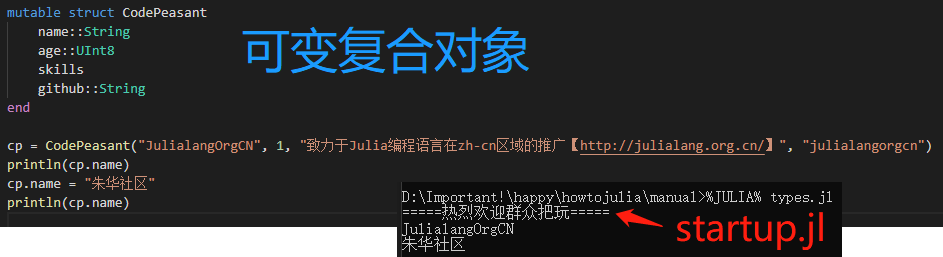
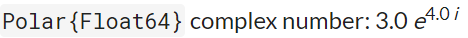

类型系统已然习惯地分为风格迥异的两大阵营：

- 静态类型系统：程序运行之前每个表达式必须有确定的类型。
- 动态类型系统：程序运行之前对于类型一无所知，实际值由程序就地计算。

面向对象允许静态类型语言某些灵活，编码时不写编译时可知的确切类型。
编写执行不同类型代码的能力叫多态（polymorphism）。
典型动态类型语言的所有代码都是多态的，只有显式检查类型或在运行时碰到对象未能支持的操作，代码不限制任何值的类型。

Julia的类型系统是动态的，但是汲取静态类型系统的某些优势，指示确定值得指定类型成为可能。
这会成为生成高效代码的得力助手，但更显著的是，允许方法根据函数参数的类型重载、和语言深度集成。
探索方法重载，详见【[方法](./方法.md "Methods")】，但却植根于这里表述的类型系统。

Julia缺省类型的值默认任意类型。
因此可以无须显式应用类型来编写有用的函数。
当需要额外的表达式时，不管怎样，很容易逐步引入明确的类型注解到之前的“无类型”代码。
添加注解旨在三个主要目标：利用Julia强大的多重分派（multiple-dispatch）机制，提升可读性和捕捉码农错误。

用【[类型系统](https://en.wikipedia.org/wiki/Type_system)】术语阐述Julia，她是：动态的、主格的（nominative）、参数的（parametric）。
一般类型可被参数化，类型之间的层级关系是[明确公开的](https://en.wikipedia.org/wiki/Nominal_type_system)，而不是被[继承架构](https://en.wikipedia.org/wiki/Structural_type_system)所隐含的。
一个Julia类型系统特别不同的特征是具体类型可能不会相互为子类型：全部具体类型都是最终的且大概只有抽象类型为其亲类型。
但这可能第一印象似乎过度严格，这样做有很多受益结果、缺点少得惊人。已经证明继承行为比继承结构要重要得多，两者都继承给传统面向对象语言带来不小的麻烦。
别的应该正面提及的Julia类型系统的高级方面有：

- 没有对象和非对象之分：Julia中一切都是真正的对象，具体类型取决于单个、全连接的类型图，其中所有节点平等、都是一流类型。
- 编译时类型概念没意义：一个值仅有的类型就是运行时的真实类型，面向对象语言结合多态机制的静态编译称作“运行时类型”将此区分开来（make this distinction significant）。
- 仅值有类型而不是变量：变量是绑定到值的简单名称。
- 具体类型抽象类型均可被别的类型参数化：也能被符号、任何类型的值——只要`isbits`返回真（本质上像C类型或结构体不含指向别的对象指针的数字和布尔值）参数化，元组亦在此列（also by tuples thereof）。非必须引用或限制，类型参数可以省略。

Julia的类型系统被设计得强大而富有表现力、清晰、直观且低调（unobtrusive）。
许多Julia码农撸代码从来不觉得需要显式应用类型。
然而某些编程，带上类型声明，不敢怎样还是会让代码变得清晰、简单、快速且更健壮。

# 类型声明

操作符`::`可用来给程序的表达式和变量附加类型注解。这么做主要有两个理由：

- 作为断言帮助码农确认程序如期工作；
- 给编译器提供额外的类型信息，在某些场景会提升性能。

当添加了类型注解的表达式计算值的时候，操作符`::`理解为“是该类型实例”。
可用在任何断言左边表达式的值是右边类型实例的地方。
当右边的类型是具体的，左边的值必须以该类型实现，回想下，所有具体类型都是最终的（不可更改的），因此不肯能出现某个具体类型是另外一个具体类型子类型或亲类的情况。
当右边的类型是抽象的，左边值的类型必须满足是该抽象类型子类型。
如果类型断言是假的，抛出异常，否则返回左边值。
```
julia> (9527+1314)::AbstractFloat
ERROR: TypeError: in typeassert, expected AbstractFloat, got Int64
Stacktrace:
 [1] top-level scope at none:0

julia> (9527+1314)::Int
10841
```
这允许任何表达式就地附加一个类型断言。

当添加类型注解到一个赋值语句左边的变量或作为本地声明的一部分的时候，操作符`::`的意思略有不同，声明变量总是指定的类型，正如C等静态类型语言的类型声明。
每个分配给变量的值用`convert`转换为声明的类型。
```
julia> function cto()
         age::Int8 = 48
         return age
       end
cto (generic function with 1 method)

julia> cto()
48

julia> typeof(ans)
Int8
```
该特性在避免如果赋值语句的变量类型被意外修改引发的性能陷阱（gotchas）方面很有用。

这种声明效果仅发生在指定的上下文中：
```
julia> local x::Int8 # 本地类型声明

julia> x::Int8 = 0 # 目前不支持全局变量类型声明
ERROR: syntax: type declarations on global variables are not yet supported

julia> function se()
         age::Int8 = 35 # 作为赋值语句左边的一部分
         return age
       end
se (generic function with 1 method)

julia> se()
35
```

而且作用于当前整个作用域，即使是声明之前的。
目前**类型声明还不能用在全局作用域**，举例来说，在JuliaREPL中也没有常量类型全局对象。

类型声明也可以附加到函数定义：
```
julia> function codepeasant(post)::String
         if post == "项目管理"
           return "嚣张"
         end
         return "苦逼"
       end
codepeasant (generic function with 2 methods)

julia> codepeasant("Python专家")
"苦逼"

julia> codepeasant("JavaScript专家")
"苦逼"

julia> codepeasant("Openstack专家")
"苦逼"

julia> codepeasant("Container专家")
"苦逼"

julia> codepeasant("Go专家")
"苦逼"

julia> codepeasant("Julia专家")
"苦逼"

julia> codepeasant("SDS专家")
"苦逼"
```
该函数返回行为正如带类型声明的变量赋值：（返回）值总是转换成`String`类型。

# 抽象类型

抽象类型不能实例化，仅作为类型图中的节点伺服，从而描述具体类型的相关集合：那些具体类型是这些抽象类型的“子孙”。
开始抽象类型，尽管没有实例，因为抽象类型是类型系统的主干：形成概念上的层次，让Julia的类型系统不止是一堆对象实现。

回想【[整型数字和浮点型数字](./整型数字和浮点型数字.md "Integers and Floating-Point Numbers")】中介绍了各种各样的数值类型：`Int8`、`UInt8`、`Int16`、`UInt16`、`Int32`、`UInt32`、`Int64`、`UInt64`、`Int128`、`UInt128`、`Float16`、`Float32`和`Float64`。
尽管这些具体类型有着不同的表达尺寸，Int8、Int16、Int32、Int64、Int128的共同点是有符号整型类型，UInt8、UInt16、UInt32、UInt64、UInt128共同点是无符号整型类型，而Float16、Float32、Float64是明显不同于整型的浮点型。
对代码片段通常是有意义的，举例说明，如果只有参数是某种整型，但并非真的取决于某个特定整型，但浮点型肯定不会接受。
抽象类型允许一个类型层级的构建，提供具体类型可适应的上下文。
这允许码农，比如简化接受任意整型类型编程、不局限某算法于指定的整型类型。

抽象类型用`abstract type`关键字（组）声明。
声明抽象类型的一般语法：

    abstract type <name> end
    abstract type <name> <: <supertype> end

关键字（组）`abstract type`引入一个新的名为`<name>`的抽象类型。
名称后边可选地跟着`<:`（真让喜XML编辑器为难）、已存在地类型，表明这个新声明的抽象类型是这个已存在类型的子类型。

*习惯上把这个已存在的类型称为新类型的父类型（以后看到“亲类”也是这个意思——男女平等且父母同尊）。*

不提供亲类型，默认亲类型是`Any`（*相当于Python中的`object`——中国神话中的女娲——不过后边还有个`DataType`篡位*），是个预定义的类型，所有对象都是它的实例、所有类型都是它的子类型。
在类型理论中，通常称`Any`为“顶（鼎）”，因为它站在类型图的顶端！
猪吏还有个预定义的抽象类型，名曰`bottom`（刺痛笔者的心），
趴在类型图的最下面，写作`Union{}`（赏个高端的代号）。
这个`bottom`和`Any`相对，不存在`Union{}`的实例，所有类型都是`Union{}`的亲类型。

一起思考构成Julia数值层级的抽象类型：

    abstract type Number end
    abstract type Real          <: Number end
    abstract type AbstractFloat <: Real end
    abstract type Integer       <: Real end
    abstract type Signed        <: Integer end
    abstract type Unsigned      <: Integer end

类型`Number`是类型`Any`的直接子类型，类型`Real`是类型`Number`类型的子类型。
按顺序`Real`类型有两个子类型（其实有更多——这儿暂时只提这两个）：`Integer`和`AbstractFloat`，将世界分为整数表达和实数表达。
实数表达当然不但包括浮点类型，也还包括别的类型，如分数（有理数）。
因此`AbstractFloat`是`Real`的一个子类型，只囊括实数表达的浮点型部分。
整型进一步分割为`Signed`和`Unsigned`两种（*其实还有`Bool`类型*）。

操作符`<:`一般表示“是后者的子类型”的意思，如上述例程的用法，声明右边的类型是左边新类型的亲类型。
也可以用在表达式中，判断左边被操作对象是右边被操作对象的子类型否：
```
julia> Bool <: Integer
true

julia> Bool <: AbstractFloat
false
```

抽象类型*最*重要的用途是提供具体类型的默认实现。看一个例子并思考：
```
julia> function nbjoint(n, b)
         n * b
       end
nbjoint (generic function with 1 method)
```
首先要明确上述例子中参数声明等价于`n::Any`和`b::Any`。
当该函数被调用，拿`nbjoint("huaan", "qiuxiang")`来说（say as），重载（器）选择最具特效的、名为`nbjoint`、匹配调用参数的方法（查看【[方法](./方法.md "Methods")】获取关于多路分发-多重分派-重载的更多信息）。

假设上述方法就是能找到的最佳函数，Julia接着基于上述给定的一般函数内部定义并编译一个称作`nbjoint`的方法，特定两个`String`类型参数，也就是说，隐式地定义并编译。
```
julia> function nbjoint(n::String, b::String)
         n * b
       end
nbjoint (generic function with 2 methods)
```
最后，Julia调用该方法。

这样，抽象类型允许码农编写以后用作许多具体类型组合（参数函数的）默认方法的一般函数。
感谢重载（感谢党的好政策），码农完全控制用最匹配的方法还是用默认的方法。

注意一个要点，码农依赖抽象类型参数搞的函数没有性能损失，因为为每种具体类型（组合）重新编译了精确版本供使唤。
可能会有性能问题，然而，在函数参数场景是抽象类型容器，详查【[性能窍门](./性能窍门.md "Performance Tips")】。

# 原始类型

原始类型就是数据由普通老式比特组成的具体类型。
典型的原始类型案例就是整型和浮点型数值。
不同于大多数编程语言，Julia让码农声明自己的原始类型，而不是提供固定的内建原始类型集合。
实际上，标准的原始类型均在语言本身有定义。

    primitive type Float16 <: AbstractFloat 16 end
    primitive type Float32 <: AbstractFloat 32 end
    primitive type Float64 <: AbstractFloat 64 end

    primitive type Bool <: Integer 8 end
    primitive type Char <: AbstractChar 32 end

    primitive type Int8    <: Signed   8 end
    primitive type UInt8   <: Unsigned 8 end
    primitive type Int16   <: Signed   16 end
    primitive type UInt16  <: Unsigned 16 end
    primitive type Int32   <: Signed   32 end
    primitive type UInt32  <: Unsigned 32 end
    primitive type Int64   <: Signed   64 end
    primitive type UInt64  <: Unsigned 64 end
    primitive type Int128  <: Signed   128 end
    primitive type UInt128 <: Unsigned 128 end

声明原始类型的一般语法如下：

    primitive type <name> <bits> end
    primitive type <name> <: <supertype> <bits> end

比特（bits）数量表示该类型需要的存储空间，名称（name）是新类型的名称。
原始类型也可以选择亲类型（supertype），如果亲类型缺失，默认亲类型为`Any`。
上述`Bool`类型声明，意思是一个布尔类型值占八个比特，以整型为亲类型。
目前，**仅支持多个八比特尺寸**。
因此，布尔值，尽管实际需要一个比特，也不能声明为小于八比特。

类型`Bool`、`Int8`和`UInt8`都有特定的表达，是八比特内存块。
因为Julia的类型系统是主格的（nominative），无论如何，这些类型之间不能互换，尽管有完全相同的结构。
一个基本的区别是这些类型有不同的亲类型：`Bool`的直接亲类型是`Integer`，`Int8`的直接亲类型是`Signed`，`UInt8`的直接亲类型是`Unsigned`。
所有`Bool`、`Int8`、`UInt8`之间的其余区别是行为的问题——函数定义的当给定这些类型对象作为参数时的动作方式。
这就是必须主格类型系统的理由：如果架构检测类型，按轮换命令行动，那将`Bool`参数和`Int8`或`UInt8`参数行为区分开来是不可能的。

# 复合类型

[复合类型](https://en.wikipedia.org/wiki/Composite_data_type)在众多编程语言中称作记录、结构体或对象。
一个复合类型就是一堆命名字段，它（复合类型）的一个实例可以当作单个值。
在很多编程语言中，复合类型是仅有的用户可自定义类型，截止目前，也是Julia最常用的用户自定义类型。

在主流面向对象编程语言中，如C++、Java、Python和Ruby，复合类型也有对应的具名函数（相对于匿名函数），组合成为“对象（object）”。
在更纯粹的变相对象语言中，如Ruby和Smalltalk，所有值都是对象，无论是复合类型与否。
在略不纯的面向对象编程语言中，如C++、Java，某些值，如整数和浮点数，不是对象，而用户自定义的复合类型是拥有对应方法的真实对象。
在Julia中，所有值都是对象，但函数并没有绑定到所操作的对象上。
这是**必须的（好好念）**，因为Julia通过重载选择执行哪个函数，意味着选择方法的时候，函数所有参数的全部类型都考虑在内的，而不只是第一个（查看【[方法](./方法.md "Methods")】获取更多有关方法和重载的信息）。
因此，函数只归属于第一个参数是不合适的。
**组织方法到函数对象，而不是每个对象都带有命名的方法包，让编程语言设计受益匪浅。**

复合类型通过`struct`关键字及紧跟的字段名块、可选的类型注解（用`::`操作符）构成：
```
julia> struct MaNong
           name::String
           age::UInt8
           skills
           others
       end
```
没有类型注解的字段默认`Any`，能把持任何类型的值（还是带钩的）。

创建类型`MaNong`的对象，就像函数调用那样，给字段塞值。
```
julia> xiucai = MaNong("xiugai",0,["加班", "思路广", "欢乐多", "便宜", "好用", "活好", "话少", "英俊潇洒", "风流倜傥", "诗词若滔滔江水", "文赋如黄河泛滥", "……"],"www.nagexiucai.com")
MaNong("xiugai", 0x00, ["加班", "思路广", "欢乐多", "便宜", "好用", "活好", "话少", "英俊潇洒", "风流倜傥", "诗词若滔滔 江水", "文赋如黄河泛滥", "……"], "www.nagexiucai.com")
```
当像搞函数一样搞一个类型叫做构造函数。
两个自动生成的构造函数（叫做默认构造函数）。
一个接受任何参数，调用`convert`将参数转换成字段类型；一个接受精确匹配字段类型的参数。
一次搞两个默认构造函数的原因是：让创建新定义的类型实例更简单（貌似想到某些公司令人作呕的宣传语），大家再也不用担心替换默认构造函数这茬儿啦。

由于`skills`和`others`两个字段不受类型约束，任何值都可以。然而`name`字段的值必须能转换成`String`，`age`字段的值必须能转换成`UInt8`。
```
julia> xiucai = MaNong(9527,0,["加班", "思路广", "欢乐多", "便宜", "好用", "活好", "话少", "英俊潇洒", "风流倜傥", "诗词若滔滔江水", "文赋如黄河泛滥", "……"],"www.nagexiucai.com")
ERROR: MethodError: Cannot `convert` an object of type Int64 to an object of type String
Closest candidates are:
  convert(::Type{T<:AbstractString}, ::T<:AbstractString) where T<:AbstractString at strings/basic.jl:207
  convert(::Type{T<:AbstractString}, ::AbstractString) where T<:AbstractString at strings/basic.jl:208
  convert(::Type{T}, ::T) where T at essentials.jl:154
Stacktrace:
 [1] MaNong(::Int64, ::Int64, ::Array{String,1}, ::String) at .\REPL[1]:2
 [2] top-level scope at none:0

julia> xiucai = MaNong("xiugai","1314",["加班", "思路广", "欢乐多", "便宜", "好用", "活好", "话少", "英俊潇洒", "风流倜 傥", "诗词若滔滔江水", "文赋如黄河泛滥", "……"],"www.nagexiucai.com")
ERROR: MethodError: Cannot `convert` an object of type String to an object of type UInt8
Closest candidates are:
  convert(::Type{T<:Number}, ::T<:Number) where T<:Number at number.jl:6
  convert(::Type{T<:Number}, ::Number) where T<:Number at number.jl:7
  convert(::Type{T<:Integer}, ::Ptr) where T<:Integer at pointer.jl:23
  ...
Stacktrace:
 [1] MaNong(::String, ::String, ::Array{String,1}, ::String) at .\REPL[1]:2
 [2] top-level scope at none:0
```

可用`fieldnames`函数查找复合类型的字段名列表：
```
julia> fieldnames(MaNong)
(:name, :age, :skills, :others)
```

用`struct`声明的复合对象是不可变的；构造完成后不能修改。乍一看感觉奇怪（不是第一次啦），有若干优势：

- 更高效：打包为数组；某些场景编译器避免为整个不可变对象分配空间。
- 不可能侵犯类型构造函数提供的不变式。
- 包含不可变对象的代码更容易推测。

一个不可变对象可能包含可变对象，如数组作为字段。
这些被包含的可变对象保持可变；**只是不可变对象本身不能改变为指到别的对象**。

若有需要，【可变复合类型】可用`mutable struct`关键字（组）声明，后边有叙述。

无字段的不可变复合类型是单例的；只能有一个该类型的实例。
```
julia> struct NoFieldsImmutableCompositeTypeIsSingleton
       end

julia> NoFieldsImmutableCompositeTypeIsSingleton() === NoFieldsImmutableCompositeTypeIsSingleton()
true

julia> struct AnotherNoFieldsImmutableCompositeTypeIsSingleton
       end

julia> AnotherNoFieldsImmutableCompositeTypeIsSingleton() === NoFieldsImmutableCompositeTypeIsSingleton()
false
```
恒等（`===`）函数确认构造的两个无字段的不可变复合实例是单例的（两次构造的对象**一模一样**）。
【单例类型】后边有更深入讨论。

关于如何创建复合类型实例要说的还有很多，但这些讨论基于【参数类型】和【[方法](./方法.md "Methods")】，重要到足以独立成章（【[构造函数](./构造函数.md "Constructors")】）。

# 可变复合类型

如果一个复合类型以`mutable struct`关键字（组）替代`struct`关键字声明，则该类型的实例是可变的。



为了支持可变，这种对象通常在分配在堆上，有稳定的内存地址。
一个可变对象犹如一个小型容器，可超时（相对于栈）持有不同值，可以仅凭其内存地址确保一致。
相反地，不可变类型的实例对应指定的字段值——字段值只身传达所属对象的全部（多疑的骚年不信）。
决定一个类型（对象）是否可变（这下说字段呢），问下两个实例的同名字段能认为是同一个对象否，或者如果任何时候（over time）需要独立（各自）修改否。
若可认为是同一个对象或不需要各自修改，则是不可变对象。

扼要重述，Julia中定义的不可变对象两个本质属性：

- 不允许修改不可变类型的值。
  - 对于比特类型，意味着一个值的比特模式一经设置、不可更改，该值身份是比特类型。
  - 对于符合类型，意味着字段值的身份不可更改。当字段是比特类型，则比特不能改变；对于值是数组等可变类型，则字段总是引用同一个可变值，即使可变值的内容本身被修改。
- 不可变类型对象可被编译器自由拷贝，因为不可变对象让以编程方式搞得源对象和拷贝对象不同是不可能。
  - 特别地，意思是足够小的不可变值如整数或浮点数，通常以寄存器（或栈分配）方式传递给函数。
  - 可变值，另一方面是开辟在堆存储空间的，以指向堆分配的值的指针方式传递给函数，除了编译器确信无法告知发生的情况的场景。

# 公开类型

上一小节讨论的三种类型（抽象类型、原始类型、复合类型（及可变复合类型））实际上紧密相关。
都有下列关键属性：

- 显式声明
- 有名称
- 有显式声明的亲类型
- 可能有参数

因为这些共有属性，这些类型在内部统一表现为`DataType`概念的实例，也就是说这些类型都是`DataType`类型。
```
julia> typeof(Any)
DataType
```

**终于走到Python中`type`和`object`的那种暧昧与纠缠啦！**

类型`DataType`可以是抽象类型或具体类型。
如果是具体类型，就有指定的尺寸，存储布局和可选的字段名称。
因此，一个原始类型是非零尺寸的`DataType`类型，但没有字段名称；一个复合类型是由字段名或空（零尺寸）的`DataType`类型。

Julia系统中每个具体类型值都是某些`DataType`类型的实例。

# 类型联合

类型联合始终特殊的抽象类型，包括任何参数类型实例对象，用`Union`关键字构建。
```
julia> IntegerOrString = Union{Integer, AbstractString}
Union{AbstractString, Integer}

julia> 9527 :: IntegerOrString
9527

julia> "huaan" :: IntegerOrString
"huaan"

julia> 0.1314 :: IntegerOrString
ERROR: TypeError: in typeassert, expected Union{AbstractString, Integer}, got Float64
Stacktrace:
 [1] top-level scope at none:0
```
很多编程语言的编译器有内部联合结构用来推理类型；Julia简单地将它暴露给码农。
Julia的编译器借助`Union`类型以及**少量**类型能产生高效代码（少量由`MAX_UNION_SPLITTING`常数定义——当前是四），通过产生将各个分支分割到每个可能的类型的特殊代码。

一个`Union`类型特别有用的案例是`Union{T, Nothing}`，其中`T`可以是任意类型、`Nothing`是单例类型（只有一个实例`nothing`）。
该模式是Julia等价于别的编程语言的[`Nullable`](https://en.wikipedia.org/wiki/Nullable_type)、[`Option`](https://en.wikipedia.org/wiki/Option_type)或[`Maybe`](https://en.wikipedia.org/wiki/Monad_(functional_programming))类型。
声明一个函数参数或字段为`Union{T, Nothing}`允许设置该参数为`T`类型或`nothing`表明没有值。
查看【[常见问题](./常见问题.md "FAQ")】获取更多信息。

# 参数类型

Julia类型系统一个重要且强大的特性是参数：类型可以带参数，因此类型声明实际上引入新类型的整个家族——参数值的每种可能的组合。
有许多支持某个[泛型编程](https://en.wikipedia.org/wiki/Generic_programming)版本的编程语言，其中数据结构和算法通过巧妙的处理、无需指定包含的精确类型。
例如ML、Haskell、Ada、Eiffel、C++、Java、C#、F#和Scala等编程语言存在某种泛型编程形式，仅举几例（just to name a few）。
这些编程语言中，有些支持参数多态（ML/Haskell/Scala），而有些支持专门（ad-hoc）、基于模板的泛型编程风格（C++/Java）。
在各种各样的编程语言中有这么多不同种类的泛型编程和参数类型。
咱不打算和别的编程语言比较Julia的参数类型，而是聚焦于阐述Julia系统本身的能力。
咱将注意，无论怎样，Julia总归是门动态类型编程语言，不需要在编译时做出所有类型的决策，很多在静态参数类型系统中碰到的传统难题会被相对容易地处理。

所有声明的类型（`DataType`多样化）都可以带参数，每种情况用相同语法。
下面会按顺序讨论：带参数的复合类型，带参数的抽象类型，带参数的原始类型。

## 参数复合类型

类型参数紧随类型名称之后引入，用花括号包围。
```
julia> struct Point{T}
         x::T
         y::T
         z::T
       end
```
上述声明定义了一个新的带参数的类型`Point{T}`，持有三个`T`类型的坐标。
小白会问，那个`T`是什么？
好，那是精确的带参数类型的点：根本就是任意类型（或任何比特类型值——事实上——即便这儿清楚地当一个类型用）。
`Point{Float64}`是具体类型，等价于把上述定义中`T`替换成`Float64`。
因此，该单个声明事实上声明了无限个类型：`Point{Float32}`、`Point{AbstractString}`、`Point{Int64}`等，每个也都是一个可用的具体类型。
```
# 书接前文
julia> Point{Float64}
Point{Float64}

julia> Point{Float32}
Point{Float32}

julia> Point{AbstractString}
Point{AbstractString}

julia> Point{Int64}
Point{Int64}
```
别的类型，当然并非它的子类型：
```
# 书接前文
julia> Float64 <: Point
false

julia> Float32 <: Point
false

julia> AbstractString <: Point
false

julia> Int64 <: Point
false
```
不同`T`值得具体`Point`类型相互之间也无继承关系：
```
# 书接前文
julia> Point{Float64} <: Point{Float32}
false

julia> Point{AbstractString} <: Point{Int64}
false
```
**警告**：
```
# 书接前文
julia> Integer <: Real
true

julia> Point{Integer} <: Point{Real}
false
```
即使`Integer <: Real`，也没有`Point{Integer} <: Point{Real}`！

换句话说，用类型理论得语言讲，Julia得类型参数是不变式，而不是[协变式（抑或逆变式）](https://en.wikipedia.org/wiki/Covariance_and_contravariance_%28computer_science%29)。
由于现实原因：虽然任何`Point{Float64}`实例可能概念上和`Point{Real}`实例相似，但是两种类型有不同的内存表达：

- `Point{Float64}`实例可紧凑高效地表达为一组六十四比特值。
- `Point{Real}`实例必须持有`Real`实例的任何部分。因为`Real`对象可以是任意尺寸任意结构的，实践中`Point{Real}`必须表达为一组指针分别指向分配的`Real`对象。

能把`Point{Float64}`对象保存为立即数的高效在`Array{Float64}`数组情况中极大程度地放大：`Array{Float64}`可存储为连续地六十四比特浮点值内存块，然而`Array{Real}`必须保存为一组指针，分别指向分配的`Real`对象——成为【[箱子](https://en.wikipedia.org/wiki/Object_type_%28object-oriented_programming%29#Boxing)】（箱神保佑）六十四比特浮点值好些，并且可以是任意大、复杂的对象，声明为`Real`抽象类型的实现。

由于`Point{Float64}`不是`Point{Real}`的子类型，下面不能应用到`Point{Float64}`类型的参数：
```
# 书接前文
julia> function distance(point::Point{Real})
         sqrt(point.x^2 + point.y^2 + point.z^2)
       end
```
正确定义`distance`函数的方式是接受所有`Point{T}`类型参数，这里的`T`是`Real`的子类型：
```
# 书接前文
julia> function distance(point::Point{<:Real})
         sqrt(point.x^2 + point.y^2 + point.z^2)
       end
```

同理地，可以定义：
```
# 书接前文
function distance(point::Point{T} where T<:Real)
```
或
```
# 书接前文
function distance(point::Point{T}) where T<:Real
```
参考【UnionAll】类型。

更多例程会在随后的【[方法](./方法.md "Methods")】中讨论。

如何构造一个`Point`对象？
可以为符合类型自定义构造函数，在【[构造函数](./构造函数.md "Constructors")】中细说，但是缺乏任何特别构造函数声明，有两种创建新复合对象的方式，一种显式给出了参数类型，一种由传递给构造函数的参数隐含类型。

因为`Point{Float64}`类型是具体类型，等价于`Point`以`Float64`代替`T`声明，相应地可作为构造函数应用。
```
# 书接前文
julia> Point{Float64}(9527.0, 1314.0, 250.0)
Point{Float64}(9527.0, 1314.0, 250.0)

julia> typeof(ans)
Point{Float64}
```
对于默认构造函数，必须为每个字段提供确切的参数（类型）：
```
# 书接前文
julia> Point{Float64}(9527.0)
ERROR: MethodError: no method matching Point{Float64}(::Float64)
Closest candidates are:
  Point{Float64}(::Any, ::Any, ::Any) where T at REPL[2]:2
Stacktrace:
 [1] top-level scope at none:0

julia> Point{Float64}(9527.0, 1314.0, 250.0, 0.0)
ERROR: MethodError: no method matching Point{Float64}(::Float64, ::Float64, ::Float64, ::Float64)
Closest candidates are:
  Point{Float64}(::Any, ::Any, ::Any) where T at REPL[2]:2
Stacktrace:
 [1] top-level scope at none:0
```
**带参数的类型只有一个默认构造函数**，因为覆盖它是不可能的。
该默认构造函数接受任何类型参数并转换为相应字段的类型。

在很多情况下，提供群众想构造的`Point`对象的类型是多余的，因为传递给构造函数的参数类型已经隐含地提供了类型信息。
因为这个，群众也把`Point`本身当作构造函数，模糊地提供参数类型：
```
# 书接前文
julia> Point(9527.0, 1314.0, 250.0)
Point{Float64}(9527.0, 1314.0, 250.0)

julia> typeof(ans)
Point{Float64}

julia> Point(9527, 1314, 250)
Point{Int64}(9527, 1314, 250)

julia> typeof(ans)
Point{Int64}
```
这种写法，仅在所有参数类型相同的情况下可以模糊地提供`T`类型，否则会报`MethodError`错误：
```
# 书接前文
julia> Point(9527.0, 1314, 250)
ERROR: MethodError: no method matching Point(::Float64, ::Int64, ::Int64)
Closest candidates are:
  Point(::T, ::T, ::T) where T at REPL[2]:2
Stacktrace:
 [1] top-level scope at none:0
```
可以定义恰当处理这种混合类型参数场景的构造函数方法，会在【[构造函数](./构造函数.md "Constructors")】中讨论。

## 参数抽象类型

参数抽象类型声明一组抽象类型，方式同【参数复合类型】：
```
julia> abstract type Pointy{T} end
```
这样声明，`Pointy{T}`当`T`在不同的类型或不同类型值的情况下是完全不同的抽象类型。
就像【参数复合类型】，这些具体类型都是`Pointy`的子类型：
```
# 书接前文
julia> Pointy{Float64} <: Pointy
true

julia> Pointy{Integer} <: Pointy
true

julia> Pointy{9527.0} <: Pointy
true
```
带参数的抽象类型是不变式，同【参数复合类型】：
```
# 书接前文
julia> Pointy{Integer} <: Pointy{Real}
false
```
符号`Pointy{<:Real}`可用来表达Julia协变式类型类似物，而`Pointy{>:Integer}`表达Julia逆变式类型相似物，但技术上这些表达一组类型（详查【UnionAll】类型）。
```
# 书接前文
julia> Pointy{Real} <: Pointy{>:Integer}
true
```
和普通老式抽象类型伺服几乎一样创建有用的具体类型的类型层次，参数抽象类型可作和【参数符合类型】相同目的用。
例如可声明`Point{T}`是`Pointy{T}}`的子类型：
```
# 新的JuliaREPL中（否则报“ERROR: invalid redefinition of constant Point”错误）
# 当然Pointy{T}在新的JuliaREPL中还是要准备好的
julia> struct Point{T} <: Pointy{T}
         x::T
         y::T
         z::T
       end
```
给出这样的声明，每种`T`选择都是`Pointy{T}`的子类型：
```
# 书接前文
julia> Point{String} <: Pointy{<:AbstractString}
true

julia> Point{Real} <: Pointy{>:Integer}
true
```
带参数抽象类型和具体类型的关系也是不变式：
```
julia> Point{Integer} <: Pointy{Real}
false

julia> Point{Integer} <: Pointy{<:Real}
true
```
带参数抽象类型如`Pointy`意欲何为？
考虑如果群众想创建类似点的实现，只需要一个坐标，因为点是在平面直线（`z=0,x=y`）上的。
```
julia> struct PlanarLinePoint{T} <: Pointy{T}
         x::T
       end
```
现在`Point{Float64}`和`PlanarLinePoint{Float64}`都是`Pointy{Float64}`抽象类型的的实现（具体类型），别的任何`T`可选的类型同理。
这允许编写所有`Pointy`对象共享的通用的接口，为`Point`和`PlanarLinePoint`均实现。
这没有充分演示到，无论怎样，会把关子卖到【[方法](./方法.md "Methods")】中的方法和重载介绍完之后。

有类型参数范围随意到全部可能类型却有理的情况。这种情况下，可如下约束范围：
```
julia> abstract type Pointy{T<:Real} end
```
这么干则接受任何`Real`子类型替代`T`，但不接受任何非`Real`子类型：
```
julia> Real <: Real
true

julia> Pointy{Real}
Pointy{Real}

julia> Pointy{AbstractString}
ERROR: TypeError: in Pointy, in T, expected T<:Real, got Type{AbstractString}
Stacktrace:
 [1] top-level scope at none:0

julia> AbstractString <: Real
false
```
参数复合类型中的类型参数也可以这样限制：
```
julia> struct Point{T<:Real} <: Pointy{T}
         x::T
         y::T
         z::T
       end
```
举个现实中的例子来说明参数类型机制有多好用，就这儿，实际上是Julia的`Rational`不可变类型的定义（除了省略的构造函数——用默认的），表示整数的一个精确分数：
```
julia> struct Rational{T<:Integer} <: Real
         numerator::T
         denominator::T
       end
ERROR: cannot assign variable Base.Rational from module Main
Stacktrace:
 [1] top-level scope at none:0
```
仅对整数值有意义，因此参数类型`T`约束为`Integer`的子类型，一个有理数表示实数域的一个值，则任何`Rational`是抽象类型`Real`的一个实例（子类型）。

## 参数原始类型

*说好的按顺序的，怎么被插（队）了，已提交抗议（[PR](https://github.com/JuliaLang/julia/pull/28868)）给社区。*

原始类型也可声明为带参数。
例如表示为原始类型的指针在Julia中可这么声明：
```
# 只看别跑
primitive type Ptr{T} 32 end # 32-bit julia
primitive type Ptr{T} 64 end # 64-bit julia
```
相比典型的【参数复合类型】这些声明略显古怪，定义中没有用到表示类型本身的`T`参数——只是个抽象的标志，本质上定义整个有着安全相同架构的类型家族，仅根据类型参数分化（differentiated）。
因此`Ptr{Float64}`和`Ptr{Int64}`是不同的类型，即使有相同的表达（*TODO: 这话怎么说的*）。
当然（好好念），特定的指针类型都是后台（umbrella）老板`Ptr`类型的子类型。
```
julia> Ptr{String} <: Ptr
true

julia> Ptr{Real} <: Ptr
true
```

# 元组类型

元组是函数参数的抽象——不包括函数本身。
函数参数的显著方面是顺序和类型。
因此，一个元组类型和每个参数是字段的类型的带参数的比可变类型相似。
例如，两个元素的元组像下面不可变类型：
```
julia> struct MyTuple{T, TT}
         t::T
         tt::TT
       end
```
然而，有三个关键区别：

- 元组类型可以有任意数量的参数。
- 元组类型是以参数协变式的：类型`Tuple{Integer}`是类型`Tuple{Any}`的子类型。因此`Tuple{Any}`可认为是抽象类型，元组具体类型仅是其参数的类型。
- 元组没有字段名称；字段仅通过索引访问。

元组类型按圆括号和逗号书写。
当一个元组被构造好，按需生成一个恰当的远足类型：
```
julia> typeof(("xiucai", 9527, "huaan", "qiuxiang", 1314, 250, 2, 2.0))
Tuple{String,Int64,String,String,Int64,Int64,Int64,Float64}
```
注意隐含的协变式。
```
julia> Tuple{Integer, AbstractString} <: Tuple{Real, Any}
true

julia> Tuple{Real,String} <: Tuple{Real, AbstractString}
true

julia> Tuple{Real,Integer} <: Tuple{Real}
false
```
秀才就爱多想：
```
julia> typeof(Tuple{Real}(9527))
Tuple{Int64}

julia> typeof(Tuple{Real,}(9527))
Tuple{Int64}

julia> typeof(Tuple{Real,}(9527,1314))
ERROR: MethodError: no method matching Tuple{Real}(::Int64, ::Int64)
Closest candidates are:
  Tuple{Real}(::Any) where T<:Tuple at tuple.jl:243
Stacktrace:
 [1] top-level scope at none:0
```
直观地，函数对应地参数是函数“签名”的一个子类型（当签名匹配）。

# 不定元组类型

元组类型最后一个参数可以是特殊类型`Vararg`，表明末尾元素数量不限。
```
julia> drawingtuple = Tuple{AbstractString, Vararg{Real}}
Tuple{AbstractString,Vararg{Real,N} where N}

julia> isa(("那些经常被调侃的", 9527, 1314, 250, 2, 9527.0, 1314.0, 250.0, 2.0), drawingtuple)
true

julia> isa(("那些经常被调侃的", 9527, 1314, 250, 2, "huaan", "qiuxiang", "tangyin", "xiucai"), drawingtuple)
false
```
注意`Vararg{T}`对应零个或多个`T`类型的元素。
不定元组类型用来表示接受可变参数方法的参数（见【[不定参数函数](./函数.md "Functions")】）。

类型`Vararg{T, N}`对应`N`个`T`类型的元素。
而`NTuple{N, T}`是`Tuple{Vararg{T, N}}`即包含`N`个`T`类型元素的元组类型。
```
julia> Vararg{Real, 3}
Vararg{Real,3}

julia> NTuple{3, Real}
Tuple{Real,Real,Real}

julia> Tuple{Vararg{Real, 3}}
Tuple{Real,Real,Real}
```

*呼呼`NTuple{N, T}`的`N`小白傻傻分不清楚，以提交[PR](https://github.com/JuliaLang/julia/pull/28868)给社区。*

# 命名元组类型

有字段名称的元组是`NamedTuple`类型的实例，有两个参数：给字段取名的符号，字段类型。
```
julia> typeof((huaan=9527, qiuxiang=1314))
NamedTuple{(:huaan, :qiuxiang),Tuple{Int64,Int64}}
```
类型`NamedTuple`可用作构造函数，接受一个元组参数。
构造完成的`NamedTuple`可以是具体类型（所有参数都指定）或只给出字段名（无值）：
```
julia> NamedTuple{(:huaan, :qiuxiang), Tuple{Real, Real}}((9527, 1314))
NamedTuple{(:huaan, :qiuxiang),Tuple{Real,Real}}((9527, 1314))

julia> NamedTuple{(:huaan, :qiuxiang)}((9527, 1314))
(huaan = 9527, qiuxiang = 1314)
```
如果字段类型被指定，参数值会自动转换为对应的类型；否则直接用参数值的类型。

# 单例类型

必须提到一种特殊的【参数抽象类型】：单例类型。
对于每种类型`T`对应的的单例类型`Type{T}`是只能有一个`T`对象（具体类型）的抽象类型。
因为定义解析小有难度，一起看例子：
```
julia> isa(Real, Type{String})
false

julia> isa(Integer, Type{Real})
false
```
换句话说，当且仅当`A`和`B`是同一个对象，该对象还必须是个类型，则有`isa(A, Type{B})`成立。
不带参数，那么所有类型对象都是`Type`的实例（子类型），当然包括单例类型。
```
julia> isa(Type{Real}, Type)
true

julia> abstract type NBRoot end

julia> struct NBAgent <: NBRoot
         why::String
       end

julia> nb = NBAgent("烧红的碳锹都敢舔")
NBAgent("烧红的碳锹都敢舔")

julia> isa(NBAgent, Type)
true

julia> isa(NBRoot, Type)
true

julia> isa(nb, Type)
false
```
不是类型的对象不是`Type`的实例。

*相当于Python中的`type`——中国神话中的盘古。*

在讨论【[参数方法](./方法.md "Methods")】和【[转换和提升](./转换和提升.md "Conversion and Promotion")】之前，很难解释单例类型构造的用法，简短说下，允许在指定类型值上特化函数。
这对编写行为取决于显式给定参数类型而不是参数值隐含的类型的方法（特别是带参数的）很有用。

少许流行编程语言有单例类型，包括Haskell、Scala和Ruby（又拉仇恨）。
一般使用时，单例项引用仅有的实例是单个值的类型。
这个意思适合Julia的单例类型，随之而来（but with）警告群众**只有类型对象有单例**！

# 统一战线（UnionAll）类型

子曾经曰过，像`Ptr`这样的【参数类型】作为其全部实例的亲类型（超类型）。
怎么做到的？它（Ptr）本身不能是个正常数据类型（二院长露出微笑），因为不清楚了解引用数据的类型，就不能用于内存操作。
这回答了`Ptr`（或别的像`Array`的参数类型）不同于江胡尊称【[`UnionAll`](../基础/精要.md "Essentials")】的类型。
这种类型表达某些参数所有值的迭代的联合（iterated union）。

`UnionAll`类型通常用关键字`where`编写。
例如`Ptr`可更准确的写作`Ptr{T} where T`，意思事所有类型是某`T`类型的`Ptr{T}`的值。
在这个上下文中，参数`T`也经常称作类型变量，因为它像变量一样包括各种类型。
每个`where`引入单个类型变量，因此这些表达式可嵌套以表示有多个参数的类型，例如`Array{T, N} where N where T`。

类型应用语法`A{B, C}`要求`A`是`UnionAll`类型，第一个代词（substitute）`B`对应最外层的类型变量`A`。
结果期望是另外一个`UnionAll`类型，就是`C`代词承接的。
因此`A{B, C}`等价于`A{B}{C}`。
这解释为何可能部分实例化一个类型，如`Array{Float64}`：第一个参数值是固定的，但第二个值仍然可取任何可能的值。
采用显式`where`语法，任何参数子集都可以被固定。
例如所有一维数组的类型可写为`Array{T, 1} where T`。

类型变量可以对子类型关系提出限制。
`Array{T} where T<:Integer`引用所有元素类型是`Integer`的数组。
`Array{<:Integer}`是`Array{T} where T<:Integer`的快捷缩写。
类型变量有上限下限。
`Array{T} where Int<:T<:Number`引用所有元素类型是Int和Signed、Integer、Real、Number即其直接子类型数组。
`where T>:Int`也可以单独限定可取类型的下线，`Array{>:Int}`等价于`Array{T} where T>:Int`。

由于`where`表达式嵌套，类型变量边界可参考外部类型变量。
例如`Tuple{T, Array{S}} where S<:AbstractArray{T} where T<:Real`参考两个元素的元组：第一个元素是某种`Real`值；第二个元素是`Array`，其成员是含第一个元素类型（`Real`）。

关键字`where`本身能嵌套进更复杂的声明。
例如，考虑下面两句代码所声明的类型：
```
julia> const Talice = Array{Array{T, 1} where T, 1}
Array{Array{T,1} where T,1}

julia> const Tbob = Array{Array{T, 1}, 1} where T
Array{Array{T,1},1} where T
```
类型`Talice`定义了元素是一维数组的一维数组，每个内部数组由相同的类型元素组成，但类型会从一个内部数组到下一个内部数组地改变。
另一方面，`Tbob`定义了元素是一位数组的一维数组，所有内部数组的类型必须相同。
注意：

- `Tbob`是个抽象类型，例如`Array{Array{Integer, 1}, 1} <: Tbob`，而`Talice`是具体类型；
- 推论，`Talice`可以用零参数构造，而`Tbob`不行。

有个便捷语法来命名这种类型，和短函数定于语法类似：`Vector{T} = Array{T, 1}`。

等价于`const Vector = Array{T, 1} where T`。
书写`Vector{Float64}`和`Array{Float64, 1}`等价，且后台（umbrella）老板类型`Vector`拥有全部——第二个参数是数组维度（这儿是一）——`Array`对象的实例，无论元素类型是啥。
参数类型必须总是全面指定的编程语言中，这并不特别有用，但在Julia中，这允许码农编写`Vector`作为所有元素是任意类型的一维（稠密度）数组的抽象类类型。

# 类型别命

有时候，给现有可表达的l欸行取个新名字是便捷的。
可以通过简单的赋值声明来做。
比如`UInt`是`UInt32`或`UInt64`的别命，对应Julia系统指针的尺寸。
```
# 32-bit julia:
julia> UInt
UInt32

# 64-bit julia:
julia> UInt
UInt64
```
**目前Julia的机器字长是根据Julia的版本，而不是操作系统甚至中央处理单元的字长。**

这在`base/boot.jl`中实现。
```
if Int === Int64
    const UInt = UInt64
else
    const UInt = UInt32
end
```
当然，这取决于`Int`是谁的别命——但推荐是正确的类型——要么`Int32`要么`Int64`。

注意，不同于`Int`，`Float`不存在类型别名、针对指定尺寸的`AbstractFloat`；不像整数寄存器，浮点数指针寄存器尺寸由IEEE-754标准规定。相反，`Int`的尺寸反应机器本地指针的尺寸。

# 类型操作

由于Julia中的类型本身是对象，普通函数可操作之。
某些函数检索已经引入的类型或与之配合特别有用，例如`<:`操作符，表示左边的左边的被操作对象是右边的被操作对象的子类型否。

有个`ias`函数测试对象是给定类型的对象否，返回布尔值。
```
julia> isa(9527, Int)
true

julia> isa(1314, AbstractFloat)
false
```

有个`typeof`函数，在之前的介绍中经常用到，返回其参数的类型。因为，如上述提到的，类型是对象，也有其类型，可以问它类型是什么：
```
julia> typeof(Rational{Int})
DataType

julia> typeof(Union{Real,Float64,Rational})
DataType

julia> typeof(Union{Real,String})
Union
```
重复处理会如何呢？类型的类型的类型是什么？碰巧（as it happens），类型都是复合值，因此都是`DataType`类型。

```
julia> typeof(DataType)
DataType

julia> typeof(Any)
DataType

julia> typeof(Union)
DataType
```
**`DataType`的类型是自身。**

适用某些类型的另外一个操作是`supertype`，透露类型的超类型。
**仅声明的类型（`DataType`）有清楚的超类型。
```
julia> supertype(Float64)
AbstractFloat

julia> supertype(Number)
Any

julia> supertype(AbstractString)
Any

julia> supertype(DataType)
Type{T}

julia> supertype(Type)
Any

julia> supertype(Any)
Any
```

如果应用`supertype`到别的类型对象（或无类型对象），抛出`MethodError`错误：
```
julia> supertype(Union{Float64,Int64})
ERROR: MethodError: no method matching supertype(::Type{Union{Float64, Int64}})
Closest candidates are:
  supertype(!Matched::DataType) at operators.jl:42
  supertype(!Matched::UnionAll) at operators.jl:47
```

# 客户优雅打印

经常想要（接稳），定制对象显式的姿势。
通过覆盖`show`函数实现。举个栗子，假设定义表达复数数字为极坐标形式的类型：
```
julia> struct Polar{T<:Real} <: Number
         r::T
         Θ::T
       end

julia> Polar(r::Real, Θ::Real) = Polar(premote(r, Θ)...)
Polar
```
这里，添加自定义构造函数，因此可以接受不同的`Real`类型值并提升（`premote`）所有参数为普通类型（查看【[构造函数](./构造函数.md "Constructors")】）和【[转换和提升](./转换和提升.md "Conversion and Promotion")】）。
当然，可以定义很多别的方法，让`Polar`行动起来像`Number`，如`+`、`*`、`one`、`zero`，提升（`premote`）规则等。
默认地，这种类型的实例显示非常简单，类型名称和字段值，像`Polar{Float64}(3.0, 4.0)`。

如果像换成`3.0 * exp(4.0im)`，需要定义下述方法将该对象打印到`io`对象（代表一个文件、终端、缓冲等等——详查【[网络和流](./网络和流.md "Networking and Streams")】）：
```
Base.show(io::IO, z::Polar) = print(io, z.r, " * exp(", z.Θ, "im)")

julia> Polar{Float64}(3.0,4.0)
3.0 * exp(4.0im)
```

控制`Polar`对象显示可能收获更多好处。
特别地，有些时候同时想要一个冗余的多行打印格式，用于在JuliaREPL或别的交互式环境打印单个对象；一个更紧凑单行格式用来`print`或展示作为另一个对象一部分的对象（例如在数组中）。
尽管默认地两种情况都调用`show(io, z)`函数，可以通过覆盖三个参数形式的`show`函数定义不同的版本以显示一个对象的多行格式，该三个参数的`show`函数的第二个参数接受`text/plain`MIME类型（参见【[多媒体IO](../基础/输入输出（IO）和网络.md "I/O and Network")】）。

此外，还可以为别的MIME类型定义`show`函数，用来在支持的环境（如IJulia）中开启对象富显示（HTML或图像等）。例如，可以定义格式化HTML显示`Polar`对象，通过下述代码添加上脚标和斜体：
```
julia> Base.show(io::IO, ::MIME"text/html", z::Polar{T}) where {T} =
           println(io, "<code>Polar{$T}</code> complex number: ",
                   z.r, " <i>e</i><sup>", z.Θ, " <i>i</i></sup>")
```
接下来一个`Polar`对象可自动显示为HTML格式，在支持HTML显示的环境中，可以手动获取HTML格式输出：
```
julia> show(stdout, "text/html", Polar(3.0, 4.0))
<code>Polar{Float64}</code> complex number: 3.0 <i>e</i><sup>4.0 <i>i</i></sup>
```
将被渲染成：。

作为经验规则（rule of thumb），单行`show`方法应当打印一个有效的Julia表达式以创建被显示对象。
当`show`方法包含中缀操作符，如上述`Polar`打印例子中乘号（*），打印为另一个对象的一部分可能不会正确解析。
为理解这一点，考虑表达式对象（见【[程序表示](./元编程.md "Metaprogramming")】），做了一个`Polar`类型特殊实例的平方（打印）。
```
# 书接前文
julia> ans
3.0 * exp(4.0im)

julia> print(:($ans^2))
3.0 * exp(4.0im) ^ 2
julia> print(:(ans^2))
ans ^ 2
```
因为`^`操作具有比`*`操作更高的优先级（见【[操作符优先级和结合性](./算术操作符和基本函数.md "Mathematical Operations and Elementary Functions - Operator Precedence and Associativity")】），这个输出并非忠实地表达表达式`ans^2`（这里`ans`即`Polar{Float64}(3.0,4.0)`）——应该等价于`(3.0 * exp(4.0im))^2`。
为解决这个问题，必须定制`Base.show_unquoted(io::IO, z::Polar, indent::Int, precedence::Int)`，它会在打印时被内部表达式对象调用。
```
julia> function Base.show_unquoted(io::IO, z::Polar, indent::Int, precedence::Int)
         if Base.operator_precedence(:*) <= precedence
           print(io, "(")
           show(io, z)
           print(io, ")")
         else
           show(io, z)
         end
       end

julia> Polar{Float64}(9527, 1314)
9527.0 * exp(1314.0im)

julia> :($ans^2)
:((9527.0 * exp(1314.0im)) ^ 2)
```
上述定义的方法给调用`show`前后添加了圆括号——当主调操作符优先级不低于乘号（*）。
该检查允许正确解析没有圆括号的表达式，如`:($ans + 2)`和`($ans == 3)`，打印时省略圆括号。
```
julia> Polar{Float64}(250, 2)
250.0 * exp(2.0im)

julia> :($ans + 9527)
:(250.0 * exp(2.0im) + 9527)

julia> Polar{Float64}(0, 1)
0.0 * exp(1.0im)

julia> :($ans + 1314)
:(0.0 * exp(1.0im) + 1314)
```
在某些场合，根据上下文调整`show`的行为很有用。
可通过`IOContext`类型实现，它允许将包装的输入输出流和上下文属性一起传递。
举个例子，可以在`show`方法中构建精简的表达，当`:compat`属性设置为真，否则回退到长篇表达。
```
julia> function Base.show(io::IO, z::Polar)
         if get(io, :compact, false)
           print(io, z.r, "e", z.Θ, "im")
         else
           print(io, z.r, " * exp(", z.Θ, "im)")
         end
       end
```
这个新压缩表达在传递的输入输出流是`IOContext`对象且`:compat`属性被设置为真时被用到。
特别是打印多列数组（水平空间受限）的情况。
```
julia> show(IOContext(stdout, :compact=>true), Polar(9527, 1314))
9527e1314im
julia> [Polar(9527, 9527) Polar(1314, 1314)]
1×2 Array{Polar{Int64},2}:
 9527e9527im  1314e1314im
```
详查【[输入输出（IO）和网络](../基础/输入输出（IO）和网络.md "I/O and Network")】文档了解用于调整打印的常规属性列表。

# 值类型

Julia中，不能重载`true`或`false`这种值。
然而，可以重载带参数的类型，且Julia允许大家包含普通比特值（类型、符号、整数、浮点数、元组等等）为类型参数。
一个常规的例子，演示`Array{T, N}`的参数，这里的`T`是一种类型（如`Float64`等），而`N`必须是`Int`（值）。

可以创建定制化类型，将值作为参数，用来控制定制类型的重载。
当作演示这个概念，让咱引入【参数类型】`Val{x}`及其构造函数`Val(x) = Val{x}()`作为针对不需要更信息层级情况开发该技术的通常手段。

定义`Val`如下：
```
julia> struct Val{x} end

julia> Val(x) = Val{x}()
Val
```
仅仅只是`Val`的实现。某些函数，在Julia标准库的，接受`Val`实例为参数，就可以用之编写自己的函数。看下面（黑洞洞——定是那贼巢穴——噢~看前面）：
```
julia> firstlast(::Val{true}) = "First"
firstlast (generic function with 1 method)

julia> firstlast(::Val{false}) = "Last"
firstlast (generic function with 2 methods)

julia> firstlast(Val(true))
"First"

julia> firstlast(Val(false))
"Last"
```
为在Julia中完全一致，调用点应当总是传递`Val`实例，而不是一个类型，比如是`fuck(Val(:bar))`而不是`fuck(Val{:bar})`。

及其容易滥用（misuse）带参数的值类型，包括`Val`是没有价值的；在不适宜的场景，会容易挂掉（end up），搞得代码性能巨烂。
特别是，坚决不能像上述演示那样撸实际代码，想也不行。
更多关于`Val`恰当、不恰当的用法，请阅读【[性能窍门](./性能窍门.md "Performance Tips")】中更宽泛的讨论（为什么要说请字嘞）。

---
# 译后感

- 牛逼初见端倪，代价是极其飘忽的姿势。
